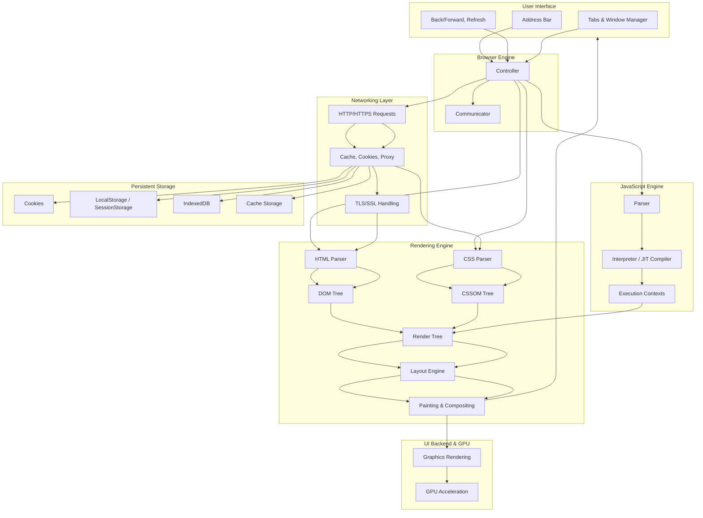
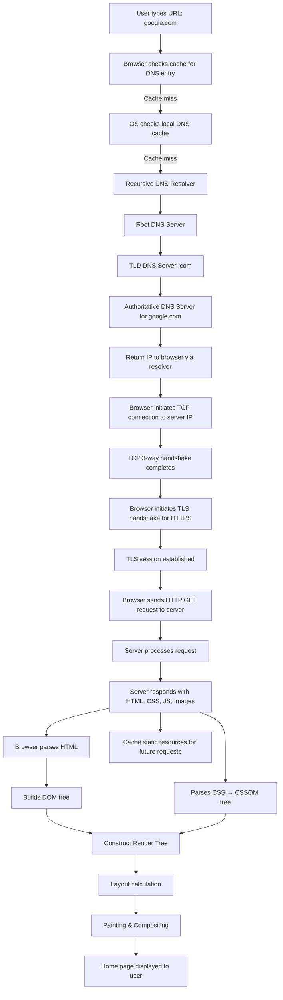

# **Modern Browser** 

### High Level Components

* **User Interface Layer** (address bar, tabs, buttons, bookmarks)
* **Browser Engine** (manages communication between UI and rendering engine)
* **Rendering Engine** (parses HTML/CSS, builds DOM + CSSOM, renders layout + painting)
* **JavaScript Engine** (parses and executes JS, e.g. V8 in Chrome, JavaScriptCore in Safari)
* **Networking** (handles HTTP/HTTPS, caching, cookies, proxy, TLS/SSL)
* **Data Storage** (cookies, localStorage, IndexedDB, cache, service workers)
* **UI Backend** (compositing, rendering graphics, GPU acceleration)

---

###  Flow :

1. **UI Layer** → User interacts (type URL, click buttons).
2. **Browser Engine** → Acts as the coordinator, passing tasks to the rendering engine or JS engine.
3. **Rendering Engine**

   * Parses HTML into **DOM**.
   * Parses CSS into **CSSOM**.
   * Combines them into a **Render Tree**, then calculates **layout** and **paints** pixels.
4. **JavaScript Engine**

   * Parses and executes JS code.
   * Updates the DOM/CSSOM dynamically (causing re-render).
5. **Networking**

   * Manages requests (HTTP/HTTPS), caching, cookies, and SSL.
6. **Storage**

   * Manages local data like cookies, localStorage, IndexedDB.
7. **UI Backend + GPU**

   * Handles actual rendering of graphics, fonts, images, accelerated by GPU.

---

** flow when a user types a URL like `google.com`** into a browser
- DNS resolution
- TCP/TLS handshake
- HTTP request/response
- Rendering

---

### 🔹 Flow Explanation:

1. **DNS Resolution**

   * Browser → OS → Recursive DNS → Root → TLD → Authoritative DNS → IP address.

2. **TCP Connection**

   * Browser establishes a TCP connection (3-way handshake) to the server.
- Client SYN 
- Server SYN + ACK
- Client ACK

3. **TLS/SSL Handshake**

   * Browser and server negotiate encryption (HTTPS).
- Client Hello : sharing cipher suites , protocol 
- generate random private key , share it's public key
- Server Hello : selecting cipher suite , protocol,  sharing certificate , confirming the elliptic curve to use ( TLS1.3)
- generate random private key , share it's public key
- Client: Validating Left Certificate-> Intermediatory Certificate -> Root Certificate using client's CA file 
- validating the domain name is owned by server host
- Generate the common points on the elliptic curve and creating a shared secret by both server and client.
- Server : creating ephemeral key pair random , signing the ephemeral public key using long term private key

4. **HTTP Request**

   * Browser sends GET request to fetch homepage.

5. **Server Response**

   * Server sends HTML, CSS, JS, images, etc.

6. **Rendering**

   * Browser parses HTML → DOM tree.
   * Parses CSS → CSSOM tree.
   * Combines to Render Tree → layout → painting → display.

7. **Caching**

   * Browser caches static resources for faster subsequent loads.

---

If you want, I can also **draw a more detailed diagram showing parallel requests for images, JS, CSS, and asynchronous loading of resources**, which happens in modern browsers for sites like Google.

