# **TCP 3-way handshake** 
How a client establishes a reliable connection with a server before sending data.

### **Sequence Diagram**  :

```mermaid
sequenceDiagram
    participant C as Client
    participant S as Server

    Note over C,S: 🔗 TCP 3-Way Handshake

    C->>S: 1. SYN<br/>(Synchronize, Seq=x)
    S->>C: 2. SYN-ACK<br/>(Synchronize + Acknowledge, Seq=y, Ack=x+1)
    C->>S: 3. ACK<br/>(Acknowledge, Ack=y+1)

    Note over C,S: ✅ Connection established<br/>Now both sides can send data
```

---

### 🔎 Step-by-Step Explanation

1. **SYN (synchronize)** – Client → Server

   * Client initiates a connection.
   * Sends a TCP segment with the **SYN flag = 1** and an **initial sequence number (Seq = x)**.

2. **SYN-ACK (synchronize + acknowledge)** – Server → Client

   * Server acknowledges receipt of SYN (`Ack = x + 1`).
   * Sends its own **SYN (Seq = y)** to establish the reverse channel.

3. **ACK (acknowledge)** – Client → Server

   * Client acknowledges the server’s SYN (`Ack = y + 1`).
   * Connection is now established.

---

✅ After this handshake:

* Both sides know each other’s **initial sequence numbers**.
* They can start reliable, ordered data transfer.

---

Do you also want me to extend this with a **4-way TCP connection termination** (FIN/ACK sequence) so you get the full lifecycle?
