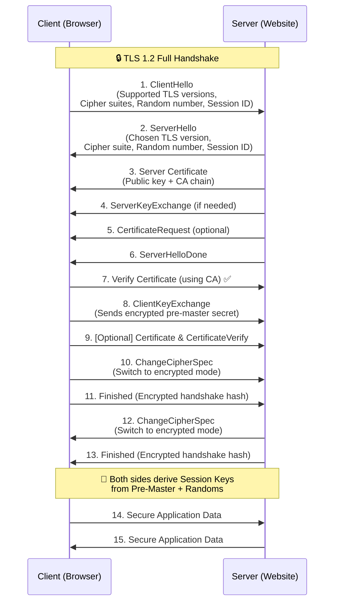

# TLS handshake 

TLS handshake is a **multi-step process** that establishes a secure, encrypted session between a client (browser) and a server (like Google).

the **TLS 1.2 full handshake** (TLS 1.3 is shorter ):

---

###  Steps :

1. **ClientHello** → Browser proposes supported TLS versions, cipher suites, compression, random nonce.
2. **ServerHello** → Server picks TLS version & cipher, sends its random nonce.
3. **Certificate** → Server sends X.509 certificate (with public key).
4. **ServerKeyExchange** → Extra key material (for Diffie-Hellman/ECDHE).
5. **CertificateRequest** (optional) → If server needs client authentication.
6. **ServerHelloDone** → Server done with negotiation phase.
7. **Client verifies certificate** → Ensures CA trust + domain name match.
8. **ClientKeyExchange** → Sends encrypted pre-master secret (with server’s public key).
9. **(Optional) Client Certificate & Verify** → If mutual TLS is required.
10. **ChangeCipherSpec** → Client signals switch to encrypted communication.
11. **Finished (Client)** → First encrypted message with handshake hash.
12. **ChangeCipherSpec (Server)** → Server switches to encrypted mode.
13. **Finished (Server)** → Server confirms handshake integrity.
    14–15. **Application Data** → Secure communication begins using symmetric keys.

---
### Deep dive :
Got it ✅ Let’s zoom in on **steps 3, 4, and 5** of the **TLS 1.2 handshake**:

---

### **Step 3: Server Certificate**

* The server sends its **X.509 certificate** to the client.
* This contains:

  * Server’s **public key**.
  * **Domain name** (CN/SAN field).
  * Certificate Authority (CA) signature chain.
* **Purpose**: The client uses this certificate to verify the server’s identity (trust chain) and later encrypt the **pre-master secret**.

---

### **Step 4: ServerKeyExchange** (only in some cipher suites)

* Sent **only if the key exchange algorithm requires extra parameters** (like **Diffie-Hellman (DH), Elliptic Curve Diffie-Hellman (ECDHE)**).
* It includes:

  * DH/ECDHE parameters (prime numbers, curve points).
  * A digital signature proving the server owns the private key corresponding to its certificate.
* **Purpose**: Enables **perfect forward secrecy (PFS)** — even if the server’s private key is compromised later, past sessions stay secure.

---

### **Step 5: CertificateRequest (optional)**

* Used **only if the server wants to authenticate the client** (mutual TLS / client certificates).
* The server sends a request telling the client:

  * Which **CA certificates** it trusts.
  * What type of certificate/signature is required.
* **Purpose**: In **mutual TLS**, not only does the client verify the server, but the server also verifies the client (common in enterprise systems, APIs, banking).

---

✅ In short:

* **Step 3 (Certificate)** = Prove server identity.
* **Step 4 (ServerKeyExchange)** = Share key exchange params (for PFS).
* **Step 5 (CertificateRequest)** = Ask client to prove its identity (optional).

---

## **steps 7 → 13** of the TLS 1.2 handshake (the critical transition from negotiation to secure communication):

---

### **Step 7: Verify Certificate (using CA)** ✅

* The client verifies the server’s certificate chain:

  1. **Check CA Signature** → Verify the certificate is signed by a trusted Certificate Authority.
  2. **Check Validity** → Expiration date, revocation lists (CRL/OCSP).
  3. **Check Domain Name** → Ensure certificate’s CN/SAN matches `google.com`.
* If this fails → handshake aborted ⚠️

---

### **Step 8: ClientKeyExchange** 🔑

* The client generates a **pre-master secret** (random number).
* Encrypts it with the **server’s public key** (from Step 3) OR sends Diffie-Hellman parameters (if using DH/ECDHE).
* The server will use its **private key** to decrypt / compute it.
* Both sides will derive the same **session keys** from this pre-master + both randoms (from Step 1 & 2).

---

### **Step 9: \[Optional] Client Certificate & CertificateVerify**

* Only happens in **mutual TLS (mTLS)**.
* Client sends its own certificate → proves its identity.
* Then sends **CertificateVerify**, a digital signature to prove it owns the private key.
* (Skipped in normal HTTPS websites).

---

### **Step 10: ChangeCipherSpec (Client)**

* Client tells server:

  > “From now on, I will send encrypted messages using the negotiated session keys.”
* Marks the switch from **plaintext handshake messages → encrypted communication**.

---

### **Step 11: Finished (Client)**

* Client sends a **hash of all previous handshake messages**, encrypted with the new session key.
* Purpose: Proves that the handshake wasn’t tampered with.

---

### **Step 12: ChangeCipherSpec (Server)**

* Server tells client:

  > “I will also switch to encrypted mode.”

---

### **Step 13: Finished (Server)**

* Server sends its own **encrypted handshake hash**.
* Confirms that both sides derived the same keys and the handshake was successful.

---

✅ **At this point**:

* Both sides have the same **session keys** (symmetric).
* All further communication (Step 14 onward) is encrypted and secure (HTTP → HTTPS).

---

⚡ In short:

* **Step 7** = Validate trust.
* **Step 8–9** = Exchange secrets & (optionally) authenticate client.
* **Step 10–11** = Client switches to encryption.
* **Step 12–13** = Server switches to encryption.
* After this → secure channel established.

---
 
 

