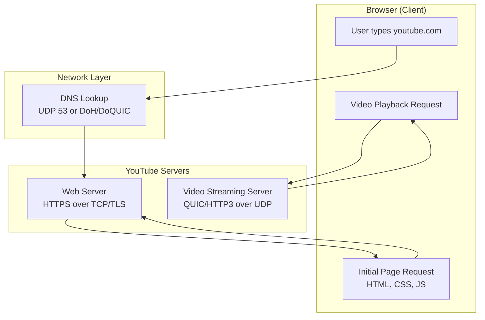

# Video Streaming

---

the browser **does use UDP as well** when communicating with YouTube (and many modern web apps), but **not for everything**. 

---

## **1. Default Web Traffic (HTTPS over TCP/TLS)**

* When you type `youtube.com` in your browser → the initial page load (HTML, CSS, JavaScript, images, metadata) is done using **HTTP/HTTPS over TCP (TLS)**.
* This ensures **reliability, ordered delivery, and encryption**.

---

## **2. Video Streaming (UDP via QUIC/HTTP/3)**

* For video playback (the actual YouTube video stream):

  * YouTube uses **QUIC protocol**, which runs on **UDP**.
  * QUIC is the foundation of **HTTP/3** (the next-gen HTTP protocol).
* Why UDP/QUIC instead of TCP?

  * **Lower latency** (no TCP 3-way handshake, faster connection setup).
  * **Better congestion control** for streaming.
  * **Multiplexing** (multiple streams without head-of-line blocking).
  * Works well with **packet loss** (common in mobile/wifi networks).

---

## **3. Other UDP Uses in Browser**

* **DNS**: Traditional DNS lookups use UDP (port 53).
* **WebRTC (live streaming, video calls)**: Uses UDP for real-time communication.
* **DoH/DoQUIC (DNS over HTTPS/QUIC)**: DNS can even ride over UDP via QUIC.

---

### Communication

How a browser communicates with **YouTube.com** using both **TCP (HTTPS)** and **UDP (QUIC/HTTP/3)**:

---

### 🔎 Explanation of Flow

1. **DNS Lookup** → Browser queries DNS (UDP 53, or DNS-over-HTTPS/QUIC).
2. **Initial Page Load** → Browser uses **TCP + TLS (HTTPS)** to fetch HTML, CSS, JS, thumbnails, ads, metadata.
3. **Video Streaming** → Actual video is streamed via **QUIC (UDP, HTTP/3)** for lower latency and better performance.

---

## ✅ Summary

* **Browser → YouTube HTML page** → **TCP/TLS (HTTPS)**.
* **YouTube video stream itself** → **UDP via QUIC/HTTP/3**.
* **Supporting protocols** (DNS, WebRTC if used) → **UDP** too.

---

👉 Would you like me to **draw a Mermaid diagram** showing how a YouTube session looks (browser using both TCP and UDP paths)? That way you can see which parts go over TCP and which over UDP.
