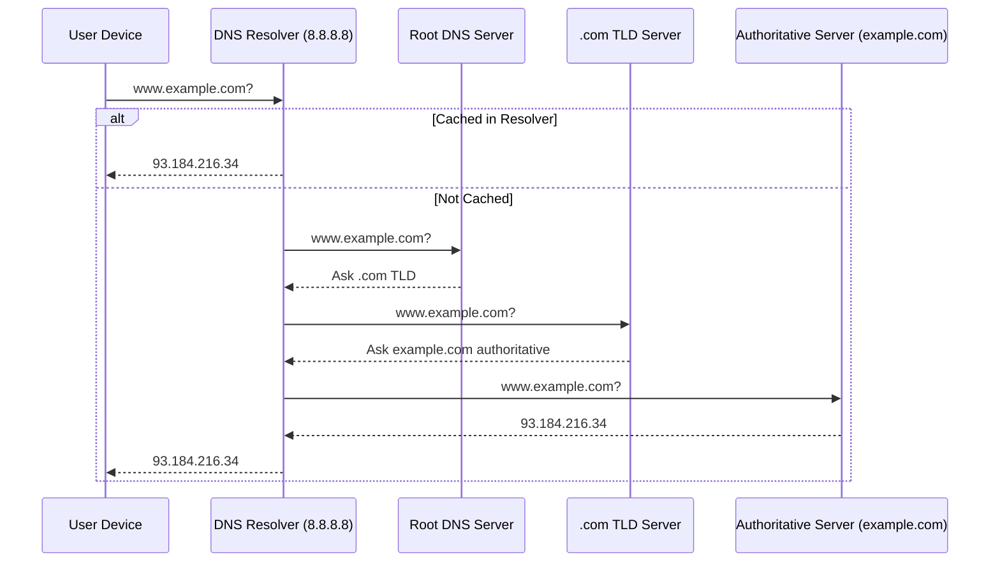

A **DNS Resolver** (also called a **DNS Recursive Resolver**) is a **server or service** that acts as the **middleman between your device and the DNS system**.
Its main job is to take a **domain name** (like `www.google.com`) and find out the corresponding **IP address** (like `142.250.77.132`) by **recursively querying** other DNS servers — until it gets the answer.

Let’s do a **technical deep dive** 👇

---

## 🧩 1. What Is a DNS Resolver?

A **DNS Resolver** is part of the **DNS resolution process** that converts a **human-readable domain** into a **machine-readable IP address**.

It’s usually provided by:

* Your **ISP (Internet Service Provider)**, or
* A **public DNS provider** (like Google’s `8.8.8.8`, Cloudflare’s `1.1.1.1`, or OpenDNS `208.67.222.222`).

Your computer or phone sends its DNS queries to this resolver.

---

## ⚙️ 2. Steps: How a Resolver Works (Recursive Lookup Flow)

Let’s take an example:
You open your browser and type `www.example.com`.

Here’s what happens:

### **Step 1: Local Cache Check**

Your OS first checks:

* Browser cache (Chrome, Firefox, etc.)
* OS DNS cache (e.g., `/etc/hosts` in Linux or Windows cache)

If not found → It sends a query to the **DNS Resolver** configured in your system.

---

### **Step 2: Query Sent to the DNS Resolver**

The resolver receives the query:

> “What is the IP address for [www.example.com?”](http://www.example.com?”)

If it’s not in the resolver’s cache, it performs a **recursive search** — meaning it goes out to ask other DNS servers.

---

### **Step 3: Resolver Queries the Root Server**

* The resolver asks one of the **13 root DNS servers** (like `a.root-servers.net`).
* The root server doesn’t know the IP, but it knows **where the `.com` TLD servers are**.
* It replies: “Ask the `.com` TLD server.”

---

### **Step 4: Resolver Queries the TLD Server**

* The resolver now asks the **.com TLD server**.
* The TLD server responds: “I don’t know the IP, but ask the authoritative server for `example.com`.”

---

### **Step 5: Resolver Queries the Authoritative Server**

* The resolver finally queries the **authoritative DNS server** for `example.com`.
* That server responds with:

  ```
  www.example.com → 93.184.216.34
  ```

---

### **Step 6: Resolver Returns the Answer to the Client**

* The resolver caches the answer (for a period defined by **TTL**)
* It sends the IP back to your computer or browser.
* The browser now uses that IP to connect to the web server.

---

## 🧠 3. Key Characteristics

| Feature                | Description                                                                                       |
| ---------------------- | ------------------------------------------------------------------------------------------------- |
| **Recursive**          | It performs all queries on behalf of the client until it gets the final answer.                   |
| **Caching**            | Caches results to speed up future lookups and reduce load on authoritative servers.               |
| **TTL (Time to Live)** | Determines how long a record stays cached before being re-queried.                                |
| **Forwarder**          | Some resolvers delegate queries to another resolver (like Google DNS) instead of going recursive. |

---

## 🏗️ 4. Types of DNS Resolvers

| Type                    | Description                                                    | Example                   |
| ----------------------- | -------------------------------------------------------------- | ------------------------- |
| **Recursive Resolver**  | Performs full lookup from root → TLD → authoritative           | ISP DNS, Google (8.8.8.8) |
| **Caching Resolver**    | Only answers from cache (if available)                         | Local resolver service    |
| **Stub Resolver**       | Lightweight client-side resolver (in OS) that forwards queries | Your laptop’s DNS client  |
| **Forwarding Resolver** | Forwards all queries to another resolver                       | Enterprise DNS setup      |

---

## 🧭 5. Visual Diagram (Mermaid)



---

## 🛠️ 6. Example DNS Configuration

In Linux or macOS:

```bash
cat /etc/resolv.conf
```

Example output:

```
nameserver 8.8.8.8
nameserver 1.1.1.1
```

This means Google and Cloudflare resolvers will handle your DNS lookups.

---

## 🧩 7. Real-world Examples

| Provider          | Resolver IP                        | Notes                                    |
| ----------------- | ---------------------------------- | ---------------------------------------- |
| Google Public DNS | `8.8.8.8`, `8.8.4.4`               | Fast, global caching                     |
| Cloudflare DNS    | `1.1.1.1`, `1.0.0.1`               | Privacy-focused, supports DNS over HTTPS |
| OpenDNS           | `208.67.222.222`, `208.67.220.220` | Content filtering options                |
| Quad9             | `9.9.9.9`                          | Security & malware protection            |

---

Would you like me to explain **how caching resolvers use TTL and negative caching** (for missing domains like NXDOMAIN)? That’s the next layer of optimization in DNS resolution.
