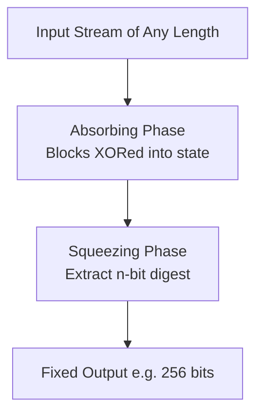

Excellent question — this goes to the heart of how **hash functions** are designed. Let’s dive deep into the **mechanics and mathematics** behind how a hash function can take an **input of arbitrary size** and always produce a **fixed-length (n-bit) output**.

---

## 🧩 1. **Core Idea**

A **hash function** ( H(x) ) is a deterministic algorithm that:

* Accepts an input message of any length
* Processes it in **fixed-size chunks (blocks)**
* Produces a **fixed-size digest (n bits)** — e.g., 256 bits for SHA-256

[
H: {0,1}^* \rightarrow {0,1}^n
]

So even if your input is 1 byte or 10 GB, the output will always be, say, 256 bits.

---

## ⚙️ 2. **High-Level Mechanism: Compression Function + Iteration**

Modern cryptographic hash functions (like **SHA-2**, **SHA-3**, **BLAKE2**) are built using a **compression function** that processes data block by block.

### Step-by-Step:

1. **Initialization:**
   Start with a fixed **initial state (IV)**, e.g., 256 bits of constants.

2. **Preprocessing / Padding:**

   * Input message is padded to make its length a multiple of the **block size (b bits)**.
   * Padding includes a `1` bit + zeros + original length (so that it’s reversible).

3. **Block Processing (Compression Function):**
   Each block ( M_i ) is combined with the current hash state ( H_{i-1} ):
   [
   H_i = f(H_{i-1}, M_i)
   ]
   where `f` is the **compression function** (nonlinear, mixing bits).

4. **Finalization:**
   After the last block, the final state ( H_N ) becomes the **hash output** (truncated or expanded to n bits).

---

### 🧮 Example: SHA-256 (Merkle–Damgård Construction)

| Stage                | Description                                               | Size                             |
| -------------------- | --------------------------------------------------------- | -------------------------------- |
| Block size           | 512 bits (64 bytes)                                       | Input split into 512-bit chunks  |
| State size           | 256 bits                                                  | Maintained as 8 × 32-bit words   |
| Compression function | Takes (512-bit block + 256-bit state) → new 256-bit state | Core of SHA-256                  |
| Output               | Final 256-bit state                                       | Fixed length regardless of input |

So, whether your input is 100 bytes or 100 MB:

* It’s divided into 512-bit blocks.
* Each block updates the internal 256-bit state.
* Final 256-bit state = final hash.

---

## 🧠 3. **Why Fixed-Length Output Is Crucial**

| Property               | Reason                                                                           |
| ---------------------- | -------------------------------------------------------------------------------- |
| **Constant size**      | Makes hashes efficient to compare, store, and use as keys or digital signatures. |
| **Uniformity**         | Output space ( 2^n ) ensures near-random distribution — reduces collisions.      |
| **Security guarantee** | Collision resistance, preimage resistance depend on n (bit strength).            |

For example:

* SHA-256 → 256-bit output → ~128-bit collision resistance (birthday bound).

---

## 🧩 4. **Mathematical Abstraction**

Hash functions use constructions like:

* **Merkle–Damgård construction (SHA-1, SHA-2):**
  Iteratively compresses blocks using a fixed-length chaining value.

* **Sponge construction (SHA-3):**
  Absorbs input into a state and “squeezes” out fixed-length output.

  * Internal state much larger (e.g., 1600 bits).
  * Output truncated to n bits (e.g., 256).

---

### Sponge Model Visualization (used in SHA-3)

The **absorbing phase** handles arbitrary-length input;
the **squeezing phase** produces a constant-length output.

---

## 🔒 5. **Truncation / Expansion**

Even if internal state is bigger (e.g., 1600 bits in SHA-3),
the final step **truncates** or **extracts** exactly `n` bits.

So:
[
\text{Output} = H(x) = \text{Truncate}_n(f(x))
]

---

## 💡 6. **Key Takeaways**

| Concept                            | Summary                                                       |
| ---------------------------------- | ------------------------------------------------------------- |
| **Hash = Compression + Iteration** | Arbitrary input processed in blocks, maintaining fixed state. |
| **Fixed-length output**            | Determined by hash function design (e.g., 256 bits).          |
| **Padding**                        | Makes arbitrary input fit into fixed block size.              |
| **Construction type**              | Merkle–Damgård (SHA-2) or Sponge (SHA-3).                     |
| **Security strength**              | Depends on n (bits of output).                                |

---

Would you like me to show you **the internal block diagram of SHA-256** (with message schedule, mixing, and compression function)?
That’s the easiest way to see *how exactly the fixed 256-bit digest is derived*.
