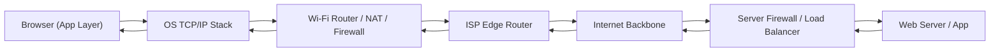

Excellent — you’re thinking like a network architect now 👏

Let’s trace **every hop** and **every major component** that a browser request passes through — from your laptop to a web server and back.
We’ll cover both **the forward path (request)** and **the return path (response)**.

---

## 🌐 Example Scenario

You open Chrome and go to:
👉 `https://www.google.com`

Your laptop is on Wi-Fi behind a router with NAT and firewall.

---

## 🛣️ **1. Outbound Request Path (Browser → Server)**

| #    | Layer                | Component                                                                         | What Happens                                                            |
| ---- | -------------------- | --------------------------------------------------------------------------------- | ----------------------------------------------------------------------- |
| 1️⃣  | **Application (L7)** | **Browser (Chrome/Edge/Firefox)**                                                 | Generates HTTPS request; passes it to OS via TCP/IP stack               |
| 2️⃣  | **Transport (L4)**   | **Operating System Network Stack**                                                | Opens a TCP connection (usually port 443)                               |
| 3️⃣  | **Network (L3)**     | **Network Interface Card (NIC / Wi-Fi Adapter)**                                  | Encapsulates packet with source = your private IP (e.g. `192.168.1.10`) |
| 4️⃣  | **Data Link (L2)**   | **Home Router / Access Point**                                                    | Sends packet toward default gateway                                     |
| 5️⃣  | **Network (L3)**     | **Router’s NAT Module**                                                           | Rewrites private IP → public IP (`203.0.113.5`), updates NAT table      |
| 6️⃣  | **Network (L3)**     | **Router’s Firewall Module**                                                      | Checks rules (e.g., allow outbound 443)                                 |
| 7️⃣  | **Network (L3)**     | **ISP Edge Router / Modem**                                                       | Routes packet to Internet backbone                                      |
| 8️⃣  | **Network (L3)**     | **ISP Core Routers**                                                              | Forward packet to destination ASN (Autonomous System)                   |
| 9️⃣  | **Network (L3)**     | **Internet Backbone Routers**                                                     | Handle long-haul transit routing (BGP)                                  |
| 🔟   | **Network (L3)**     | **Server’s Edge Firewall / Load Balancer / Reverse Proxy (e.g., Nginx, AWS ELB)** | Terminates TCP/TLS, may do SSL offload or routing                       |
| 11️⃣ | **Application (L7)** | **Web Server / Application Server (e.g., Google Frontend)**                       | Processes HTTP request and generates response                           |

---

## 🛬 **2. Inbound Response Path (Server → Browser)**

| #   | Layer                | Component                             | What Happens                                                             |
| --- | -------------------- | ------------------------------------- | ------------------------------------------------------------------------ |
| 1️⃣ | **Application (L7)** | **Web Server**                        | Sends HTTPS response packets                                             |
| 2️⃣ | **Network (L3)**     | **Server’s Firewall / Load Balancer** | Allows outgoing response traffic                                         |
| 3️⃣ | **Network (L3)**     | **Internet Backbone Routers**         | Route response back via BGP path                                         |
| 4️⃣ | **Network (L3)**     | **ISP Core Routers**                  | Deliver packet to your ISP edge                                          |
| 5️⃣ | **Network (L3)**     | **ISP Edge Router / Modem**           | Forwards to your home router                                             |
| 6️⃣ | **Network (L3)**     | **Home Router (NAT Table Lookup)**    | Finds the mapping: `public_ip:port → 192.168.1.10:port`, rewrites header |
| 7️⃣ | **Data Link (L2)**   | **Wi-Fi / Ethernet Adapter**          | Sends packet to your laptop                                              |
| 8️⃣ | **Transport (L4)**   | **OS TCP Stack**                      | Reassembles TCP segments, verifies checksums                             |
| 9️⃣ | **Application (L7)** | **Browser**                           | Decrypts HTTPS, renders HTML / CSS / JS                                  |

---

## 🧭 **Simplified Flow Diagram**

---

## 🔒 **Where Each Function Happens**

| Function                      | Component                                                             |
| ----------------------------- | --------------------------------------------------------------------- |
| **DNS Lookup**                | Performed by OS (browser calls resolver → router → ISP DNS / 8.8.8.8) |
| **NAT (Address Translation)** | Home/enterprise router, NAT gateway, or cloud NAT                     |
| **Firewalling**               | Router, cloud gateway, or dedicated firewall                          |
| **TLS Handshake**             | Between browser and server (sometimes offloaded at load balancer)     |
| **Load Balancing**            | Reverse proxy, CDN edge, or cloud load balancer                       |
| **Caching**                   | CDN or browser cache                                                  |
| **Routing**                   | ISP routers and Internet backbone (BGP)                               |

---

## 🧠 **Key Takeaway**

* The **browser** operates at the **application layer** — it never handles IP routing or NAT.
* The **router/firewall/NAT gateway** is the **boundary device** doing all network translation and access control.
* Between your device and the web server, **dozens of routers** and sometimes **CDNs / proxies** relay your packets — all transparent to the browser.

---

Would you like me to include **CDNs and reverse proxies (like Cloudflare / Akamai)** in this path next? That’s a real-world addition to most Internet traffic today.
