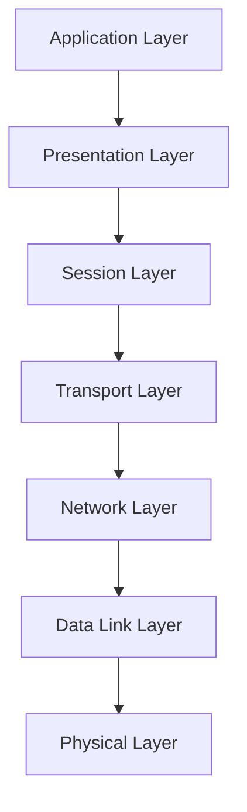

# OSI Model 

The **OSI (Open Systems Interconnection) Model** has **7 layers**, from **Physical (Layer 1)** to **Application (Layer 7)**. Each layer provides **services to the layer above** and **relies on the layer below**.

###  **Logical Components**

| Layer               | Logical Component / Unit              | Responsibilities                                                                                                         | Examples / Protocols                                          |
| ------------------- | ------------------------------------- | ------------------------------------------------------------------------------------------------------------------------ | ------------------------------------------------------------- |
| **7. Application**  | Application Processes                 | Provides network services directly to applications. Handles resource sharing, remote access, file transfer, email.       | HTTP, FTP, SMTP, DNS, Telnet                                  |
| **6. Presentation** | Syntax / Data Translator              | Translates data formats, handles encryption/decryption, compression, serialization.                                      | SSL/TLS (encryption), JPEG, MPEG, ASCII, EBCDIC               |
| **5. Session**      | Session Manager / Dialogue Controller | Manages sessions between applications, controls connection establishment, maintenance, termination, and synchronization. | NetBIOS, RPC, PPTP, SQL session management                    |
| **4. Transport**    | Segment / Transport Layer Protocol    | Provides end-to-end communication, reliability, flow control, segmentation/reassembly.                                   | TCP (reliable), UDP (unreliable), SCTP                        |
| **3. Network**      | Packet / Router / Logical Addressing  | Determines logical addressing (IP), routing, path selection, and congestion control.                                     | IP, ICMP, IGMP, IPsec, routers                                |
| **2. Data Link**    | Frame / Switch / MAC & LLC            | Provides node-to-node data transfer, error detection/correction, flow control, physical addressing.                      | Ethernet, Wi-Fi (IEEE 802.11), PPP, HDLC, MAC addresses       |
| **1. Physical**     | Bit / Physical Media                  | Transmits raw bits over physical medium; defines voltage levels, timing, modulation, cabling.                            | Ethernet cables, fiber optics, radio signals, hubs, repeaters |

---

### 🔹 3. **Logical Components & Their Functioning**

1. **Application Layer**

   * Logical component: Application Process
   * Functions: Data access, network resource sharing, messaging between applications.

2. **Presentation Layer**

   * Logical component: Data Translator / Encoder/Decoder
   * Functions: Converts internal application data to network format, encryption/decryption, compression/decompression.

3. **Session Layer**

   * Logical component: Session Manager
   * Functions: Establish, maintain, synchronize, and terminate sessions between processes. Provides checkpoints for recovery.

4. **Transport Layer**

   * Logical component: Segmentation & Reassembly, Port Manager
   * Functions: Split messages into segments, provide end-to-end reliability, flow control, multiplexing via ports.

5. **Network Layer**

   * Logical component: Packet Manager / Router
   * Functions: Logical addressing (IP), path selection, packet forwarding, congestion control, routing.

6. **Data Link Layer**

   * Logical component: Framing & MAC / LLC
   * Functions: Create frames, detect/correct errors, control access to physical medium, node-to-node delivery.

7. **Physical Layer**

   * Logical component: Bit Transmission / Media Interface
   * Functions: Transmit bits, define physical connections, voltage, frequency, cabling, and signaling.

* **Data Flow:** Application → bits on wire → Application
* **Encapsulation:** Each layer adds its header/trailer (except physical) as data passes down.

* **Encapsulation:** Each layer wraps data from above in its own protocol header/trailer.
* **Abstraction:** Each layer provides services without exposing internal implementation to higher layers.
* **Logical Components:** Represent **functional responsibilities**, not necessarily hardware.
* **Protocols:** Actual implementations of OSI layers; TCP/IP stack maps OSI layers differently.

# **Physical Devices**

## **Layer 1 — Physical Layer (Bits → Electrical/Optical Signals)**

These deal with **raw transmission of bits**.

### **Devices & Media**

* **Copper cables (Cat5/Cat6 Ethernet cables)**
* **Fiber optic cables**
* **Coaxial cables**
* **Wireless radio (WiFi, Bluetooth transmitters)**
* **Network Interface Card (NIC) — electrical/optical signaling part**
* **Hubs**
* **Repeaters**
* **Modems** (physical modulation/demodulation)
* **Power Line Communication devices**

## **Layer 2 — Data Link Layer (Frames, MAC addressing)**

Responsible for **MAC, switching, ARP, VLANs**.

### **Devices**

* **Ethernet Switch**
* **Bridges**
* **WiFi Access Points (AP)** – MAC + frame control
* **Network Interface Card (NIC) — MAC layer logic**
* **Layer-2 Load Balancer** (rare, MAC-level)
* **Media converters**

## **Layer 3 — Network Layer (IP addressing, routing)**

Responsible for **routing, IP, ICMP, fragmentation**.

### **Devices**

* **Routers**
* **Layer 3 Switches**
* **Firewalls (L3 packet filtering)**
* **VPN Gateways**
* **NAT Devices**
* **SD-WAN routers**

## **Layer 4 — Transport Layer (TCP/UDP)**

Responsible for **port numbers, connections, reliability**.

### **Devices**

* **Load Balancers – L4 (TCP/UDP load balancers)**
* **Firewalls with L4 filtering**
* **TCP accelerators**
* **NAT Gateways performing port translation**

## **Layer 5 — Session Layer (Sessions, connections)**

Not many physical devices — mostly software, but some appliances operate here.

### **Devices**

* **SSL/TLS Offloaders**
* **VPN devices (session management, IPSec handshake)**
* **Application Delivery Controllers (ADC)** (partially)

---

## **Layer 6 — Presentation Layer (Encoding/Encryption)**

Encryption, compression, and translation.

### **Devices**

* **SSL/TLS Termination Devices**
* **Hardware Security Modules (HSM)**
* **Encryption appliances**

---

## **Layer 7 — Application Layer (HTTP, DNS, API Gateway)**

Understands **application protocols**.

### **Devices**

* **Layer-7 Load Balancer** (NGINX, HAProxy, F5 L7)
* **API Gateway**
* **Web Application Firewall (WAF)**
* **Proxy Servers**
* **CDN Edge Servers**
* **DNS Servers**
* **Email Gateways**

(blank line as you prefer)

| OSI Layer             | Devices / Components                                                                     |
| --------------------- | ---------------------------------------------------------------------------------------- |
| **L1 – Physical**     | Ethernet cables, fiber cables, coaxial cable, NIC (PHY), hubs, repeaters, modems, radios |
| **L2 – Data Link**    | Switches, bridges, NIC (MAC), WiFi AP, media converters                                  |
| **L3 – Network**      | Routers, L3 switches, firewalls (L3), NAT, VPN gateways, SD-WAN routers                  |
| **L4 – Transport**    | L4 Load balancer, TCP/UDP firewalls, NAT gateways, TCP accelerators                      |
| **L5 – Session**      | VPN devices, SSL offloaders, ADCs                                                        |
| **L6 – Presentation** | HSMs, encryption appliances, SSL/TLS termination devices                                 |
| **L7 – Application**  | L7 Load balancer, WAF, API Gateway, proxies, CDN, DNS servers                            |

📌 OSI Layer diagram with devices
📌 Network end-to-end packet flow diagram
📌 Mermaid diagram of how routers/LBs/APs fit in each layer

If you want, I can **draw a more detailed diagram showing all logical components with examples of headers/units (bits, frames, packets, segments) at each layer**, which is very useful for understanding network troubleshooting and packet flow.

Do you want me to do that?

Excellent — this is a subtle but foundational networking question 👏

Let’s clarify where a **web browser** fits in the **OSI model** and what layers it interacts with.

---

## 🧭 **Short Answer**

A **web browser (like Chrome, Safari, Firefox, Edge)** primarily operates at the **Application Layer (Layer 7)** of the OSI model.

However, it **interacts with lower layers** through the operating system and network stack.

---

## 🧩 **Layer-by-Layer Breakdown**

| OSI Layer                  | Role                                                                    | Browser’s Involvement                                                                                  |
| -------------------------- | ----------------------------------------------------------------------- | ------------------------------------------------------------------------------------------------------ |
| **Layer 7 – Application**  | Handles application-level protocols (HTTP, HTTPS, WebSocket, FTP, etc.) | ✅ **Browser runs here.** It generates HTTP requests, parses HTML/CSS/JS, manages cookies, caches, etc. |
| **Layer 6 – Presentation** | Data formatting, encryption/decryption, compression                     | ✅ The browser uses **TLS/SSL libraries** here for HTTPS (encrypts/decrypts data).                      |
| **Layer 5 – Session**      | Establishes and maintains sessions                                      | ✅ Browser manages **sessions** (cookies, tokens, persistent connections).                              |
| **Layer 4 – Transport**    | End-to-end transport (TCP/UDP)                                          | ⚙️ Browser **uses** TCP (for HTTP) or UDP (for QUIC/HTTP/3), but the OS handles this.                  |
| **Layer 3 – Network**      | IP routing                                                              | ⚙️ OS kernel handles this; browser doesn’t directly interact here.                                     |
| **Layer 2 – Data Link**    | MAC addressing, framing                                                 | ⚙️ Network card + driver handle it.                                                                    |
| **Layer 1 – Physical**     | Electrical/optical signals                                              | ⚙️ Hardware layer (Ethernet, Wi-Fi).                                                                   |

---

## 💡 **In Simpler Terms**

A browser doesn’t send bits on the wire itself.
It:

* Builds an **HTTP or HTTPS request** (Layer 7)
* Uses **TLS encryption** (Layer 6)
* Relies on the **TCP connection** (Layer 4)
* Which is transmitted over **IP and Ethernet** (Layers 3–1) by the OS and NIC.

---

## 🧠 **Example: Browser Loading a Webpage**

When you open `https://example.com`:

1. **Layer 7 (Application):**
   Browser constructs an HTTP GET request.
   → `"GET / HTTP/1.1\r\nHost: example.com\r\n\r\n"`

2. **Layer 6 (Presentation):**
   Uses TLS to encrypt that request (HTTPS).

3. **Layer 5 (Session):**
   Maintains the session (cookies, persistent connections, etc.)

4. **Layer 4 (Transport):**
   OS opens a **TCP** or **QUIC (UDP)** socket to the server.

5. **Layer 3–1:**
   OS and NIC handle IP addressing, routing, and physical transmission.

---

## 📊 **Summary**

| Layer                | Description                                       | Browser Role             |
| -------------------- | ------------------------------------------------- | ------------------------ |
| **7 – Application**  | HTTP, WebSocket, FTP                              | ✅ Directly operates here |
| **6 – Presentation** | TLS encryption/decryption                         | ✅ Uses it for HTTPS      |
| **5 – Session**      | Session control (cookies, persistent connections) | ✅ Uses it                |
| **4 – Transport**    | TCP / UDP                                         | ⚙️ Delegates to OS       |
| **3 – Network**      | IP routing                                        | ⚙️ OS handles            |
| **2 – Data Link**    | MAC addressing                                    | ⚙️ Network card handles  |
| **1 – Physical**     | Electrical signals                                | ⚙️ Hardware              |

---

### 🔐 Example:

* `HTTP` → Layer 7
* `HTTPS (TLS over TCP)` → Layers 6 + 5 + 4
* Browser itself = **Application Layer software**
* OS network stack = **Layers 4–1**

---

Would you like me to show a **diagram of browser-to-server communication** showing where each OSI layer’s responsibility begins and ends?
