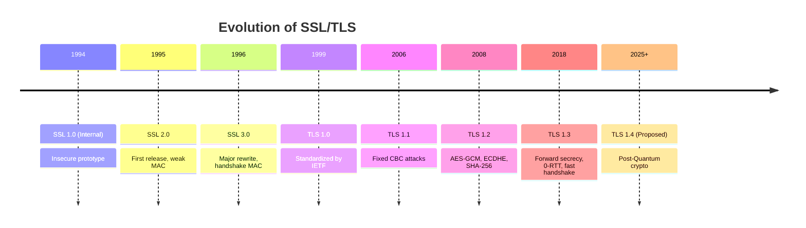

Fantastic question — and one that truly connects the dots between **cryptography**, **network security**, and **web evolution**.

Let’s take a **deep technical and historical dive** into how **SSL evolved into modern TLS**, including **protocol versions, design flaws, and cryptographic improvements** that shaped secure HTTP (HTTPS) as we know it today.

---

## 🕰️ **1. The Beginning — SSL 1.0 (1994, Netscape)**

| Aspect           | Details                                                  |
| ---------------- | -------------------------------------------------------- |
| **Year**         | 1994                                                     |
| **Developed by** | Netscape Communications                                  |
| **Purpose**      | Secure HTTP traffic (HTTPS) between browsers and servers |
| **Status**       | **Never released publicly** (too insecure)               |

### 🔍 Why SSL 1.0 was Abandoned

* Poor cryptographic design: used weak key derivation and message authentication.
* Vulnerable to **man-in-the-middle (MITM)** and **replay** attacks.
* No proper handshake integrity check.

➡️ Netscape scrapped SSL 1.0 internally and released SSL 2.0 the next year.

---

## 🔐 **2. SSL 2.0 (1995)**

| Aspect                | Details                                                    |
| --------------------- | ---------------------------------------------------------- |
| **Key Features**      | First public release of SSL                                |
| **Crypto Algorithms** | RSA for key exchange, MD5 for MAC                          |
| **Authentication**    | Only server authenticated (client authentication optional) |
| **Port**              | Default HTTPS port `443` introduced                        |
| **Main Use**          | Early web e-commerce and login systems                     |

### ⚠️ Major Security Flaws

* Weak MAC (MD5 collisions possible).
* No protection for handshake integrity.
* Same key used for message encryption and authentication.
* Vulnerable to **Truncation** and **Cipher-rollback** attacks.
* Allowed **downgrade attacks** to weaker ciphers.

➡️ **RFC 6176 (2011)**: Officially **prohibited SSL 2.0** for any use.

---

## 🔒 **3. SSL 3.0 (1996)**

| Aspect                | Details                                                           |
| --------------------- | ----------------------------------------------------------------- |
| **Developed by**      | Netscape & IETF collaboration                                     |
| **RFC**               | RFC 6101                                                          |
| **Crypto Algorithms** | RSA, DH for key exchange; 3DES, RC4 for encryption; SHA-1 for MAC |
| **Handshake**         | Introduced proper handshake hash and MAC separation               |
| **Notable**           | Backward compatible with SSL 2.0 (later a problem)                |

### ✅ Improvements

* Added **Handshake Integrity** (Finished message MACs).
* Separate keys for encryption and MAC.
* More extensible cipher negotiation.

### ⚠️ Issues

* RC4 and SHA-1 proved weak later.
* Padding oracle vulnerabilities (POODLE attack, 2014).
* No Forward Secrecy with static RSA.

➡️ **Deprecated in 2015 (RFC 7568)** — marked **insecure**.

---

## 🚀 **4. TLS 1.0 (1999) — The Birth of TLS**

| Aspect     | Details                                                                  |
| ---------- | ------------------------------------------------------------------------ |
| **RFC**    | RFC 2246                                                                 |
| **Origin** | IETF standardized SSL 3.0 → TLS 1.0                                      |
| **Goal**   | Open standard, improved message authentication, integrity, and alerting. |

### 🔑 Changes from SSL 3.0

* New PRF (Pseudo-Random Function) for key derivation using MD5 + SHA-1.
* Added support for stronger ciphers (AES, DH).
* Introduced HMAC for better message integrity.
* More robust record-layer handling.

### ⚠️ Issues

* Vulnerable to **BEAST attack (2011)** due to predictable IV in CBC mode.
* Still relied on outdated crypto primitives.

➡️ Still supported by some old systems, but **deprecated (RFC 8996)**.

---

## 🛡️ **5. TLS 1.1 (2006)**

| Aspect               | Details                                                      |
| -------------------- | ------------------------------------------------------------ |
| **RFC**              | RFC 4346                                                     |
| **Key Improvements** | Fixed CBC IV vulnerability; protection against BEAST attack. |
| **Added Features**   | Explicit IVs for CBC; clearer error alerts.                  |

### ⚠️ Issues

* Rarely adopted (browsers jumped directly from 1.0 to 1.2).
* Still lacked Forward Secrecy by default.

➡️ **Deprecated in 2021** by browsers and IETF.

---

## 🧠 **6. TLS 1.2 (2008)** — The Workhorse Era

| Aspect             | Details                                    |
| ------------------ | ------------------------------------------ |
| **RFC**            | RFC 5246                                   |
| **Crypto Updates** | Support for AES-GCM, SHA-256, ECDHE, ECDSA |
| **Adopted By**     | Modern web (2010s–2020s)                   |

### ✅ Improvements

* Added **AEAD (Authenticated Encryption with Associated Data)** ciphers (AES-GCM).
* Introduced **Elliptic Curve Cryptography (ECC)** for smaller keys & better performance.
* Allowed **SHA-256/384** for message digests.
* Enabled **Perfect Forward Secrecy** via **ECDHE** key exchange.

### ⚙️ Cipher Suite Example

```
TLS_ECDHE_RSA_WITH_AES_128_GCM_SHA256
```

### ⚠️ Issues

* Complex handshake; vulnerable to **protocol downgrade (POODLE, FREAK, Logjam)** if misconfigured.
* Still backward-compatible with weaker cipher suites (optional RC4, SHA-1).

➡️ Still **widely in use**, but being replaced by TLS 1.3.

---

## ⚡ **7. TLS 1.3 (2018)** — The Modern Standard

| Aspect                 | Details                                                     |
| ---------------------- | ----------------------------------------------------------- |
| **RFC**                | RFC 8446                                                    |
| **Design Goal**        | Simplify protocol, improve security & speed                 |
| **Handshake Messages** | Reduced from ~6 to 2 round trips (faster)                   |
| **Key Exchange**       | Only (EC)DHE (forward secrecy mandatory)                    |
| **Removed Features**   | No RSA key exchange, no static keys, no CBC, no compression |
| **Encryption**         | AEAD only: AES-GCM or ChaCha20-Poly1305                     |

### ✅ Benefits

* **0-RTT (Zero Round Trip Time)** resume for faster connections.
* **No fallback to weaker ciphers.**
* Simplified cipher suites (`TLS_AES_128_GCM_SHA256`, etc).
* **Forward secrecy by design.**
* Stronger handshake integrity.

➡️ Adopted by all major browsers, CDNs, and APIs (Cloudflare, Google, AWS).

---

## 🧩 **8. TLS 1.4 (Proposed / Experimental)**

Still in draft and research stage — aims for:

* Post-Quantum Cryptography (PQC) integration.
* Even faster connection setup.
* Improved certificate privacy.

---

## 📊 **Timeline Summary**

| Year   | Version | RFC      | Notes                       |
| ------ | ------- | -------- | --------------------------- |
| 1994   | SSL 1.0 | —        | Internal, never released    |
| 1995   | SSL 2.0 | —        | First public SSL, insecure  |
| 1996   | SSL 3.0 | RFC 6101 | Foundation of TLS           |
| 1999   | TLS 1.0 | RFC 2246 | Successor to SSL 3.0        |
| 2006   | TLS 1.1 | RFC 4346 | CBC fix                     |
| 2008   | TLS 1.2 | RFC 5246 | Modern strong crypto        |
| 2018   | TLS 1.3 | RFC 8446 | Fast, secure, AEAD-only     |
| Future | TLS 1.4 | (Draft)  | Post-quantum, privacy focus |

---

## 🔒 **Evolution Highlights**

| Concept                      | Introduced | Benefit                  |
| ---------------------------- | ---------- | ------------------------ |
| **Handshake MAC**            | SSL 3.0    | Prevent tampering        |
| **HMAC**                     | TLS 1.0    | Stronger integrity check |
| **AEAD (GCM)**               | TLS 1.2    | Unified encryption + MAC |
| **Forward Secrecy (ECDHE)**  | TLS 1.2    | Protect past sessions    |
| **Simplified Cipher Suites** | TLS 1.3    | Fewer attack surfaces    |
| **0-RTT**                    | TLS 1.3    | Faster connection resume |
| **PQC Support**              | (Upcoming) | Quantum resistance       |

---

## 🧠 **Visual Evolution Diagram**



---

## 🔍 In Short

| Old Protocols | Modern Protocols           |
| ------------- | -------------------------- |
| SSL 2.0 / 3.0 | ❌ Deprecated               |
| TLS 1.0 / 1.1 | ⚠️ Deprecated              |
| TLS 1.2       | ✅ Secure, widely supported |
| TLS 1.3       | ✅ Recommended standard     |
| TLS 1.4       | 🚧 Research stage          |

---

Would you like me to continue this with a **Mermaid sequence diagram** showing **how the TLS handshake evolved from SSL 3.0 → TLS 1.3**, including which steps got removed or optimized?
