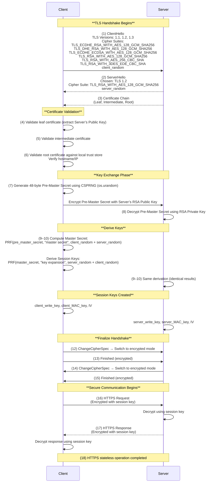

# **TLS 1.2 (RSA key exchange) handshake** flow 

### Prerequisite
Server to generate Key Pairs and Certificate

### DNS Lookup
Recursive DNS Lookup

### TCP Handshake
TCP Handshake SYN , SYN - ACK , ACK

### TLS Handshake

### Notes

* **Pre-master secret** is encrypted using the server’s **long-term RSA public key**.
* **Master secret** is derived using PRF (HMAC-based function).
* **Session keys** (client/server write keys, MAC keys, IVs) are derived separately.
* **ChangeCipherSpec** transitions both ends to encrypted mode.
* **Finished** messages confirm both sides derived identical keys.

