# **TLS 1.2 (RSA key exchange) handshake** flow 

### Prerequisite
Server to generate Key Pairs and Certificate

### DNS Lookup
Recursive DNS Lookup

### TCP Handshake
TCP Handshake SYN , SYN - ACK , ACK

### TLS Handshake

```mermaid
sequenceDiagram
    %% =============================
    %% TLS 1.2 HANDSHAKE (RSA MODE)
    %% =============================

    participant Client
    participant Server
    
    

    Note over Client,Server: **TLS Handshake Begins**

    Client->>Server: (1) ClientHello<br/>TLS Versions: 1.1, 1.2, 1.3<br/>Cipher Suites:<br/>TLS_ECDHE_RSA_WITH_AES_128_GCM_SHA256<br/>TLS_DHE_RSA_WITH_AES_128_GCM_SHA256<br/>TLS_ECDHE_ECDSA_WITH_AES_128_GCM_SHA256<br/>TLS_RSA_WITH_AES_128_GCM_SHA256<br/>TLS_RSA_WITH_AES_256_CBC_SHA<br/>TLS_RSA_WITH_3DES_EDE_CBC_SHA<br/>client_random
    Server-->>Client: (2) ServerHello<br/>Chosen: TLS 1.2<br/>Cipher Suite: TLS_RSA_WITH_AES_128_GCM_SHA256<br/>server_random
    Server-->>Client: (3) Certificate Chain<br/>(Leaf, Intermediate, Root)

    Note over Client: **Certificate Validation** RSA
    Client->>Client: (4) Validate leaf certificate (extract Server’s Public Key)
    Client->>Client: (5) Validate intermediate certificate
    Client->>Client: (6) Validate root certificate against local trust store<br/>Verify hostname/IP

    Note over Client,Server: **Key Exchange Phase** RSA

    Client->>Client: (7) Generate 48-byte Pre-Master Secret using CSPRNG (os.urandom)
    Client->>Server: Encrypt Pre-Master Secret with Server’s RSA Public Key
    Server->>Server: (8) Decrypt Pre-Master Secret using RSA Private Key

    Note over Client,Server: **Derive Keys** SHA256
    Client->>Client: (9–10) Compute Master Secret:<br/>PRF(pre_master_secret, "master secret", client_random + server_random)
    Client->>Client: Derive Session Keys:<br/>PRF(master_secret, "key expansion", server_random + client_random)
    Server->>Server: (9–10) Same derivation (identical results)

    Note over Client,Server: **Session Keys Created**
    Client->>Client: client_write_key, client_MAC_key, IV
    Server->>Server: server_write_key, server_MAC_key, IV

    Note over Client,Server: **Finalize Handshake**
    Client->>Server: (12) ChangeCipherSpec → Switch to encrypted mode
    Client->>Server: (13) Finished (encrypted)
    Server->>Client: (14) ChangeCipherSpec → Switch to encrypted mode
    Server->>Client: (15) Finished (encrypted)

    Note over Client,Server: **Secure Communication Begins** AES_128_GCM

    Client->>Server: (16) HTTPS Request<br/>(Encrypted with session key)
    Server->>Server: Decrypt using session key
    Server-->>Client: (17) HTTPS Response<br/>(Encrypted with session key)
    Client->>Client: Decrypt response using session key
    Client->>Client: Validate Data integrity GCM (AES-GCM)
    Note over Client,Server: (18) HTTPS stateless operation completed
```

### Notes

* **Pre-master secret** is encrypted using the server’s **long-term RSA public key**.
* **Master secret** is derived using PRF (HMAC-based function).
* **Session keys** (client/server write keys, MAC keys, IVs) are derived separately.
* **ChangeCipherSpec** transitions both ends to encrypted mode.
* **Finished** messages confirm both sides derived identical keys.

### Cipher Suite Breakdown

| Component       | Meaning                                     | Used For                                                                                                                                              |
| --------------- | ------------------------------------------- | ----------------------------------------------------------------------------------------------------------------------------------------------------- |
| **TLS**         | Protocol layer                              | Defines handshake and record layer behavior                                                                                                           |
| **RSA**         | Key Exchange (and Authentication) Algorithm | Used in handshake to encrypt the pre-master secret and to verify the server’s identity                                                                |
| **AES_128_GCM** | Bulk Encryption Algorithm                   | Used after handshake to encrypt/decrypt actual HTTPS data                                                                                             |
| **SHA256**      | Hash / PRF Algorithm                        | Used in the pseudo-random function (PRF) for master/session key generation and message authentication (in GCM it’s implicit for AEAD tag computation) |

---

## 🔐 Where Each One Appears in the Flow

Here’s how it ties directly to your steps:

| Step                  | Stage                                 | Algorithm Used              | Description                                                                                                                            |
| --------------------- | ------------------------------------- | --------------------------- | -------------------------------------------------------------------------------------------------------------------------------------- |
| **0–3**               | Server setup and certificate exchange | **RSA (asymmetric)**        | The server’s **long-term RSA public/private key pair** is used for authentication (inside certificate).                                |
| **7**                 | ClientKeyExchange                     | **RSA (asymmetric)**        | The **pre-master secret** generated by the client is **encrypted using the server’s RSA public key** and sent to the server.           |
| **8**                 | Server decrypts pre-master            | **RSA (asymmetric)**        | Server uses **its RSA private key** to decrypt and recover the pre-master secret.                                                      |
| **9–10**              | Key Derivation                        | **SHA256 (hash)**           | TLS 1.2 uses a **PRF based on HMAC-SHA256** to generate the **master secret** and then the **session keys** from pre-master + randoms. |
| **11–13**             | Finished messages                     | **SHA256 (hash)**           | The Finished message includes a **verify_data hash** over all prior handshake messages computed using HMAC-SHA256.                     |
| **14–17**             | Application Data (HTTPS)              | **AES_128_GCM (symmetric)** | Once session keys are ready, all HTTPS payloads are **encrypted/decrypted using AES in GCM mode (128-bit key)**.                       |
| **14–17 (continued)** | Application Data Integrity            | **GCM (built-in auth tag)** | AES-GCM provides both **confidentiality and integrity**; no separate MAC key is needed (unlike CBC+HMAC).                              |

---

## 🔁 Putting It All Together

Here’s the simplified **mapping** of each cryptographic role in your handshake flow:

| Phase           | Algorithm         | Purpose                                                        |
| --------------- | ----------------- | -------------------------------------------------------------- |
| Authentication  | **RSA**           | Server proves identity (via certificate)                       |
| Key Exchange    | **RSA**           | Client encrypts pre-master secret with server’s RSA public key |
| Key Derivation  | **SHA256**        | Both sides derive master secret and session keys               |
| Data Encryption | **AES_128_GCM**   | Encrypt/decrypt HTTPS traffic using symmetric session key      |
| Data Integrity  | **GCM (AES-GCM)** | Ensures message authenticity and integrity via AEAD tag        |

---

## 🧠 Why Combine These

* **RSA**: Easy to implement, but no forward secrecy.
* **AES-128-GCM**: Efficient, modern, provides both encryption and authentication.
* **SHA-256**: Strong cryptographic hash, used for deterministic key derivation.

Together, they form a **complete security chain**:

1. RSA secures the handshake,
2. SHA-256 derives keys,
3. AES-128-GCM secures the data.

--- 

