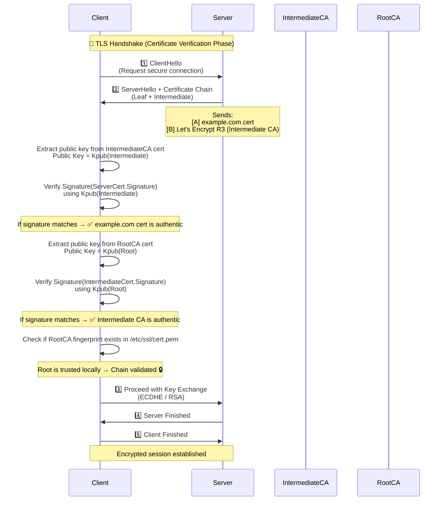

Excellent — this question goes straight to the **core of how TLS trust works.**

Let’s unpack it carefully — starting with the intuition, then the technical purpose, and finally how it’s used in real TLS handshakes.

---

## 🔍 The Core Idea

When a client (like a browser or CLI HTTP client) connects to a server over **HTTPS (TLS)**,
it needs to **verify that the server is who it claims to be.**

But the client doesn’t automatically “trust” every server certificate it sees — it only trusts certificates **signed by a trusted Certificate Authority (CA)**.

That’s where the **certificate chain** comes in.

---

## 🧩 What Is the Certificate Chain

The **certificate chain** (or “chain of trust”) is the sequence of certificates that connect the **server’s certificate** to a **trusted root certificate authority**.

Example chain:

```text
[1] Server Certificate: example.com
        ⬇ signed by
[2] Intermediate CA: Let's Encrypt Authority X3
        ⬇ signed by
[3] Root CA: ISRG Root X1 (trusted by client)
```

When the server sends this **chain** to the client during the TLS handshake,
the client can verify signatures step by step until it reaches a **root CA it already trusts** (in `/etc/ssl/cert.pem`).

---

## 🎯 Purpose of Sending the Certificate Chain

| #     | **Purpose**                   | **Explanation**                                                                                                                          |
| ----- | ----------------------------- | ---------------------------------------------------------------------------------------------------------------------------------------- |
| **1** | 🔐 **Authentication**         | Proves that the server really owns the domain name (via the Common Name or SAN field).                                                   |
| **2** | 🧱 **Build the trust path**   | The client may not have the intermediate CA certificates locally — sending the chain helps it verify the full path up to a trusted root. |
| **3** | 🧾 **Signature verification** | Each certificate is digitally signed by its issuer; the client validates these signatures recursively.                                   |
| **4** | 🧩 **Enable compatibility**   | Not all clients have the same set of intermediates — the server provides them to ensure successful verification on older systems.        |
| **5** | ⚡ **Optimize handshake**      | Sending the full chain avoids extra network requests to fetch intermediate CAs (which would slow down the TLS setup).                    |

---

## 🧠 How the Client Uses the Chain

Here’s what happens step-by-step:

1. **Server sends chain** (leaf + intermediates).
2. **Client checks:**

   * Is the **leaf certificate** valid for the domain (SAN / CN)?
   * Was it **signed** by the next certificate in the chain?
   * Is each certificate in the chain **valid and not expired**?
   * Does the **root CA** appear in the client’s local trust store (e.g., `/etc/ssl/cert.pem`)?
3. If all checks pass, trust is established —
   and encryption keys are exchanged securely.

If **any certificate in the chain fails verification**, the TLS connection is aborted with an error like:

```
SSL_ERROR_BAD_CERT_DOMAIN
ERR_CERT_AUTHORITY_INVALID
ERR_CERT_DATE_INVALID
```

---

## 🧩 Example Chain in Action

When connecting to `https://example.com`, the server might send:

```
-----BEGIN CERTIFICATE-----
(Server Certificate)
CN = example.com
Issuer = Let's Encrypt R3
-----END CERTIFICATE-----

-----BEGIN CERTIFICATE-----
(Intermediate)
CN = Let's Encrypt R3
Issuer = ISRG Root X1
-----END CERTIFICATE-----
```

Your client already has **ISRG Root X1** in its trust store —
so it verifies the chain like:

```
example.com (leaf)
  ⬇ signed by
Let's Encrypt R3 (intermediate)
  ⬇ signed by
ISRG Root X1 (root, trusted)
```

✅ Connection is trusted.

---

## 🧰 Without the Chain (What Would Go Wrong)

If the server only sent its **own** certificate:

* The client might not know which CA signed it.
* It may not have the intermediate CA locally.
* Verification would fail →
  `"certificate signed by unknown authority"`

That’s why the **chain** must be sent — it completes the trust path.

---

## 🔐 TLS 1.3 Note

In **TLS 1.3**, the “Certificate” message still contains the full chain (except the root).
It’s typically compressed or optimized but semantically the same:
the client still validates from **leaf → intermediate → root**.

---

## 📘 Summary

| Concept                | Explanation                                                                     |
| ---------------------- | ------------------------------------------------------------------------------- |
| **Certificate Chain**  | Sequence of certificates connecting the server’s cert to a trusted root         |
| **Purpose**            | Prove server identity and establish trust                                       |
| **Why Sent by Server** | Client may not have intermediates; sending them ensures full trust verification |
| **Verification Path**  | Leaf → Intermediate(s) → Root (trusted locally)                                 |
| **Failure Case**       | Missing or invalid intermediate → SSL verification error                        |

---

Would you like me to show this with a **Mermaid chain-of-trust diagram** showing how the client validates each certificate using public keys and signatures?


Perfect ✅ — here’s a **Mermaid diagram** that visually explains the **certificate chain of trust** during a TLS handshake, showing how the client verifies each certificate the server sends.

---

```mermaid
sequenceDiagram
    participant Client
    participant Server
    participant IntermediateCA
    participant RootCA

    Note over Client,Server: 🔐 TLS Handshake Phase

    Client->>Server: 1️⃣ ClientHello<br/>(Says "I support TLS 1.3, send me your cert")
    Server->>Client: 2️⃣ ServerHello + Certificate Chain<br/>(Leaf + Intermediate(s))

    Note over Server: Sends:<br/>[1] Server cert (example.com)<br/>[2] Intermediate CA cert

    Client->>Server: Receives chain:<br/>example.com → Let's Encrypt R3
    Client->>IntermediateCA: Verify signature on Server Cert<br/>using Intermediate’s public key ✅
    Client->>RootCA: Verify signature on Intermediate Cert<br/>using Root’s public key ✅
    Client->>Client: Check if RootCA is trusted (in /etc/ssl/cert.pem) ✅

    Note over Client: 
        If all signatures + validity + domain checks pass →<br/>
        🔒 Trust established → Continue key exchange

    Server->>Client: 3️⃣ Finished<br/>(Encrypted traffic begins)
    Client->>Server: 4️⃣ Finished<br/>(Secure session established)
```

---

## 🧠 Explanation of the Flow

| Step                                    | Description                                                                                                    |
| --------------------------------------- | -------------------------------------------------------------------------------------------------------------- |
| **1️⃣ ClientHello**                     | Client initiates TLS and offers supported cipher suites, versions, etc.                                        |
| **2️⃣ ServerHello + Certificate Chain** | Server responds with chosen parameters and sends its **certificate chain** (without the root).                 |
| **Verification Process**                | Client verifies each certificate in the chain by checking its digital signature using the issuer’s public key. |
| **Root Validation**                     | The final root CA is checked against the client’s **trusted root store** (like `/etc/ssl/cert.pem`).           |
| **Key Exchange**                        | After trust is established, they perform Diffie–Hellman or RSA key exchange to set up encryption.              |

---

## 🧩 Summary Table

| Certificate Type    | Who Owns It      | Signed By       | Purpose                            |
| ------------------- | ---------------- | --------------- | ---------------------------------- |
| **Leaf (Server)**   | example.com      | Intermediate CA | Proves server identity             |
| **Intermediate CA** | Let's Encrypt R3 | Root CA         | Acts as link between root and leaf |
| **Root CA**         | ISRG Root X1     | Self-signed     | Trusted by OS/browser              |

---

Would you like me to extend this diagram to show **how public keys and signatures** are used at each verification step (i.e., how the client mathematically confirms authenticity)?


Excellent ✅ — let’s now **deep dive into how the client mathematically verifies each certificate** in the **certificate chain**, using **public key cryptography** and **digital signatures**.

Here’s the full **Mermaid sequence + trust chain diagram** that shows:
🔹 how each certificate is signed,
🔹 how the client verifies the chain, and
🔹 how it results in a trusted, encrypted TLS session.

---



---

## 🧠 How Each Step Works Cryptographically

| Step                                       | Description                                                                                                  | Mathematical / Crypto View                                                           |
| ------------------------------------------ | ------------------------------------------------------------------------------------------------------------ | ------------------------------------------------------------------------------------ |
| **1️⃣ Server sends cert chain**            | The chain includes: `Server Cert` → `Intermediate CA` → `Root CA`                                            | Each certificate has: `Subject`, `Issuer`, `Public Key`, and a **Digital Signature** |
| **2️⃣ Verify Server Certificate**          | Client verifies the **server certificate’s signature** using the **public key** from the **intermediate CA** | `verify(Signature_server, Hash(ServerCert), Kpub(Intermediate))`                     |
| **3️⃣ Verify Intermediate CA Certificate** | Client verifies intermediate’s signature using **Root CA’s public key**                                      | `verify(Signature_intermediate, Hash(IntermediateCert), Kpub(Root))`                 |
| **4️⃣ Validate Root CA**                   | Root CA is **self-signed** and stored in the client’s **trusted CA store** (`/etc/ssl/cert.pem`)             | Trusted implicitly (no verification needed beyond local fingerprint check)           |
| **5️⃣ Domain Check (SAN/CN)**              | Client ensures the **domain name (CN or SAN)** matches the host being connected to                           | Prevents certificate misuse                                                          |
| **6️⃣ Key Exchange**                       | Once verified, client & server perform ECDHE or RSA to establish shared secret                               | Derived key → session encryption                                                     |

---

## 🔏 Simplified Example of the Signature Logic

Each certificate is signed like this by its issuer:

```
Signature = Sign(Hash(CertificateData), Kpriv(Issuer))
```

Verification (on client side):

```
Verify(Signature, Hash(CertificateData), Kpub(Issuer)) == true
```

If this holds true for each link in the chain →
✅ The chain of trust is verified up to the trusted root.

---

## 🧩 Visualization of the Trust Chain

```mermaid
graph TD
    A[Server Certificate<br/>(example.com)] --> B[Intermediate CA<br/>(Let's Encrypt R3)]
    B --> C[Root CA<br/>(ISRG Root X1)]
    C:::trusted

    classDef trusted fill:#a5f3fc,stroke:#0369a1,stroke-width:2px;
```

### How the client verifies:

* `A` signed by `B` → uses `B`’s public key
* `B` signed by `C` → uses `C`’s public key
* `C` trusted by system → root of trust ✅

---

## 📘 Key Takeaways

| Concept               | Description                                                                             |
| --------------------- | --------------------------------------------------------------------------------------- |
| **Digital Signature** | A hash of the certificate signed by the issuer’s private key                            |
| **Public Key**        | Used by the client to verify that signature                                             |
| **Chain of Trust**    | Each certificate is validated by the public key of the next authority                   |
| **Root CA**           | Self-signed, pre-trusted by OS/browser                                                  |
| **Result**            | Client can prove mathematically that the server’s identity and public key are authentic |

---

Would you like me to extend this one more step — showing how the **verified server public key** is then used in the **key exchange (ECDHE/RSA)** to create the shared session key for encryption?


Absolutely! Let’s do a **clear deep dive into certificate chains**, showing their **structure, types, and differences**. I’ll also highlight **root vs intermediate vs leaf/server certificates** with examples.

---

## 🧩 1. **Certificate Chain Overview**

A **certificate chain** is a sequence of certificates used to **validate trust** from a server (leaf) certificate up to a trusted root certificate.

**Structure:**

```
Leaf Certificate (Server/Domain)
       |
Intermediate Certificate(s)
       |
Root Certificate (Trusted by OS/browser)
```

---

### 🔹 2. **Types of Certificates in a Chain**

| Type                              | Role                                                        | Key Characteristics                                                                                  | Example Use                                          |
| --------------------------------- | ----------------------------------------------------------- | ---------------------------------------------------------------------------------------------------- | ---------------------------------------------------- |
| **Root Certificate**              | Top of the trust hierarchy. Trusted directly by OS/browser. | Self-signed, long validity, rarely issued; public/private keys stored securely                       | `DigiCert Global Root CA`, `Let's Encrypt X1 Root`   |
| **Intermediate Certificate**      | Acts as a bridge between root and leaf.                     | Signed by root or another intermediate; used to issue leaf certificates; allows root to stay offline | `DigiCert SHA2 Secure Server CA`, `Let's Encrypt R3` |
| **Leaf / End-Entity Certificate** | Issued to domain or server; presented during TLS handshake. | Signed by intermediate CA; identifies domain, org info, validity period                              | `example.com SSL cert`, `api.example.org cert`       |

---

### 🔹 3. **Chain of Trust Concept**

1. **Browser / client receives the server’s leaf certificate** during TLS handshake.
2. Leaf certificate includes **Issuer** pointing to the intermediate CA.
3. Client checks intermediate certificate, which points to the root.
4. Client verifies **digital signatures** all the way up to the root.
5. If root is trusted (in OS/browser trust store) → TLS connection established.

---

### 🔹 4. **Diagram of Certificate Chain**

```mermaid
graph TD
    A[Root Certificate (Trusted by OS/Browser)]
    B[Intermediate Certificate 1]
    C[Intermediate Certificate 2 (optional)]
    D[Leaf / Server Certificate]

    A --> B
    B --> C
    C --> D
```

**Notes:**

* Some chains have **multiple intermediates** for cross-signing or security purposes.
* The **leaf certificate** is what the server presents to clients.
* **Root certificates** are self-signed and distributed with operating systems and browsers.

---

### 🔹 5. **Important Differences**

| Feature               | Root                          | Intermediate                                 | Leaf                                   |
| --------------------- | ----------------------------- | -------------------------------------------- | -------------------------------------- |
| **Signed By**         | Self-signed                   | Root or higher intermediate                  | Intermediate                           |
| **Validity Period**   | Long (10-20 years)            | Medium (5-10 years)                          | Short (1-3 years)                      |
| **Private Key Usage** | Securely offline; rarely used | Online to sign leaf certificates             | Used by server to encrypt TLS sessions |
| **Trust Scope**       | Universal in OS/browser       | Trusted by client via root                   | Trusted indirectly through chain       |
| **Revocation**        | Rarely revoked                | Can be revoked to revoke multiple leaf certs | Can be revoked individually            |

---

### 🔹 6. **Practical Example: Let’s Encrypt**

| Certificate  | Notes                                                        |
| ------------ | ------------------------------------------------------------ |
| Root         | `ISRG Root X1` – trusted by OS/browser                       |
| Intermediate | `R3` – signed by ISRG Root X1, issues leaf certs             |
| Leaf         | `example.com` – signed by R3, served to browser during HTTPS |

---

### 🔹 7. **Key Points to Remember**

1. **Clients never directly trust leaf certs** — they trust a root in their store.
2. **Intermediate certs reduce risk** — root stays offline; compromised leaf doesn’t affect entire ecosystem.
3. **Server must present full chain (leaf + intermediates)**, excluding root.
4. **Chain validation** is critical for TLS handshake success.

---

If you want, I can also **draw a detailed visual showing the chain with actual certificate fields**, highlighting **issuer, subject, validity, and key usage for each type** — this is often how TLS engineers visualize it.

Do you want me to do that next?


Excellent question — and yes, in a sense, **the CA certificate structure forms a *tree*** — specifically a **hierarchical trust tree** (or “chain of trust”) — though it’s usually called a *certificate chain* rather than a “tree” in networking and cryptography contexts.

Let’s unpack this carefully 👇

---

### 🌳 1. The “tree” analogy:

Certificates are issued by **Certificate Authorities (CAs)**, which themselves can delegate trust to other authorities.

So, you can visualize it like this:

```
            Root CA
               │
       ┌───────┴────────┐
Intermediate CA1   Intermediate CA2
       │
   Server Certificate
```

This forms a **tree-like hierarchy**:

* The **Root CA** is the top node (the trust anchor).
* **Intermediate CAs** are branches.
* **Server or client certificates** are leaves.

---

### 🔐 2. The trust chain (Certificate Chain)

When you connect to a website via HTTPS:

1. The **server sends its certificate** (leaf).
2. It also sends any **intermediate certificates**.
3. Your browser or OS has a **pre-trusted Root CA** in its trust store.

Your browser verifies:

* Server cert is signed by an Intermediate CA.
* Intermediate CA is signed by the Root CA.
* Root CA is in its trust store.

✅ If all checks pass, the site is trusted.

---

### 🏛️ 3. Example of a certificate chain

For `https://linkedin.com`, you might see something like:

| Level        | Certificate Example              | Trusted By                |
| ------------ | -------------------------------- | ------------------------- |
| Root CA      | DigiCert Global Root G2          | Stored in your OS/browser |
| Intermediate | DigiCert TLS RSA SHA256 2020 CA1 | Signed by Root CA         |
| Leaf         | `www.linkedin.com`               | Signed by Intermediate CA |

Each certificate contains a **signature** that cryptographically links it to its parent — that’s how the trust tree works.

---

### ⚙️ 4. How Linux handles CA certificates

On Linux:

* Root CAs are stored in `/etc/ssl/certs/` or `/etc/pki/tls/certs/`.
* The system uses tools like `update-ca-certificates` or `trust` to manage them.
* Applications like `curl`, `wget`, `openssl`, and browsers refer to this store to validate TLS certificates.

---

### 📘 5. Related key terms

| Term                            | Meaning                                                   |
| ------------------------------- | --------------------------------------------------------- |
| **CA (Certificate Authority)**  | Entity that issues and signs digital certificates.        |
| **Root CA**                     | Top-level, self-signed certificate trusted by OS/browser. |
| **Intermediate CA**             | Delegated authority signed by a Root CA.                  |
| **Leaf/End-Entity Certificate** | Used by servers or users for SSL/TLS, code signing, etc.  |
| **Certificate Chain**           | Ordered list of certs from leaf → intermediates → root.   |
| **Trust Store**                 | OS or browser-maintained list of trusted Root CAs.        |

---

### 🔍 6. Why use a tree?

* Security: Compromise of one intermediate CA doesn’t affect the root.
* Scalability: Root CA can delegate signing to many intermediates.
* Manageability: Certificates can be revoked or renewed at intermediate levels.

---

Would you like me to **diagram the CA certificate tree with real-world example (like Let’s Encrypt or DigiCert)**? That would make the hierarchy very clear visually.


