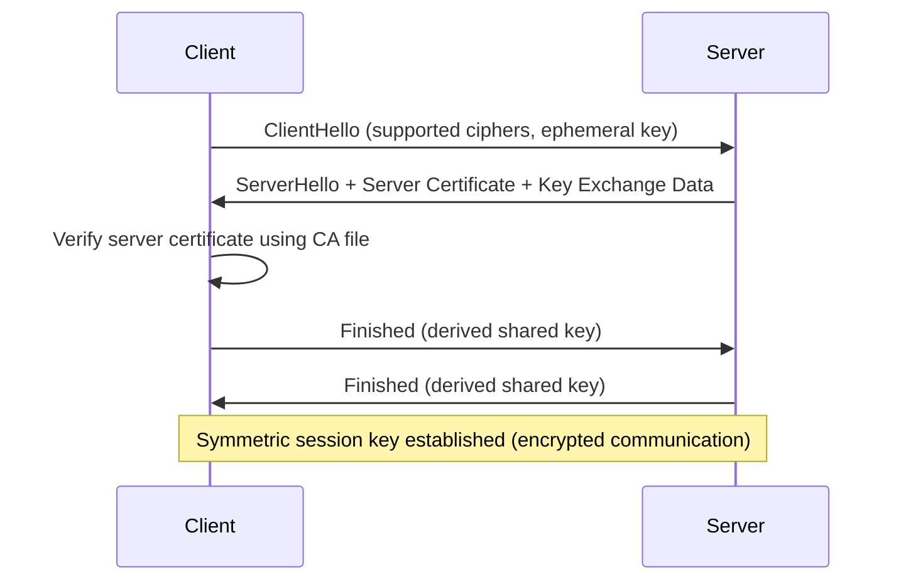

Perfect question — this goes to the **core of HTTPS/TLS security**. Let’s break it down step by step.

---

## 🔑 **Role of CA file in TLS Key Exchange**

When a client connects to a server over **HTTPS/TLS**, the client needs to **trust the server’s public key** to establish a secure connection. The **CA file helps the client verify that trust**.

---

### 1️⃣ **TLS Handshake Overview (Simplified)**

---

### 2️⃣ **Step-by-Step: How CA file is used**

1. **Server Sends Certificate**

   * Contains server’s public key (e.g., for RSA, or ECDHE parameters)
   * Signed by a Certificate Authority (CA)

2. **Client Verifies Certificate Using CA file**

   * CA file contains **trusted root CA certificates**
   * Client checks:

     * Is the server’s certificate signed by a trusted CA in the CA file?
     * Does the certificate chain lead to a root CA in the CA file?
     * Is the certificate valid (dates, hostname match)?

3. **Trust Established**

   * If certificate is valid, the client **accepts the server’s public key**
   * Otherwise, the connection is aborted (untrusted)

4. **TLS Key Exchange**

   * Depending on the cipher suite (e.g., **ECDHE**):

     * Client and server exchange ephemeral keys
     * Use server’s public key (verified via CA file) to prevent **MITM attacks**
   * Both derive the same **shared symmetric session key**
   * Further communication is encrypted

---

### 3️⃣ **Why CA file is critical**

| Problem without CA file               | Risk                                         |
| ------------------------------------- | -------------------------------------------- |
| Client accepts any server certificate | Vulnerable to **man-in-the-middle attacks**  |
| Shared key could be intercepted       | Encrypted communication can be **broken**    |
| Cannot trust server identity          | Sensitive data (passwords, payments) exposed |

---

### 4️⃣ **Example: ECDHE with CA Verification**

1. **Server has ephemeral ECDHE key**
2. **Server signs ephemeral public key with certificate**
3. **Client checks signature against CA file**
4. If valid → proceeds to compute shared secret (`ECDHE`)
5. If invalid → handshake fails

> ✅ The CA file **does not participate in key derivation**, but it **authenticates the public key** used in the key exchange.

---

### 5️⃣ **Analogy**

* **ECDHE key exchange** = exchanging a secret padlock key to lock your messages
* **CA file** = verifying that the padlock belongs to the trusted party, not an attacker
* Without the CA file, an attacker could give you a fake padlock → compromise your session

---

### 6️⃣ **Summary**

| Step                            | Role of CA file                                      |
| ------------------------------- | ---------------------------------------------------- |
| Server certificate verification | Confirms server identity                             |
| Prevent MITM attacks            | Ensures ephemeral keys are authentic                 |
| Trust in key exchange           | Only verified public keys are used for TLS handshake |
| Secure symmetric key derivation | Shared session key is only computed with trusted key |

---

If you want, I can **draw a diagram showing TLS 1.3 handshake with ECDHE + CA file verification**, highlighting exactly **where the CA file is used in the key exchange process**.

Do you want me to do that?
