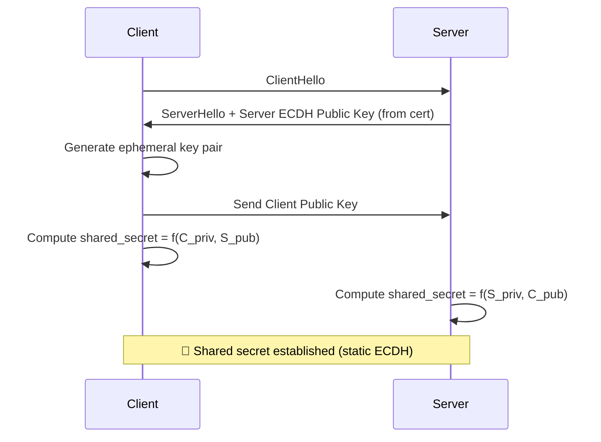
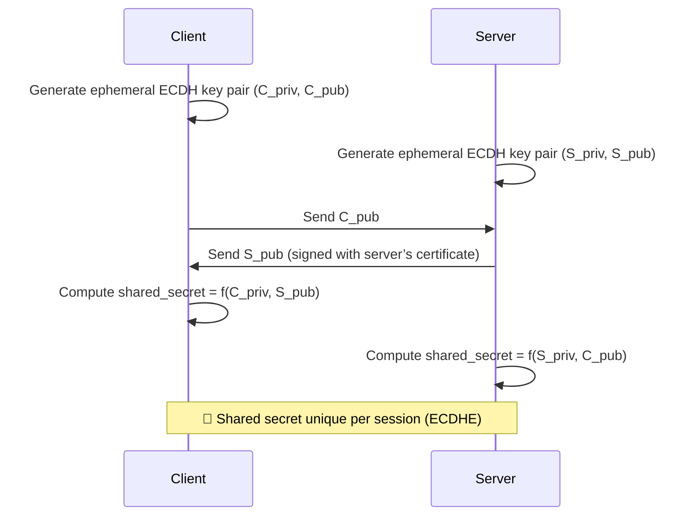
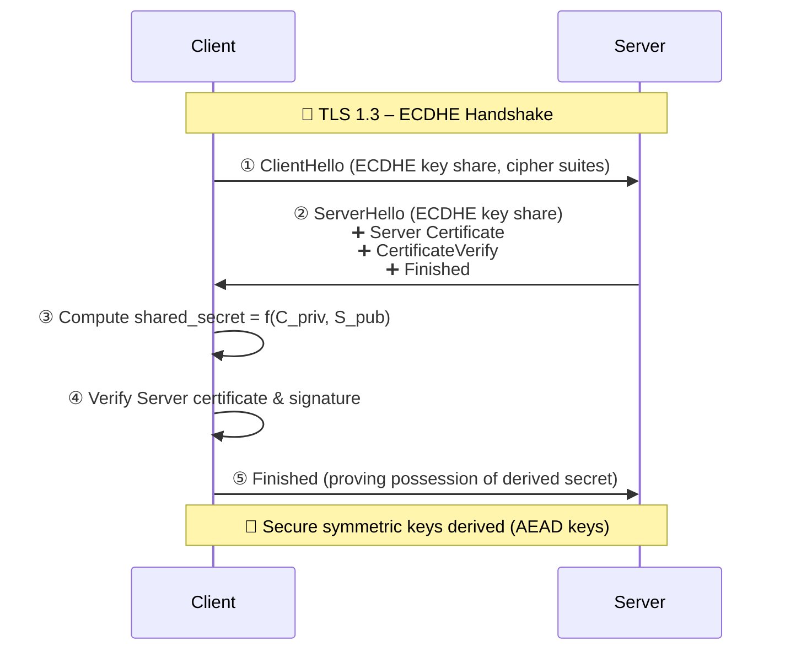

Excellent — this is one of the most crucial distinctions in modern cryptography and TLS design.

Let’s go step by step 👇

---

## 🧩 **ECDH vs ECDHE — the Core Difference**

Both are **Elliptic Curve Diffie-Hellman (ECDH)** methods, meaning they use elliptic curve math to create a **shared secret** between two parties (client & server).

The **difference** lies in **key lifespan and security properties**:

| Feature         | **ECDH (Static)**                                      | **ECDHE (Ephemeral)**                                    |
| --------------- | ------------------------------------------------------ | -------------------------------------------------------- |
| Key type        | **Static** — long-term key pair (stored on the server) | **Ephemeral** — new key pair generated for every session |
| Forward secrecy | ❌ No (compromise of server key exposes past sessions)  | ✅ Yes (each session has a unique key)                    |
| Performance     | Slightly faster (no need to generate keys every time)  | Slightly slower (new key generated per connection)       |
| Used in         | Older TLS 1.0–1.2 configurations                       | Default and mandatory in TLS 1.3                         |
| Key reuse       | Reused across all sessions                             | Used once per handshake                                  |
| Security level  | Lower                                                  | Higher                                                   |

---

## ⚙️ **1. How ECDH (Static) Works**

In **static ECDH**, the server has a **long-term** elliptic curve key pair (same one used in its certificate).

* The server’s **private key never changes**
* If that key is ever compromised, **all previous session secrets can be recovered**

⚠️ **No forward secrecy**

---

## ⚙️ **2. How ECDHE (Ephemeral) Works**

In **ECDHE**, both sides generate **temporary key pairs** for each handshake.

✅ Each connection gets a **unique session key**.
✅ Even if the server’s private key is stolen later, **past sessions remain safe** (forward secrecy).
✅ Server signs its ephemeral public key with its certificate to **prove identity**.

---

## 🧠 **3. Mathematical Basis (Simplified)**

Both rely on:
[
K = (P_{other})^{d_{self}} \mod \text{curve parameters}
]

* ( P_{other} ) = other party’s public key
* ( d_{self} ) = your private key
* Both sides compute the same ( K ) (shared secret)

The only difference is **whether those keys are reused (static)** or **freshly generated each time (ephemeral)**.

---

## 🔐 **4. Why ECDHE Is Preferred**

| Security Property          | ECDH Static                      | ECDHE Ephemeral                     |
| -------------------------- | -------------------------------- | ----------------------------------- |
| **Forward secrecy**        | ❌                                | ✅                                   |
| **Session uniqueness**     | ❌                                | ✅                                   |
| **Server identity proven** | ✅ (certificate)                  | ✅ (certificate signs ephemeral key) |
| **Key compromise impact**  | High (past sessions recoverable) | Low (only current session affected) |
| **Standard TLS 1.3**       | ❌ Removed                        | ✅ Mandatory                         |

---

## 🌍 **5. Real-World Use**

* **ECDH (static):** Rare today — used in some older embedded systems or TLS 1.2 configurations.
* **ECDHE:** Default in all modern systems (TLS 1.2+, TLS 1.3, HTTPS, SSH, QUIC).

In TLS 1.3:

* Every handshake uses **ephemeral ECDHE**.
* No static RSA or static ECDH key exchanges are allowed.

---

## 💡 **Quick Analogy**

| Concept               | Analogy                                                                                             |
| --------------------- | --------------------------------------------------------------------------------------------------- |
| **ECDH (Static)**     | Using one padlock for every message you send — if someone gets the key, they can unlock everything. |
| **ECDHE (Ephemeral)** | Using a new padlock and key for every message — even if one is stolen, the others remain safe.      |

---

✅ **In short:**

> * **ECDH:** Same keys every time → fast but not forward-secret
> * **ECDHE:** New keys every time → slightly slower but highly secure
> * **TLS 1.3:** Only uses **ECDHE** because security > speed

---

Would you like me to show **how ECDHE is integrated inside the full TLS 1.3 handshake (with certificate signing)** — so you can see how it achieves both authentication and forward secrecy?

Perfect 👏 — let’s walk through **ECDHE inside the TLS 1.3 handshake** to see how **authentication** and **forward secrecy** both happen.

---

## ⚙️ **TLS 1.3 Handshake Overview (with ECDHE)**

In TLS 1.3, the handshake is shorter, faster, and always uses **Ephemeral Diffie–Hellman (ECDHE)** for key exchange.

Here’s the simplified sequence 👇

---

## 🔍 **Detailed Step-by-Step Explanation**

### **① ClientHello**

* The **client** sends:

  * Supported cipher suites (e.g. `TLS_AES_128_GCM_SHA256`)
  * Supported groups (elliptic curves like `secp256r1`, `x25519`)
  * **Client’s ephemeral ECDHE public key**

So, the client already starts key exchange early (for speed).

---

### **② ServerHello**

* The **server**:

  * Picks a matching cipher suite and curve.
  * Generates its **own ephemeral ECDHE key pair**.
  * Sends its **public key** back in `ServerHello`.

At this point, both have the two public keys needed for the ECDHE operation.

---

### **③ Compute Shared Secret**

Both compute:

[
\text{shared_secret} = (P_{other})^{d_{self}} \pmod{\text{curve parameters}}
]

* Client: `S_pub ^ C_priv`
* Server: `C_pub ^ S_priv`

They now share a **common secret** that no eavesdropper can compute.

---

### **④ Authentication: Server Certificate & Signature**

To **prove identity**, the server:

1. Sends its **certificate** (signed by CA)
2. Sends a **CertificateVerify** message — a digital signature over the transcript (handshake messages) using its **private key from the certificate**

🔒 This ensures:

* The ephemeral public key **really belongs to the server in the certificate**
* Prevents MITM attacks (man-in-the-middle)

The client:

* Validates the certificate chain (Root → Intermediate → Server)
* Verifies the signature in `CertificateVerify`

✅ Now, the client *knows who the server is.*

---

### **⑤ Key Derivation**

Using HKDF (HMAC-based Key Derivation Function):

[
\text{traffic_key} = HKDF(\text{shared_secret}, \text{handshake_context})
]

This generates encryption keys for both directions:

* Client-to-Server key
* Server-to-Client key

---

### **⑥ Finished Messages**

* The server sends **Finished**, encrypted with the new key.
* The client sends **Finished** back, proving it computed the same shared secret.

After this, both sides use symmetric encryption (e.g. AES-GCM).

---

## 🔐 **Security Properties Achieved**

| Property            | Achieved By                     | Explanation                                 |
| ------------------- | ------------------------------- | ------------------------------------------- |
| **Confidentiality** | ECDHE + symmetric encryption    | Only client & server know the shared secret |
| **Authentication**  | Certificate + CertificateVerify | Ensures the server is genuine               |
| **Integrity**       | HMAC & AEAD ciphers             | Messages can’t be tampered with             |
| **Forward secrecy** | Ephemeral ECDHE keys            | New keys per session; past sessions safe    |

---

## 🧩 **ECDHE Inside TLS 1.3 Cipher Suites**

All TLS 1.3 cipher suites imply ECDHE by default.

| Cipher Suite                 | Key Exchange | AEAD Encryption   | Hash    |
| ---------------------------- | ------------ | ----------------- | ------- |
| TLS_AES_128_GCM_SHA256       | ECDHE        | AES-GCM 128-bit   | SHA-256 |
| TLS_AES_256_GCM_SHA384       | ECDHE        | AES-GCM 256-bit   | SHA-384 |
| TLS_CHACHA20_POLY1305_SHA256 | ECDHE        | ChaCha20-Poly1305 | SHA-256 |

No static RSA or static ECDH exists anymore in TLS 1.3.

---

## 🧠 **Visual Summary**

| Step                 | Purpose                               | Keys Used                      |
| -------------------- | ------------------------------------- | ------------------------------ |
| ClientHello          | Offer ciphers + send ephemeral pubkey | C_priv (temp)                  |
| ServerHello          | Choose cipher + send ephemeral pubkey | S_priv (temp)                  |
| Certificate + Verify | Authenticate server                   | Server’s long-term signing key |
| Key Derivation       | Create session keys                   | shared_secret                  |
| Finished             | Prove key possession                  | derived handshake key          |

---

## ✅ **Result**

After the handshake:

* Both have derived symmetric keys (AES/ChaCha)
* The session is authenticated
* Perfect forward secrecy is ensured
* Older vulnerabilities (like Heartbleed key reuse) have no impact on past traffic

---

Would you like me to draw a **Mermaid diagram showing all the cryptographic elements** (long-term cert keys + ephemeral keys + derived secrets) to make this visually clear?
