Great question again — RSA is one of the **foundations of modern public-key cryptography**. Let’s break it down clearly and intuitively.

---

## 🔐 What Is RSA?

**RSA (Rivest–Shamir–Adleman)** is an **asymmetric cryptographic algorithm** — meaning it uses **two different keys**:

* **Public key** → shared with everyone (used for encryption or signature verification)
* **Private key** → kept secret (used for decryption or signing)

---

## ⚙️ The Core Idea

RSA is based on the mathematical difficulty of **factoring very large numbers**.

If you multiply two large prime numbers together, it’s easy to compute the product.
But given only the product, finding those two primes again is extremely hard.

That’s what RSA exploits.

---

## 🧮 How RSA Works (Step by Step)

Let’s outline the basic math (simplified):

### **1. Choose two large prime numbers**

Say:

```
p = 61
q = 53
```

### **2. Compute n and φ(n):**

```
n = p * q = 61 * 53 = 3233
φ(n) = (p - 1)(q - 1) = 60 * 52 = 3120
```

`n` becomes part of both the public and private keys.

---

### **3. Choose a public exponent (e)**

Choose `e` such that:

```
1 < e < φ(n)
and gcd(e, φ(n)) = 1
```

Example:

```
e = 17
```

---

### **4. Compute the private exponent (d)**

Find `d` such that:

```
(e * d) % φ(n) = 1
```

Here:

```
d = 2753
```

---

### **5. Keys:**

| Key Type        | Value                |
| --------------- | -------------------- |
| **Public key**  | (e = 17, n = 3233)   |
| **Private key** | (d = 2753, n = 3233) |

---

## 🔒 How Encryption and Decryption Work

### **Encryption**

To encrypt a message `m` (as a number):

```
c = (m^e) mod n
```

Example:

```
m = 65
c = (65^17) mod 3233 = 2790
```

---

### **Decryption**

To decrypt:

```
m = (c^d) mod n
```

```
m = (2790^2753) mod 3233 = 65
```

✅ You get back your original message!

---

## 🧠 Why RSA Is Secure

Because even if someone knows your **public key** (n, e), they cannot easily find **d** without factoring `n` into its two primes (p and q).
Factoring very large numbers (2048-bit or more) is **computationally infeasible** with current technology.

---

## 📑 Common Uses of RSA

| Use Case               | Description                                             |
| ---------------------- | ------------------------------------------------------- |
| **Encryption**         | Encrypt data using public key, decrypt with private key |
| **Digital Signatures** | Sign data with private key, verify with public key      |
| **TLS/HTTPS**          | Used in establishing secure connections on the web      |
| **SSH Keys**           | Used in secure shell authentication                     |

---

## ⚖️ RSA vs ECC

| Feature        | RSA                             | ECC                                 |
| -------------- | ------------------------------- | ----------------------------------- |
| Security basis | Factoring large primes          | Elliptic curve discrete log problem |
| Key size       | Large (2048–4096 bits)          | Small (256–512 bits)                |
| Speed          | Slower                          | Faster                              |
| Common usage   | Older systems, TLS certificates | Modern mobile/IoT, Signal, etc.     |

---

## 🧩 Summary

| Step | Description                              |
| ---- | ---------------------------------------- |
| 1️⃣  | Choose two primes (p, q)                 |
| 2️⃣  | Compute n = p × q                        |
| 3️⃣  | Compute φ(n) = (p − 1)(q − 1)            |
| 4️⃣  | Pick e (public exponent)                 |
| 5️⃣  | Compute d (private exponent)             |
| 6️⃣  | Encrypt with (e, n), decrypt with (d, n) |

---

Would you like me to show a **diagram comparing RSA and ECC key exchange flows** (how the keys move between client and server)? It makes their difference visually clear.

Perfect 👍 Let’s visualize the **difference between RSA and ECC key exchange** using simple **Mermaid diagrams** and short explanations.

---

## 🔒 **1. RSA Key Exchange Flow**

RSA is based on **key transport** — the client generates a random session key, encrypts it using the server’s public key, and sends it over.


### ⚙️ **Process**

* **Server** has: Public/Private RSA key pair
* **Client** encrypts a symmetric key using **Server’s public key**
* **Server** decrypts it using **its private key**
* They both now use that symmetric key for fast AES communication

✅ Simple
⚠️ But not forward-secret (if RSA private key is stolen, past sessions can be decrypted).

---

## 🧮 **2. ECC (ECDHE) Key Exchange Flow**

ECC (often used as **ECDHE** — Elliptic Curve Diffie-Hellman Ephemeral) is based on **key agreement** — both sides contribute to generating the shared secret.

```mermaid
sequenceDiagram
    participant Client
    participant Server

    Client->>Client: Generate ECC key pair (C_priv, C_pub)
    Server->>Server: Generate ECC key pair (S_priv, S_pub)
    Client->>Server: Send C_pub
    Server->>Client: Send S_pub
    Client->>Client: Compute shared_secret = f(C_priv, S_pub)
    Server->>Server: Compute shared_secret = f(S_priv, C_pub)
    Note over Client,Server: 🔑 Both independently derive the same shared secret
```



### ⚙️ **Process**

* **Both** client and server generate temporary ECC key pairs
* They **exchange public keys**
* Each uses its **private key + the other’s public key** to compute the **same shared secret**
* No private key ever travels over the wire

✅ Forward-secret (old sessions stay secure even if keys are compromised)
✅ Faster and more secure per bit than RSA

---

## ⚖️ **RSA vs ECC Summary**

| Feature                     | RSA                       | ECC (ECDHE)                       |
| --------------------------- | ------------------------- | --------------------------------- |
| Type                        | Key Transport             | Key Agreement                     |
| Key Size (128-bit security) | 3072 bits                 | 256 bits                          |
| Speed                       | Slower                    | Faster                            |
| Forward Secrecy             | ❌ No                      | ✅ Yes                             |
| Common Usage                | Older TLS, legacy systems | Modern TLS 1.3, mobile, IoT       |
| Mathematical Problem        | Factoring large primes    | Elliptic Curve Discrete Logarithm |

---

✅ **In short:**

* **RSA** → "I encrypt a session key for you."
* **ECC (ECDHE)** → "We both create the same secret independently."

---

Would you like me to extend this with a diagram showing **how these fit into the full TLS 1.2 vs TLS 1.3 handshake** (with RSA vs ECDHE flows side by side)?
It makes the evolution of secure key exchange crystal clear.

