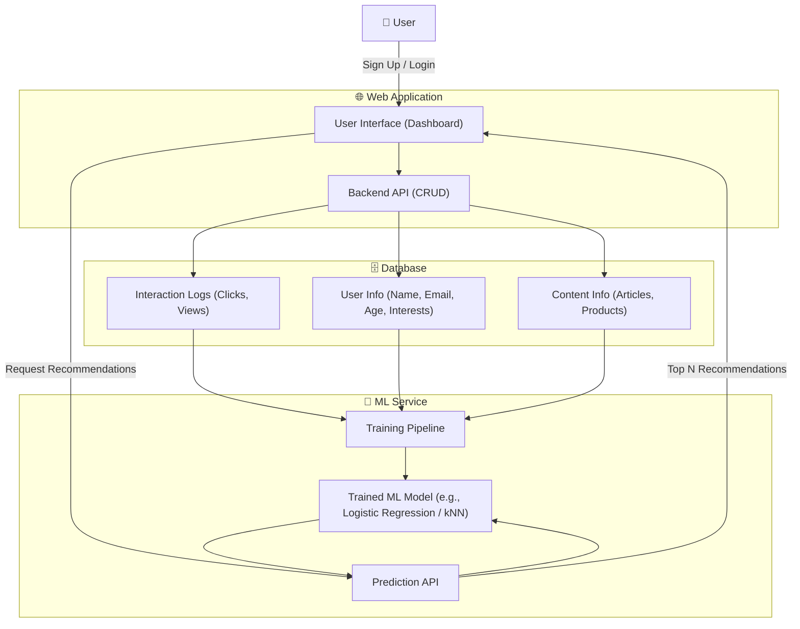

Got it 👍 Let’s keep this **simple and practical**. Imagine you are building a **web application** that stores user information (like name, email, age, preferences). At first, it’s just CRUD (Create, Read, Update, Delete). Now let’s add a **basic AI/ML use case**.

---

## 🖥️ Web App Use Case: User Profile & Personalization

### Scenario

* Users register and provide some basic info:

  * Name, email, age, gender, location, interests.
* The app stores this in a **database**.
* You want to **improve user experience** by showing *personalized content*.

---

## 🤖 Machine Learning Use Case: Content Recommendation

* The app could use ML to **recommend relevant articles, products, or tutorials** to users based on their profile.

### Step 1. Data

From your DB, you collect:

* User features: age, interests, location.
* Content features: category, tags, popularity.
* Interaction logs: which articles/products users clicked on.

### Step 2. Model

Use a simple ML model, e.g.:

* **Logistic Regression** → predict whether a user will click on an article.
* **k-Nearest Neighbors (kNN)** → recommend articles read by *similar* users.

### Step 3. Training

* Train on past interaction logs.
* Input = user info + content info.
* Output = “clicked” (1) or “not clicked” (0).

### Step 4. Inference in Web App

* When a user logs in, the app queries the ML model:
  “Given this user’s profile and current available articles, which ones are most likely to be clicked?”
* Show top 5 predictions.

---

## 🧩 Example Flow

1. **User signs up**: Alice (age 25, interested in “fitness, cooking”).
2. **System stores profile** in PostgreSQL / MongoDB.
3. **Model predicts** Alice is 90% likely to click “Healthy Recipes” article and 85% likely for “Home Workouts”.
4. **Web app displays** these at the top of her dashboard.

---

## 🔹 Other Simple ML Use Cases for User-Info Web App

* **Spam detection**: flag suspicious signups (ML classifier trained on past spam accounts).
* **Churn prediction**: predict which users may stop using the app (so you can send reminders).
* **Form auto-complete**: predict likely values (e.g., city name from zip code).
* **Anomaly detection**: detect unusual activity in user profiles (security).

---

✅ So the **very basic ML/AI use case**:
**Take stored user info → feed into a simple ML model → personalize content or detect anomalies → return results to the web app in real time.**

---

Do you want me to **draw a small system design diagram (mermaid)** for this flow (user info DB → ML model → personalized web app)?
Perfect 👍 Here’s a **Mermaid system design diagram** showing a simple web app that stores user info and uses ML for personalization:

---

📌 **Flow Explanation**:

1. User signs up / logs in → info stored in DB.
2. DB logs interactions (clicks, views).
3. ML service trains on historical data (user info + content + logs).
4. Web app calls ML inference API → gets recommendations.
5. User sees personalized dashboard.

---

Would you like me to **extend this diagram** to also show a **real-time anomaly detection (e.g., flagging suspicious signups)** alongside personalization?
