# Content Recommendation

Imagine you are building a **web application** that stores user information (like name, email, age, preferences). At first, it’s just CRUD (Create, Read, Update, Delete). 

### Web App Use Case: User Profile & Personalization

### Scenario

* Users register and provide some basic info:

  * Name, email, age, gender, location, interests.
* The app stores this in a **database**.
* You want to **improve user experience** by showing *personalized content*.

### Machine Learning Use Case: Content Recommendation

* The app could use ML to **recommend relevant articles, products, or tutorials** to users based on their profile.

### Step 1. Data

From your DB, you collect:

* User features: age, interests, location.
* Content features: category, tags, popularity.
* Interaction logs: which articles/products users clicked on.

### Step 2. Model

Use a simple ML model, e.g.:

* **Logistic Regression** → predict whether a user will click on an article.
* **k-Nearest Neighbors (kNN)** → recommend articles read by *similar* users.

### Step 3. Training

* Train on past interaction logs.
* Input = user info + content info.
* Output = “clicked” (1) or “not clicked” (0).

### Step 4. Inference in Web App

* When a user logs in, the app queries the ML model:
  “Given this user’s profile and current available articles, which ones are most likely to be clicked?”
* Show top 5 predictions.

### Example Flow

1. **User signs up**: Alice (age 25, interested in “fitness, cooking”).
2. **System stores profile** in PostgreSQL / MongoDB.
3. **Model predicts** Alice is 90% likely to click “Healthy Recipes” article and 85% likely for “Home Workouts”.
4. **Web app displays** these at the top of her dashboard.

### Using [TFIDF Vectorizer and Cosine Similarity](code.md)

### [Improve Accuracy](mproving_accuracy.md) Using [Matirx Factorization](improvement_of_accuracy_code.md)

As TF-IDF is content-based and ignores user behavior, we can use NMF → collaborative filtering, which leverages both user behavior and latent item features.
> Using NMF non negative matrix factorization

Loss Function

> NMF optimizes a reconstruction loss, typically Mean Squared Error (MSE) between the original user-item matrix and the predicted matrix:

The mean squared error (MSE) loss formula is: \(MSE=\frac{1}{n}\sum _{i=1}^{n}(y_{i}-\^{y}_{i})^{2}\). This formula calculates the average of the squared differences between the actual values (\(y_{i}\)) and the predicted values (\(\^{y}_{i}\)) for all \(n\) data points. 

> MinMaxScaler is a data preprocessing technique that scales features to a fixed range, typically \([0,1]\). It works by transforming the data using the formula: \(X_{scaled}=(X-X_{min})/(X_{max}-X_{min})\). This process is essential for machine learning algorithms that are sensitive to feature ranges, as it brings all features to a common scale

- Form user item matrix
- Apply NMF to get user and item matrix factors
- Perform Dot product and apply Min Max Scaler
- Return the Top K scores

> Precision@K is a metric used in recommender systems to measure the proportion of relevant items within the top \(K\) recommendations. To calculate it, you divide the number of relevant items found in the top \(K\) results by \(K\). This metric helps evaluate the accuracy of the most highly-ranked suggestions, as a higher score indicates that the top results are more likely to be relevant to the user.

Measuring the accuracy of the Top K Recommendations helps evaluating model performance

[More Details Code Examples and Deployment](orchestration.md)

### [Exponentail Decay](exponential_decay.md)

### Other Simple ML Use Cases for User-Info Web App

* **Spam detection**: flag suspicious signups (ML classifier trained on past spam accounts).
* **Churn prediction**: predict which users may stop using the app (so you can send reminders).
* **Form auto-complete**: predict likely values (e.g., city name from zip code).
* **Anomaly detection**: detect unusual activity in user profiles (security).

So the **very basic ML/AI use case**:
**Take stored user info → feed into a simple ML model → personalize content or detect anomalies → return results to the web app in real time.**

```mermaid
flowchart TD

subgraph WebApp["🌐 Web Application"]
    UI["User Interface (Dashboard)"]
    API["Backend API (CRUD)"]
end

subgraph DB["🗄️ Database"]
    UserTable["User Info (Name, Email, Age, Interests)"]
    Logs["Interaction Logs (Clicks, Views)"]
    Content["Content Info (Articles, Products)"]
end

subgraph ML["🤖 ML Service"]
    Train["Training Pipeline"]
    Model["Trained ML Model (e.g., Logistic Regression / kNN)"]
    Inference["Prediction API"]
end

User["👤 User"] -->|Sign Up / Login| UI
UI --> API
API --> UserTable
API --> Logs
API --> Content

Logs --> Train
UserTable --> Train
Content --> Train
Train --> Model

UI -->|Request Recommendations| Inference
Inference --> Model
Model --> Inference
Inference -->|Top N Recommendations| UI
```

 **Flow Explanation**:

1. User signs up / logs in → info stored in DB.
2. DB logs interactions (clicks, views).
3. ML service trains on historical data (user info + content + logs).
4. Web app calls ML inference API → gets recommendations.
5. User sees personalized dashboard.

Would you like me to **extend this diagram** to also show a **real-time anomaly detection (e.g., flagging suspicious signups)** alongside personalization?
