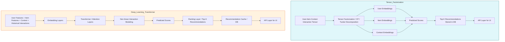

Sure! Here’s a **Mermaid diagram** comparing a **Tensor-Factorization-based recommender** vs a **Deep Learning + Transformer-based recommender** (Netflix-style).



---

### **Explanation**

#### **1. Tensor Factorization-based Recommender**

* Input: **User × Item × Context** tensor.
* Core: **Tensor factorization (CP, Tucker)** to learn latent embeddings.
* Output: Predicted scores → **Top-K recommendations** stored in DB.
* Advantage: Interpretable, lightweight, good for **moderate-scale data**.

#### **2. Deep Learning + Transformer-based Recommender**

* Input: **User features, item features, context, historical interactions**.
* Core: **Embeddings → Transformer/Attention layers → non-linear interactions**.
* Output: Predicted scores → **Top-K ranking**, stored in cache or DB for fast serving.
* Advantage: Handles **billions of users/items**, **multi-modal features**, and **sequential behaviors** (session-based).

---

If you want, I can also **merge this into a single production pipeline** diagram showing:

* **Data ingestion** → **Model training (tensor/DL)** → **Top-K generation** → **API serving**, so it’s more like **Netflix or Amazon architecture**.

Do you want me to do that next?


Sure! Let’s create a **simplified Deep Learning + Transformer-based recommender** in Python using PyTorch. This will model **user embeddings, item embeddings, and sequential behavior** (like session history) using a **Transformer Encoder**.

---

### **1. Install dependencies**

```bash
pip install torch
```

---

### **2. PyTorch Code**

```python
import torch
import torch.nn as nn
import torch.nn.functional as F

# -----------------------------
# Hyperparameters
# -----------------------------
num_users = 1000
num_items = 5000
embedding_dim = 64
max_seq_len = 20  # max length of user interaction history
num_heads = 4
num_transformer_layers = 2

# -----------------------------
# Model Definition
# -----------------------------
class TransformerRecommender(nn.Module):
    def __init__(self, num_users, num_items, embedding_dim, max_seq_len, num_heads, num_layers):
        super().__init__()
        # Embeddings
        self.user_emb = nn.Embedding(num_users, embedding_dim)
        self.item_emb = nn.Embedding(num_items, embedding_dim)
        
        # Positional Encoding for sequential item embeddings
        self.pos_emb = nn.Embedding(max_seq_len, embedding_dim)
        
        # Transformer Encoder
        encoder_layer = nn.TransformerEncoderLayer(d_model=embedding_dim, nhead=num_heads, batch_first=True)
        self.transformer = nn.TransformerEncoder(encoder_layer, num_layers=num_layers)
        
        # Output MLP
        self.output_layer = nn.Linear(embedding_dim*2, 1)  # user embedding + session summary
    
    def forward(self, user_ids, seq_item_ids, target_item_ids):
        # user embedding
        u = self.user_emb(user_ids)  # shape: [batch, embedding_dim]
        
        # sequential item embeddings
        seq_emb = self.item_emb(seq_item_ids)  # shape: [batch, seq_len, embedding_dim]
        positions = torch.arange(seq_item_ids.size(1), device=seq_item_ids.device)
        seq_emb += self.pos_emb(positions)  # add positional encoding
        
        # transformer encoding
        seq_summary = self.transformer(seq_emb)  # shape: [batch, seq_len, embedding_dim]
        seq_summary = seq_summary.mean(dim=1)  # aggregate sequence to single vector
        
        # target item embedding
        target_emb = self.item_emb(target_item_ids)
        
        # combine user + sequence summary + target item
        x = torch.cat([u + seq_summary, target_emb], dim=1)
        score = torch.sigmoid(self.output_layer(x))
        return score

# -----------------------------
# Example Usage
# -----------------------------
batch_size = 8
seq_len = 10

model = TransformerRecommender(num_users, num_items, embedding_dim, max_seq_len, num_heads, num_transformer_layers)

# Dummy input
user_ids = torch.randint(0, num_users, (batch_size,))
seq_item_ids = torch.randint(0, num_items, (batch_size, seq_len))
target_item_ids = torch.randint(0, num_items, (batch_size,))

# Forward pass
scores = model(user_ids, seq_item_ids, target_item_ids)
print(scores)
```

---

### **3. Explanation**

1. **User Embedding** → captures user-level latent features.
2. **Item Embedding** → captures item-level features.
3. **Sequential History** → Transformer encodes user’s past interactions to capture **temporal patterns**.
4. **Target Item** → concatenated with user + sequence embedding for **click/interaction prediction**.
5. **Output** → sigmoid score (0-1) → higher score = more likely to recommend.

---

### **4. Next Steps for Production**

* Replace random IDs with **real user IDs, item IDs, and sequences** from DB.
* Train with **binary labels** (click/no click) or ratings.
* Generate **Top-K recommendations** by scoring all candidate items per user.
* Cache top-K in **Redis or DB** for API serving.

---

If you want, I can **also provide a full training loop with BCE loss, Top-K evaluation metrics, and saving top-K recommendations to a database** to fully integrate this into your system.

Do you want me to do that next?
