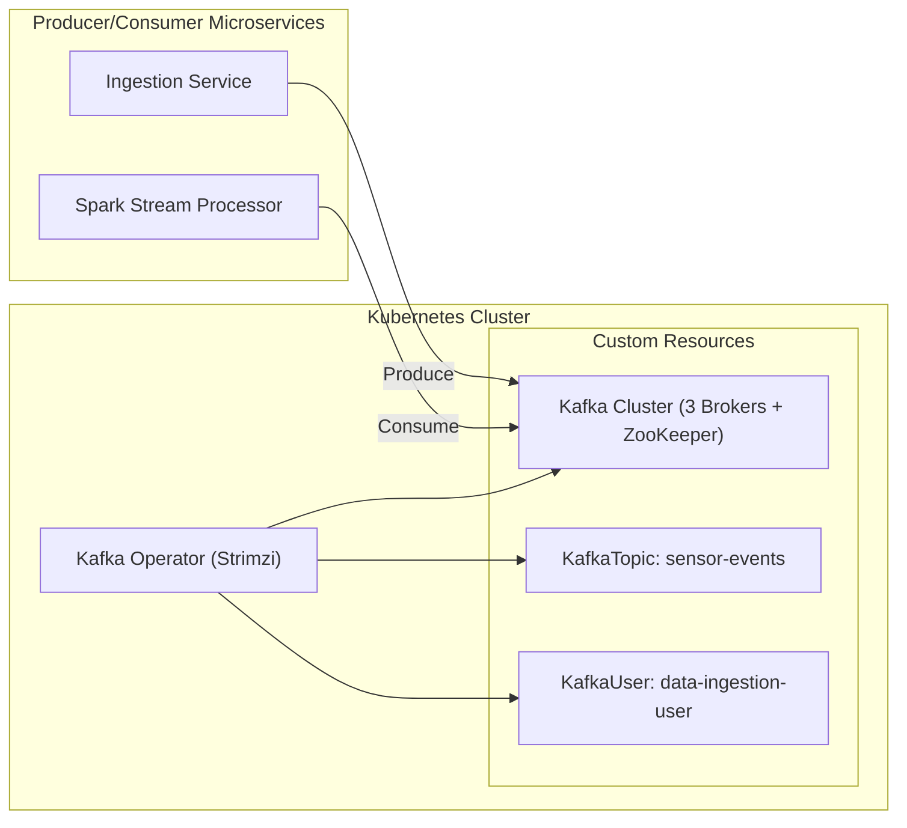

Excellent — this is an important and practical question.
Let’s go step-by-step 👇

---

## 🧠 **What Are Kafka Operators?**

A **Kubernetes Operator** is a controller that automates deployment, configuration, scaling, and management of complex applications (like Kafka) on Kubernetes.

For Kafka, the **Operator** handles:

* Cluster creation (brokers, ZooKeeper / KRaft)
* Topic and user management
* Configuration changes and rolling updates
* Persistent storage and scaling

---

## 🧰 **Popular Kafka Operators**

| Operator                        | Description                                                                        |
| ------------------------------- | ---------------------------------------------------------------------------------- |
| **Strimzi**                     | Open-source, most widely used Kafka Operator maintained by the CNCF community.     |
| **Confluent Operator**          | Enterprise-grade from Confluent, integrates with Schema Registry, Connect, KSQLDB. |
| **Banzai Cloud Kafka Operator** | Supports integrated monitoring and automatic scaling.                              |

---

## 🚀 **Deployment Overview (using Strimzi Operator)**

### **Step 1: Install the Strimzi Operator**

You install the Operator in your Kubernetes cluster — typically via Helm or kubectl.

```bash
kubectl create namespace kafka
kubectl apply -f https://strimzi.io/install/latest?namespace=kafka -n kafka
```

This deploys:

* The **Strimzi Operator Pod**
* CRDs (Custom Resource Definitions) for Kafka components:

  * `Kafka`
  * `KafkaTopic`
  * `KafkaUser`
  * `KafkaConnect`
  * `KafkaMirrorMaker`

---

### **Step 2: Create Kafka Cluster (Custom Resource)**

You define a **Kafka** CR (Custom Resource) YAML file:

```yaml
apiVersion: kafka.strimzi.io/v1beta2
kind: Kafka
metadata:
  name: my-kafka-cluster
  namespace: kafka
spec:
  kafka:
    replicas: 3
    listeners:
      - name: plain
        port: 9092
        type: internal
        tls: false
      - name: tls
        port: 9093
        type: internal
        tls: true
    storage:
      type: persistent-claim
      size: 100Gi
      deleteClaim: false
  zookeeper:
    replicas: 3
    storage:
      type: persistent-claim
      size: 20Gi
  entityOperator:
    topicOperator: {}
    userOperator: {}
```

Then apply it:

```bash
kubectl apply -f kafka-cluster.yaml -n kafka
```

The operator will:

* Spin up **3 Kafka broker pods**
* Create **3 ZooKeeper pods** (if not using KRaft mode)
* Set up **PersistentVolumes** for durability
* Expose Kafka via **ClusterIP / LoadBalancer services**

---

### **Step 3: Create Topics and Users**

You don’t use `kafka-topics.sh` manually.
Instead, you declare a **KafkaTopic** YAML:

```yaml
apiVersion: kafka.strimzi.io/v1beta2
kind: KafkaTopic
metadata:
  name: sensor-events
  labels:
    strimzi.io/cluster: my-kafka-cluster
spec:
  partitions: 6
  replicas: 3
  config:
    retention.ms: 604800000
```

And a **KafkaUser**:

```yaml
apiVersion: kafka.strimzi.io/v1beta2
kind: KafkaUser
metadata:
  name: data-ingestion-user
  labels:
    strimzi.io/cluster: my-kafka-cluster
spec:
  authentication:
    type: scram-sha-512
```

---

### **Step 4: Observe the Operator in Action**

Strimzi constantly **watches CRDs** and **reconciles** cluster state:

* If a broker crashes → it’s recreated.
* If you update storage or replica count → rolling update happens automatically.
* If you add topics or change retention → configuration is re-applied.

---

## 🧩 **High-Level Architecture Diagram**



---

## ⚙️ **Advantages of Using Operators**

| Without Operator          | With Operator                          |
| ------------------------- | -------------------------------------- |
| Manual pod management     | Automatic cluster lifecycle management |
| Manual rolling updates    | Seamless rolling upgrades              |
| Hard to scale brokers     | Declarative scaling in YAML            |
| Manual configuration sync | Continuous reconciliation              |
| No built-in monitoring    | Metrics exposed via Prometheus         |

---

## 🔒 **Optional Add-ons**

* **Schema Registry** (manage Avro/Protobuf schemas)
* **Kafka Connect** (data ingestion/sink)
* **Kafka MirrorMaker 2** (replication between clusters)
* **Prometheus + Grafana** (monitoring)
* **TLS / SCRAM / OIDC (Keycloak)** for security

---

Would you like me to show the **Helm-based deployment** of Strimzi next (with values.yaml), or the **KRaft (no ZooKeeper)** setup version that’s now becoming standard for Kafka 3.x+?
