Excellent question — the **Event Bus** is a key concept in this kind of data pipeline. Let’s break it down clearly 👇

---

## 🧩 **What Is an Event Bus?**

An **Event Bus** is a **communication backbone** that allows **microservices and systems** to exchange information in the form of **events** — asynchronously and decoupled.

In your described pipeline (with **gRPC, Kafka, Spark, S3, Redshift, PostgreSQL, and Kubernetes**), the **Event Bus** is typically implemented using **Apache Kafka**.

---

## 🧠 **Conceptual Role**

| Concept       | Description                                                                                                                   |
| ------------- | ----------------------------------------------------------------------------------------------------------------------------- |
| **Event Bus** | A message-passing layer that distributes data (events) from producers to consumers.                                           |
| **Producers** | Components (e.g., Edge Devices, Sensor Gateways, or Ingestion Services) that publish data/events to the bus.                  |
| **Consumers** | Services or data processors (e.g., Spark jobs, ETL processors, analytics microservices) that subscribe to topics on the bus.  |
| **Topics**    | Channels inside the bus where similar types of events are grouped — e.g., `sensor.raw`, `sensor.cleaned`, `analytics.alerts`. |

---

## ⚙️ **In Your Architecture**

Here’s how the **Event Bus (Kafka)** fits into your pipeline:

```mermaid
flowchart LR

subgraph Edge["🌐 Edge Layer"]
  A1["IoT Sensors"] --> A2["gRPC Gateway"]
end

subgraph Cloud["☁️ Cloud Layer (Kubernetes)"]
  A2 --> B1["Kafka Event Bus"]
  
  subgraph Microservices
    B2["Ingestion Service"] --> B1
    B3["Preprocessing Service"] --> B1
    B4["Alert Service"] --> B1
  end

  B1 --> C1["Spark Streaming Jobs"]
  C1 --> C2["Data Lake (S3 - Raw & Processed)"]
  C1 --> C3["PostgreSQL (Metadata, Time-Series)"]
  C1 --> C4["Redshift (Aggregated Analytics)"]
end

subgraph Analytics["📊 BI & ML Layer"]
  C4 --> D1["Dashboards / Reports"]
  C2 --> D2["ML Models (Lifespan Prediction)"]
end
```

---

## 🔄 **Data Flow Using Event Bus**

1. **Edge sensors** send telemetry via **gRPC** to the ingestion microservice.
2. The **Ingestion Service** publishes sensor readings to Kafka topics (`wind.turbine.raw`).
3. **Stream processors (Spark Streaming / Kafka Streams)** consume those topics:

   * Clean / aggregate / enrich the data
   * Write to **S3** (data lake) and **PostgreSQL** (for operational data)
4. Batch ETL jobs later pull from S3 → Redshift for analytics dashboards.
5. Microservices subscribe to processed topics for **alerts**, **maintenance triggers**, or **ML model input**.

---

## 💡 **Why Use Event Bus Instead of Direct Calls?**

| Problem Without Event Bus                    | How Event Bus (Kafka) Helps                                                                   |
| -------------------------------------------- | --------------------------------------------------------------------------------------------- |
| Tight coupling between producer and consumer | Asynchronous decoupling via publish/subscribe                                                 |
| Difficult to scale with growing data volume  | Kafka partitions enable massive parallelism                                                   |
| Hard to handle backpressure                  | Kafka provides durable queues and replayability                                               |
| Data loss on service crash                   | Kafka persists events for configured retention periods                                        |
| Limited integration                          | Multiple consumers can read the same data stream independently (e.g., analytics + monitoring) |

---

In short —
👉 The **Event Bus = Kafka**, and it’s the **central nervous system** of your entire data pipeline.
It allows microservices, edge systems, and analytics components to communicate **reliably, asynchronously, and at scale**.

---

Would you like me to extend this design with **event schema evolution (using Avro or Protobuf)** and **Kafka topic partitioning strategy** next? That’s typically the next architectural concern in real-time pipelines.
