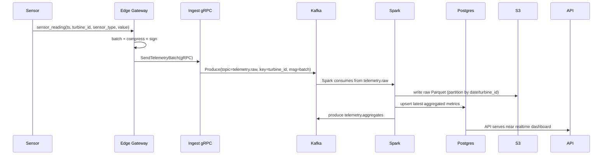

Great — below is a production-ready architecture for a **wind-turbine style edge → cloud data pipeline** (no vendor names). It uses **gRPC at the edge**, **Kafka** as the event bus, **Spark Structured Streaming** for real-time processing, **S3** as the data lake, **Redshift** as the data warehouse, **Postgres** for transactional metadata/time-series, and **Kubernetes** microservices for data/file processing. I include high-level and low-level diagrams (Mermaid), sequence flows, schema examples, Kafka/Spark/Redshift integration notes, scaling & ops guidance, and security/observability recommendations.

---

# Architecture (high level)

```mermaid
flowchart LR
  subgraph Edge["Edge (Turbine Site)"]
    SENSORS[Sensor Arrays]
    EDGE_GW[Edge Gateway (gRPC Agent)]
    SENSORS --> EDGE_GW
  end

  EDGE_GW -->|gRPC (secure)| INGEST[Ingest Gateway (K8s)]
  INGEST -->|Produce| KAFKA[Kafka Cluster (K8s / Managed)]
  subgraph Streaming["Real-time Streaming & Processing"]
    KAFKA --> SPARK[Spark Structured Streaming (K8s/Spark Operator)]
    SPARK --> METRICS_DB[(Postgres - short-term timeseries)]
    SPARK --> S3_RAW[S3 Raw Bucket]
    SPARK --> S3_ENR[S3 Enriched / Parquet]
    SPARK -->|publish| KAFKA_AGG[Kafka Topics (aggregates)]
  end

  subgraph Storage["Storage & Analytics"]
    S3_RAW --> REDSHIFT[Redshift (Data Warehouse)]
    S3_ENR --> REDSHIFT
    POSTGRES[(Postgres - Metadata & Timeseries)] 
    REDSHIFT --> BI[BI / Dashboards (QuickSight/Tableau)]
  end

  subgraph Microservices["Kubernetes Microservices"]
    API_SVC[API / gRPC Services]
    FILE_PROC[File Processor (chunking, CAS)]
    NOTIF[Alert & Notification Service]
    API_SVC --> POSTGRES
    FILE_PROC --> S3_RAW
    NOTIF -->|writes| KAFKA
  end

  KAFKA --> API_SVC
  POSTGRES --> BI
  S3_RAW --> ARCHIVE[Glacier / Cold Tier]
```

---

# Key components & responsibilities

* **Edge Gateway (gRPC Agent)**

  * Runs on turbine site or gateway device. Aggregates sensor streams, does local validation, local buffering, and forwards batches or streaming messages via **gRPC** to the cloud ingest gateway. Implements retry/backoff, encryption, and rate limiting.

* **Ingest Gateway (Kubernetes)**

  * Exposes gRPC endpoints, performs auth/mTLS, schema validation, enriches with metadata, produces events to **Kafka** (raw telemetry topic) and writes small metadata events to **Postgres**.

* **Kafka (Event Bus)**

  * Central streaming bus: `telemetry.raw`, `telemetry.enriched`, `alerts`, `aggregates`, `file.uploads`. Use topic partitioning by `site_id` or `turbine_id` to ensure ordering per turbine. Replication factor >=3.

* **Spark Structured Streaming**

  * Consumes `telemetry.raw` → cleans/enriches → writes:

    * raw Parquet to **S3** (append, partitioned by date/region)
    * enriched Parquet to S3 (for analytics)
    * aggregated results to `telemetry.aggregates` Kafka topic and **Postgres** time series table for near-real-time dashboards.

* **Postgres**

  * Stores metadata (sites, turbines, sensors), operational time-series (hot window — last N days/hours), and transactional records (ingest sessions). Use partitioning by time (monthly/daily) and index on `(turbine_id, ts)`.

* **S3 (Data Lake)**

  * `s3://company/datalake/raw/yyyy=.../mm=.../dd=.../` — raw records (append-only).
  * `s3://company/datalake/enriched/...` — Parquet/ORC for analytics & Redshift COPY.

* **Redshift (Warehouse)**

  * Periodic ETL (COPY from S3) or use Redshift Spectrum/Materialized Views. Serves BI and ML training queries.

* **Kubernetes microservices**

  * API, file/chunk processor (large file upload coordinator, CAS index), alerting, maintenance workflow — all deployed on K8s with HPA and sidecar proxies.

---

# Data flows & sequence (simplified)



---

# Kafka topic design & configs (recommendations)

| Topic                | Purpose                    | Key        | Partitions           | Replication | Retention |
| -------------------- | -------------------------- | ---------- | -------------------- | ----------- | --------- |
| telemetry.raw        | Raw sensor batches         | turbine_id | 200+ (based on load) | 3           | 7-30 days |
| telemetry.enriched   | Enriched events            | turbine_id | 200+                 | 3           | 7 days    |
| telemetry.aggregates | Windowed aggregates        | turbine_id | 100                  | 3           | 3 days    |
| alerts               | Critical alerts            | site_id    | 50                   | 3           | 30 days   |
| file.uploads         | Large file upload metadata | site_id    | 20                   | 3           | 7 days    |

* Partition by `turbine_id` to keep ordering per device.
* Make partitions >> number of consumers for parallelism.
* Use compaction for small metadata topics (e.g., `devices.metadata`) if needed.

---

# Postgres schema (suggested)

```sql
-- metadata
CREATE TABLE sites (
  site_id uuid PRIMARY KEY,
  name text,
  region text,
  created_at timestamptz
);

CREATE TABLE turbines (
  turbine_id uuid PRIMARY KEY,
  site_id uuid REFERENCES sites(site_id),
  model text,
  installed_at date
);

-- time series (hot store: last N days)
CREATE TABLE sensor_events (
  id bigint PRIMARY KEY GENERATED ALWAYS AS IDENTITY,
  turbine_id uuid NOT NULL,
  sensor_type text NOT NULL,
  ts timestamptz NOT NULL,
  value double precision,
  raw_json jsonb,
  ingest_session uuid
) PARTITION BY RANGE (ts);
-- create daily/monthly partitions for scalability

CREATE INDEX ON sensor_events (turbine_id, ts DESC);
```

* Keep Postgres as hot store for recent reads; older raw/aggregated data in S3/Redshift.

---

# Spark job outlines

**Spark Structured Streaming (pseudocode)**

```scala
// read from Kafka
val raw = spark.readStream
  .format("kafka")
  .option("kafka.bootstrap.servers", kafkaBootstrap)
  .option("subscribe", "telemetry.raw")
  .load()

val parsed = raw.selectExpr("CAST(value AS STRING) as json")
  .select(from_json($"json", schema).as("data"))
  .select("data.*")

// enrichment & windowed aggregation
val enriched = parsed.withColumn("ingest_ts", current_timestamp())
  .withColumn("region", lookupRegionUDF($"turbine_id"))

// write raw to S3 (parquet partitioned)
val writeRaw = enriched.writeStream
  .format("parquet")
  .option("path", "s3://datalake/raw")
  .option("checkpointLocation", "s3://datalake/checkpoints/raw")
  .partitionBy("date","turbine_id")
  .start()

// aggregation
val aggregates = enriched
  .withWatermark("ts", "1 minute")
  .groupBy(window($"ts", "1 minute"), $"turbine_id")
  .agg(avg("value").as("avg_value"), max("value").as("max_value"))

aggregates.writeStream
  .format("kafka")
  .option("topic", "telemetry.aggregates")
  .option("kafka.bootstrap.servers", kafkaBootstrap)
  .option("checkpointLocation", "s3://datalake/checkpoints/agg")
  .start()
```

* Use checkpointing to S3 for fault tolerance.
* Optimize parallelism with `spark.executor.cores` and `spark.executor.memory`.
* Use schema registry (Avro/Protobuf) for Kafka messages.

---

# S3 layout & Redshift ETL

S3 layout:

```
s3://company/datalake/
  raw/
    year=2025/month=10/day=12/part-0000.parquet
  enriched/
    year=2025/month=10/day=12/...
  checkpoint/
```

Redshift ingestion:

* Use **COPY** from S3 for batch loads (hourly/daily)
* Or use **Redshift Spectrum** to query Parquet directly on S3
* Create nightly ETL jobs (Airflow or Step Functions) to transform and load into fact tables:

Example ETL steps:

1. Convert enriched Parquet → staging Redshift table (COPY)
2. Run SQL transforms to populate dimension & fact tables
3. Vacuum/analyze

---

# File processing & large-file handling

* For large sensor file uploads (e.g., waveform dumps):

  * Client uploads chunks to S3 via pre-signed URLs issued by **File Processor** microservice.
  * File Processor writes upload metadata to Kafka (`file.uploads`) and Postgres.
  * After upload completion, Spark jobs or dedicated workers process file (ingest, extract features), write results to S3 and emit events to Kafka.

---

# Deployment & operators

* **Kubernetes** cluster (multi-AZ) with node pools for CPU/memory workloads.
* Use operators:

  * **Kafka**: Strimzi or Confluent Operator or managed Kafka (MSK).
  * **Postgres**: Patroni/Crunchy/Postgres Operator or managed RDS.
  * **Spark**: Spark Operator (Kubernetes native submission).
  * **S3 Connector**: use cloud native S3 or MinIO for on-prem.
  * **Redis/Scylla**: optional for cache/fast lookup.
* CI/CD: Tekton/ArgoCD/GitOps for manifests/Helm charts.
* Autoscaling:

  * HPA for APIs (CPU/RPS)
  * Kafka partitions & consumers for throughput scaling
  * Spark dynamic allocation for executor scaling

---

# Security & Auth

* **mTLS** between services (Istio/Linkerd) or Envoy sidecars; gRPC with TLS for edge→ingest.
* **OAuth2 / OIDC** for API auth (Keycloak or managed IdP).
* **KMS** for secrets and encryption keys; encrypt S3 objects at rest.
* RBAC for Kubernetes and IAM roles for S3/Redshift access.
* Sign data at edge (device certificates) to ensure device authenticity.

---

# Observability & SLOs

* **Metrics**: Prometheus + Grafana (Kafka, Spark, K8s, app metrics).
* **Logs**: EFK (Elasticsearch / Fluentd / Kibana) or managed logging.
* **Tracing**: OpenTelemetry + Jaeger for distributed traces (gRPC → Kafka → Spark).
* **Alerting**: PagerDuty integrations for critical alerts (Kafka under-replication, Spark job failures, ingestion lag).
* Define SLOs: ingestion latency (<30s), time-to-detect-critical (>1s), data durability (11 9s for S3).

---

# Scaling & cost considerations

* **Kafka** scale via partitions & broker count; monitor ISR & throughput.
* **Spark** to scale horizontally; heavy jobs should use spot/ preemptible nodes for cost savings.
* **S3** is cheap for long-term storage; move older partitions to cold storage (Glacier) for cost reduction.
* Use **Postgres** only for hot window; archive older timeseries to S3 & Redshift.

---

# Operational playbook (short)

* Backup Postgres daily; snapshot Kafka Zookeeper & brokers.
* Restore flow: replay Kafka from S3 raw if needed; Spark can reprocess raw data to rebuild downstream.
* Test disaster recovery: run full replay monthly and validate Redshift counts.

---

# Extras: sample gRPC proto (telemetry)

```proto
syntax = "proto3";
package telemetry;

message SensorReading {
  string turbine_id = 1;
  string sensor_id = 2;
  string sensor_type = 3;
  int64 ts_unix_ms = 4;
  double value = 5;
  bytes signature = 6; // optional signed payload
}

message TelemetryBatch {
  string batch_id = 1;
  repeated SensorReading readings = 2;
  string edge_id = 3;
}

service IngestService {
  rpc SendTelemetryBatch (TelemetryBatch) returns (Ack) {}
}

message Ack {
  bool ok = 1;
  string message = 2;
}
```

---

# Summary / Next steps

This design gives you a **resilient, scalable, low-latency edge → cloud pipeline** using gRPC, Kafka, Spark, S3, Redshift and Postgres, with microservices running in Kubernetes for processing and file handling.

If you want, I can next provide **one of the following (pick one)** and produce it immediately:

1. Kubernetes + Helm starter manifests for the Ingest gRPC service + Kafka producer.
2. Complete Spark job code (Scala/Java) for ingestion → enrichment → S3 + Kafka writes.
3. Detailed Kafka partitioning & capacity calculator for expected event rates.
4. End-to-end sequence diagram with failure/retry scenarios.

Which one should I generate?
