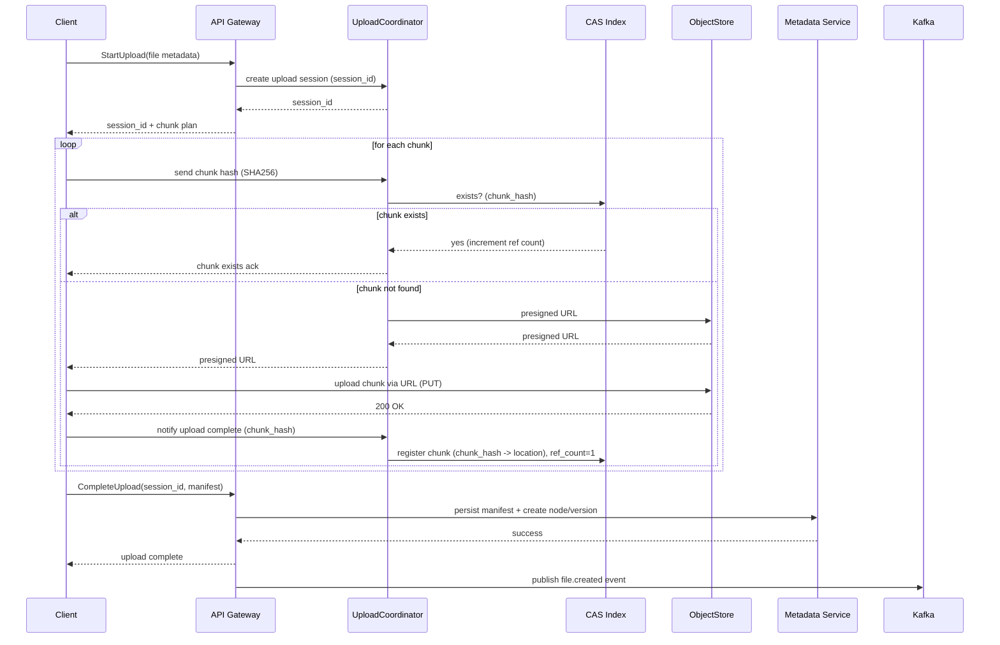

Nice — let’s design a **scalable, production-grade file storage system** like Google Drive or Dropbox. I’ll cover requirements, architecture, data models, workflows (upload, sync, download, share), consistency & durability, scaling strategies, security, and include **Mermaid diagrams** (high-level architecture + sequence flows) so you can visualize the system.

I’ll assume you want a global service that supports: web/mobile/desktop clients, sync clients with offline edits, deduplication, versioning, sharing/ACLs, and low-latency downloads.

---

# System overview — core idea

Split the system into two concerns:

* **Metadata control plane** — users, file metadata, permissions, sync state, directories, versions. (Strong consistency required.)
* **Blob data plane** — immutable file chunks/objects stored in an object store (S3 / compatible blobstore). (Highly durable, eventually consistent acceptable for some ops.)

Use content-addressable chunk storage, manifests, and a metadata DB to map user files to manifests. Use a CDN and regional object caches to serve file content fast. Provide sync clients that use change logs (event streams) and per-client persistence tokens.

---

# Requirements

## Functional (must)

* Upload/download files (web, mobile, desktop)
* Sync (bi-directional) with conflict resolution
* Versioning and undo
* Sharing (links, ACLs, team folders)
* Large-file support, resumable uploads
* Deduplication (content-based)
* Search (filename, metadata, content indexing optional)
* Throttling, quotas, billing

## Non-functional

* High availability (multi-region)
* Horizontal scalability (millions of users)
* Low latency for reads (CDN + caching)
* Strong metadata consistency
* Durability of file contents (>=11 9s via cloud storage replication)
* Secure (at-rest + in-transit encryption)

---

# High-level components

* Clients: Web, Mobile, Desktop sync client
* API Gateway / Load Balancer
* Auth & Identity service (OAuth/OpenID Connect)
* Metadata Service (File Service): stores file trees, manifests, versions, ACLs
* Chunking & Upload Coordinator / Ingest Service
* Object Storage (S3 / MinIO / Blob store) — stores chunks/objects
* Content-Addressable Store (CAS) index: maps chunk-hash → object location
* Deduplication service (logical layer + garbage collector)
* CDN / Edge Cache + Regional Cache Nodes
* Notification / Event Bus (Kafka) for change events and sync
* Search / Indexing (Elasticsearch)
* Monitoring, Logging, Billing, Quotas
* Admin & Anti-abuse (virus scan, malware detection) and DLP

---

# Architecture (Mermaid)

```mermaid
flowchart LR
  subgraph Clients
    A[Web App]
    B[Mobile App]
    C[Desktop Sync Client]
  end

  A -->|HTTPS/gRPC| APIGW[API Gateway / Load Balancer]
  B -->|HTTPS/gRPC| APIGW
  C -->|HTTPS/gRPC| APIGW

  APIGW --> Auth[Auth Service (OIDC)]
  APIGW --> FileAPI[File Metadata Service (API)]
  APIGW --> UploadCoord[Upload Coordinator]
  APIGW --> DownloadProxy[Download Proxy / Edge]

  FileAPI --> MetaDB[(Metadata DB: Postgres/Spanner/Cockroach)]
  FileAPI --> ACLService[ACL & Sharing Service]
  FileAPI --> Kafka[(Event Bus - Kafka)]
  UploadCoord --> CASIndex[(CAS Index / ScyllaDB or Redis)]
  UploadCoord --> ObjectStore[S3 / Blobstore]
  UploadCoord --> Antivirus[AV & Virus Scan]
  ObjectStore --> CDN[CDN/Regional Cache]
  DownloadProxy --> CDN
  CDN --> ClientCache[Edge]
  Kafka --> SyncWorkers[Sync Workers / Notifiers]
  SyncWorkers --> DesktopSync[Desktop clients via Push/Notifications]
  FileAPI --> Search[Search Index (Elasticsearch)]
  GarbageCollector --> CASIndex
  GarbageCollector --> ObjectStore

  style MetaDB fill:#f9f,stroke:#333,stroke-width:1px
  style ObjectStore fill:#efe,stroke:#333
  style CDN fill:#ffe,stroke:#333
```

---

# Data model (conceptual)

## Metadata DB (relational / strongly consistent; e.g., Postgres, Spanner, or Cockroach)

Tables (high level):

* **users** (user_id, email, display_name, quota, tier, created_at)
* **nodes** (node_id PK, user_id owner, parent_node_id, name, type [file/folder], metadata_json, created_at, updated_at)

  * node represents a file or folder
* **manifests** (manifest_id, node_id, version, chunk_list, size, checksum, created_by, created_at, is_deleted)

  * `chunk_list` = ordered list of chunk hashes (sha256) + length offsets
* **chunks** (chunk_hash PK, length, locations, ref_count, storage_class, last_seen)

  * maps content-hash to object(s) in object store
* **shares** (share_id, node_id, owner, scope, permissions, expiry)
* **locks** (node_id, client_id, lock_type, expiry) — optional for conflict resolution

Use JSONB for file metadata and extended attributes.

## CAS Index

Fast key-value store (ScyllaDB / Cassandra / Redis) keyed by `chunk_hash` -> storage info, ref_count — used for dedup and quick existence checks.

---

# File representation & upload model

### Chunking strategy

* Chunk size: variable (e.g., 4MB–8MB fixed) or rolling hash (Rabin fingerprinting) for delta-friendly chunking.
* Each chunk hashed with SHA-256 -> `chunk_hash`.

### Manifest

* A file is a manifest: ordered list of chunk hashes and offsets + file-level metadata (mtime, mime-type).
* Manifest is small and stored in metadata DB (and versioned).

### Content-addressed storage

* When a chunk arrives, compute `h = SHA256(chunk)`.
* Check CAS (index) if `h` exists:

  * If yes: increment `ref_count`, no duplicate upload.
  * If no: store chunk to object store (S3) using an object key like `/chunks/first2/h...` and update CAS index with location and ref_count = 1.

### Resumable uploads

* Clients upload per-chunk using UploadCoordinator:

  * Client obtains upload token / presigned URL for each chunk.
  * UploadCoordinator accepts chunk hashes first (so client can do fast-client-side dedupe).
  * After chunks uploaded (or dedupe confirmed), client sends `CompleteUpload(manifest)` to FileAPI.

---

# Upload sequence (Mermaid sequence)



---

# Download & sync flow

* **Download**: Client requests file → Metadata service returns manifest (list of chunk hashes + URLs). Download proxy/edge provides presigned URLs or direct CDN URLs for each chunk. Client streams chunks in order and reconstructs the file.

* **Sync**:

  * FileAPI produces events (Kafka) on file changes.
  * Each sync client subscribes (or is notified via push) and pulls manifest diffs.
  * Client computes which chunks it already has and requests only missing chunks (fast delta sync).

Sequence for sync (high-level):

1. Client authenticates and requests sync token (version watermark).
2. Server streams change events since watermark or returns list of changed nodes.
3. Client fetches manifests for changed files and downloads missing chunks.

Conflict resolution:

* If concurrent edits: attempt **three-way merge** for text; else create conflict copy (`filename (conflict - user - timestamp)`), provide UI to user.

---

# Versioning & garbage collection

* Each file update creates a new manifest row (versioned). Node points to latest manifest_id.
* Chunks referenced by any manifest increment `ref_count`.
* When a file version is deleted, decrement ref_counts for chunks in that manifest.
* Garbage collector periodically:

  * Scans `chunks` entries with `ref_count == 0` and `last_seen older than grace_period` (e.g., 30 days).
  * Deletes chunk objects from object store and removes index entry.

Be careful with race conditions: use tombstones + background reconciliation.

---

# Metadata DB choice & partitioning

* For global scale:

  * Use **Spanner / CockroachDB / Yugabyte** for global strong consistency and multi-region writes OR
  * Use regional Postgres clusters with a global control plane (for lower complexity).
* Partition large tables by `user_id` (primary partition) for horizontal scaling.

---

# Search & index

* File name, tags, and textual content index stored in **Elasticsearch**.
* For content indexing (text inside files), use background workers to extract text (OCR, office docs) and feed into ES.

---

# Caching, CDN & edge performance

* Use CDN (CloudFront / Fastly) for public file downloads and presigned URLs with short TTL.
* For authenticated downloads, add a short-lived edge token / cookie to allow CDN to cache while enforcing access (signed URLs).
* Regional caches: maintain hot-chunk caches near active users.

---

# Security

* **Auth**: OAuth2 / OIDC for clients; short-lived access tokens. Use refresh tokens carefully.
* **Encryption at rest**: server-side encryption (SSE) on object store; optional client-side encryption (end-to-end).
* **Encryption in transit**: TLS for all client-server and internal communication.
* **ACLs**: Metadata service enforces ACLs before returning manifests or presigned URLs.
* **Scan & DLP**: UploadCoordinator pushes copies to antivirus & malware scanning before making content available; optionally quarantine until scanned.
* **Audit logging**: log file access, sharing changes, downloads, and admin activity.

---

# Consistency model & correctness

* **Metadata**: strong consistency required (ACID) — use relational DB with transactions.
* **Chunk store**: eventually consistent acceptable; ensure manifest only references chunks that are committed in CAS (atomic registration).
* Use two-phase commit-ish flow for manifest creation:

  1. Ensure chunks exist in CAS (or upload completed).
  2. Persist manifest in metadata DB transactionally.
  3. Publish event.

Atomic guarantees keep clients from referencing non-existent chunks.

---

# Scaling strategy & bottlenecks

* **Object store**: scale via S3 (virtually infinite). Use sharding by chunk-hash prefix for on-prem.
* **CAS index**: high-throughput reads — use ScyllaDB / Cassandra or Redis Cluster for sub-ms lookups.
* **Metadata DB**: can be bottleneck; shard by user and partition tables; use read replicas for read-heavy operations (directory listing).
* **UploadCoordinator**: horizontally scale; stateless sessions stored in Redis.
* **Event Bus**: Kafka for high-rate events and replay.
* **CDN**: offload read traffic.

---

# Operational concerns

* **Backups**: metadata DB snapshots; object store lifecycle versioning + replication.
* **Data retention & compliance**: implement retention policies, legal-hold features.
* **Monitoring**: metrics (upload rate, latency, CAS hit/miss), alerting, tracing (OpenTelemetry).
* **Cost**: cold storage tiers for infrequently accessed chunks (S3 Glacier or similar) and archive policies.

---

# APIs (Representative)

### Auth

* `POST /oauth/token` — get access token

### File metadata

* `POST /v1/files` — create file node (start upload) → returns upload session
* `POST /v1/uploads/{session}/chunk` — register chunk hash or get presigned URL
* `POST /v1/uploads/{session}/complete` — finalize manifest (manifest JSON)
* `GET /v1/files/{node_id}` — get metadata + manifest
* `GET /v1/files/{node_id}/download` — get presigned URLs or stream
* `GET /v1/dirs/{dir_id}` — list children (pagination)
* `POST /v1/files/{node_id}/share` — create share link / ACL
* `POST /v1/files/{node_id}/versions` — list versions
* `DELETE /v1/files/{node_id}` — soft delete (moves to trash)

### Sync

* `GET /v1/sync?since=watermark` — list changed nodes since watermark
* Server sends webhooks / push notifications for real-time sync

---

# Example manifest (JSON)

```json
{
  "manifest_id": "m-123",
  "node_id": "n-456",
  "version": 3,
  "chunks": [
    {"hash":"a1b2...","offset":0,"length":4194304},
    {"hash":"c3d4...","offset":4194304,"length":2097152}
  ],
  "size":6291456,
  "mime":"application/pdf",
  "created_by":"user-1",
  "created_at":"2025-10-11T10:00:00Z"
}
```

---

# Fault tolerance & recovery

* Replay events from Kafka to repair state.
* Reconcile CAS ↔ Metadata via periodic scans (compare referenced chunk hashes vs CAS index, mark missing and repair).
* Use object-store versioning and lifecycle policies to recover accidentally deleted chunks for grace period.

---

# Trade-offs & design decisions

* **Use object store (S3)** for blobs — inexpensive & extremely durable; metadata in RDBS for strong consistency.
* **Content-addressable + dedupe** reduces storage but requires CAS index and GC complexity.
* **Rolling hash chunking** helps delta sync for partially changed files (e.g., large database files), but is compute-heavy.
* **Global metadata (Spanner)** gives simpler global consistency but higher cost; regional Postgres + change propagation is cheaper but more complex.

---

# Quick capacity planning (example)

* Suppose 10M active users, average 1GB/user => 10 PB of objects
* Use chunk size 8MB → ~1.25B objects; object-store scale OK, but CAS index size ~ (hash+meta) ~ 64 bytes * 1.25B ≈ 80 GB + index overhead → use ScyllaDB cluster.

(This is rough — do detailed capacity estimates for real deployments.)

---

# Next steps / What I can produce for you

Pick one and I’ll produce it:

1. Kubernetes manifest + Helm chart blueprint for UploadCoordinator + Metadata Service + Scylla/CAS.
2. Detailed sequence diagram for conflict resolution + sync.
3. Example implementation snippets (upload coordinator, chunk dedupe logic in Go/Java).
4. Cost model and capacity calculator template for your expected user numbers.

Which would you like me to generate next?
