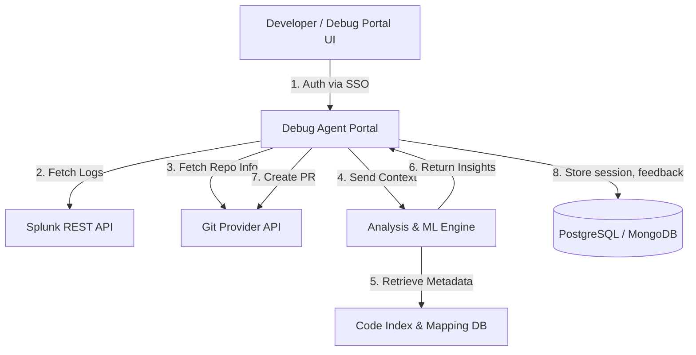

Got it 👍 — so you’re describing a **“Debug Agent Portal”** — a **web-based system** (no local agent install) that integrates **Git repositories** and **Splunk logs** to help engineers **diagnose issues**, **analyze root causes**, and even **create pull requests with fixes** directly from the UI.

Let’s design this system step by step.

---

## 🧩 High-Level Goals

* No installation required — runs as a **web portal** (SaaS or internal web app).
* User connects:

  * **Git repository** (e.g., GitHub, GitLab, Bitbucket)
  * **Splunk account / search query**
* The system:

  1. Fetches relevant logs based on error signatures or time ranges.
  2. Maps them to corresponding **code commits or files**.
  3. Runs **analysis / ML models** for likely cause & fix suggestion.
  4. Allows creating a **Pull Request (PR)** to apply or suggest a fix.

---

## 🏗️ System Design Overview (Architecture)



---

## ⚙️ Major Components

| Component                           | Description                                                                                                     |
| ----------------------------------- | --------------------------------------------------------------------------------------------------------------- |
| **Frontend (React/Next.js)**        | UI for connecting Splunk & Git, running analysis, showing insights, and creating PRs.                           |
| **Backend (Spring Boot / Node.js)** | Orchestrates API calls to Git & Splunk, manages user sessions, triggers ML analysis.                            |
| **Splunk Integration Service**      | Uses Splunk REST API or saved searches to pull logs based on query/time window.                                 |
| **Git Integration Service**         | Connects via GitHub/GitLab REST API to fetch code files, branches, diffs, and create PRs.                       |
| **Analysis Engine**                 | Core intelligence — performs log-to-code correlation, static code analysis, and recommends fixes (AI-assisted). |
| **Metadata / Code Index DB**        | Stores repo structure, commit history, log correlation metadata. (Can use ElasticSearch or Neo4j).              |
| **Auth & Security Layer**           | SSO (SAML/OAuth2) + API tokens for Git/Splunk + RBAC (role-based access).                                       |

---

## 🧠 Key Data Flow

1. **User login**

   * Authenticated via company SSO or OAuth (GitHub OAuth App).
2. **Connect services**

   * User selects or connects:

     * Splunk workspace + query or saved search.
     * Git repository and branch.
3. **Run analysis**

   * System fetches recent logs → extracts error traces or stack traces.
   * Matches function/file names with Git codebase.
   * Runs pattern recognition or static analysis to infer possible issues.
4. **Show insights**

   * Visual timeline of logs vs commits.
   * Root cause suggestions.
   * Potential fix snippets (optional AI model).
5. **Create Pull Request**

   * System generates patch file or code change suggestion.
   * Uses Git API to open PR with analysis context attached.

---

## 🧰 Tech Stack Suggestion

| Layer                 | Tools / Frameworks                                           |
| --------------------- | ------------------------------------------------------------ |
| **Frontend**          | React / Next.js / TypeScript                                 |
| **Backend API**       | Spring Boot (Java) or NestJS (Node.js)                       |
| **Storage**           | PostgreSQL / MongoDB / Redis                                 |
| **Search / Indexing** | ElasticSearch / OpenSearch                                   |
| **ML/AI Engine**      | Python (FastAPI) for log parsing, NLP-based error clustering |
| **Integration**       | Splunk REST API, GitHub GraphQL/REST API                     |
| **Auth**              | OAuth2 + JWT + Git Provider Tokens                           |
| **Deployment**        | Docker + Kubernetes + Helm                                   |

---

## 🔍 Example Flow

1. **User selects:**
   Splunk Query = “error OR exception past 2 hours”
   Repo = `github.com/org/payment-service`
2. **Portal fetches logs** and identifies multiple `NullPointerException` traces.
3. **Analyzer correlates** traces to lines in `PaymentService.java` from recent commits.
4. Suggests probable cause: missing null check after API response.
5. **Generates PR** automatically adding the null check + test case.
6. User reviews → clicks “Create Pull Request”.

---

## 🔒 Security Considerations

* All API calls use **OAuth tokens scoped per user**.
* Sensitive data (logs, code diffs) encrypted at rest and in transit (TLS 1.3).
* Use **Vault / Secrets Manager** for Git & Splunk tokens.
* Optional **audit logs** for every analysis and PR action.

---

Would you like me to **add a detailed component diagram (microservice-level)** showing the interaction between the portal backend, analysis service, Splunk, and Git APIs? That would show how data and requests flow between each service.


Excellent — let’s now dive deep into the **AI & Machine Learning components** of the **Debug Agent Portal** we just designed.

This is the intelligence layer that makes the system *more than just* an integration between Splunk and Git — it becomes an **automated debugging assistant** that can understand, correlate, and even suggest fixes.

---

## 🧠 AI / ML Components in the Debug Agent Portal

Below is the breakdown of AI/ML modules, what they do, and which concepts are applied.

---

### 1. **Log Intelligence Module (Log Parsing, Clustering, and Anomaly Detection)**

| Purpose             | Automatically understand large, noisy Splunk logs — group similar errors, identify anomalies, and extract key features (stack traces, timestamps, services).                                                                                                                                                                                                                                                                                      |
| ------------------- | ------------------------------------------------------------------------------------------------------------------------------------------------------------------------------------------------------------------------------------------------------------------------------------------------------------------------------------------------------------------------------------------------------------------------------------------------- |
| **Key ML Concepts** | - **Log Parsing / Tokenization:** Parse semi-structured logs into templates using algorithms like **Drain**, **Spell**, or **LogPai**.<br>- **Anomaly Detection:** Use models such as **Isolation Forest**, **Autoencoders**, or **One-Class SVM** to detect abnormal patterns compared to historical logs.<br>- **Clustering:** Group similar log events using **K-Means**, **DBSCAN**, or **Sentence Embeddings (BERT/SimCSE)** for similarity. |
| **Output**          | Structured logs with detected error types, frequency, severity, and correlations.                                                                                                                                                                                                                                                                                                                                                                 |

---

### 2. **Error Signature Extraction (NLP-based Stack Trace Understanding)**

| Purpose        | Convert raw error messages or stack traces into meaningful representations.                                                                                                                                                                                                                                                         |
| -------------- | ----------------------------------------------------------------------------------------------------------------------------------------------------------------------------------------------------------------------------------------------------------------------------------------------------------------------------------- |
| **Techniques** | - **Named Entity Recognition (NER):** Identify entities like function names, file paths, classes.<br>- **Transformer Embeddings (BERT / CodeBERT / GraphCodeBERT):** Encode logs and stack traces to vector embeddings for semantic similarity.<br>- **Pattern Mining:** Detect repeated or new error patterns across environments. |
| **Output**     | A semantic vector for each unique error, enabling matching with related code and commits.                                                                                                                                                                                                                                           |

---

### 3. **Log-to-Code Mapping Engine**

| Purpose      | Correlate errors from logs to exact files, functions, or commits in the Git repo.                                                                                                                                                                                                                                                                                   |
| ------------ | ------------------------------------------------------------------------------------------------------------------------------------------------------------------------------------------------------------------------------------------------------------------------------------------------------------------------------------------------------------------- |
| **Concepts** | - **Information Retrieval (IR):** Vector similarity search between log embeddings and code embeddings.<br>- **Embedding Models:** Use **CodeBERT**, **OpenAI embeddings**, or **Graph Neural Networks (GNNs)** for function-level representation.<br>- **Commit Diff Analysis:** Compare logs’ time windows with commit metadata (commit messages, modified files). |
| **Output**   | Ranked list of code locations or commits likely responsible for the error.                                                                                                                                                                                                                                                                                          |

---

### 4. **Root Cause Analysis (RCA) Engine**

| Purpose        | Infer the most probable root cause and suggest remediation.                                                                                                                                                                                                                                                                                          |
| -------------- | ---------------------------------------------------------------------------------------------------------------------------------------------------------------------------------------------------------------------------------------------------------------------------------------------------------------------------------------------------- |
| **Approaches** | - **Causal Graphs / Bayesian Networks:** Model dependencies between logs, metrics, and code changes.<br>- **Graph-based Reasoning:** Represent system components and events as nodes in a causal graph.<br>- **Supervised Classification:** Train a model to classify common root cause patterns (config error, null reference, connection failure). |
| **Output**     | Probable cause + confidence score + contextual explanation.                                                                                                                                                                                                                                                                                          |

---

### 5. **Code Analysis & Fix Suggestion (AI-assisted PR Generator)**

| Purpose        | Suggest a fix and optionally create a PR.                                                                                                                                                                                                                                                                                                                 |
| -------------- | --------------------------------------------------------------------------------------------------------------------------------------------------------------------------------------------------------------------------------------------------------------------------------------------------------------------------------------------------------- |
| **Techniques** | - **Program Analysis:** AST (Abstract Syntax Tree) traversal for detecting null checks, missing imports, etc.<br>- **LLMs / Code Models (CodeLlama, GPT-4o, DeepSeekCoder):** Use prompt-based reasoning to generate possible patches.<br>- **Reinforcement Learning from Human Feedback (RLHF):** Improve fix suggestions based on developer acceptance. |
| **Output**     | Patch suggestion (diff) or code snippet ready for review in PR.                                                                                                                                                                                                                                                                                           |

---

### 6. **Continuous Learning Loop**

| Purpose      | Make the system smarter over time.                                                                                                                                                                                                                                                     |
| ------------ | -------------------------------------------------------------------------------------------------------------------------------------------------------------------------------------------------------------------------------------------------------------------------------------- |
| **Concepts** | - **Active Learning:** When developers confirm or reject an AI-suggested fix, feed that back as labeled data.<br>- **Online Learning:** Update embeddings and anomaly models incrementally.<br>- **Feedback Reinforcement:** Store developer actions in feedback DB to re-rank models. |
| **Output**   | Adaptive AI system that aligns with project-specific code & log patterns.                                                                                                                                                                                                              |

---

## 🔍 AI Workflow Summary (Data & Model Flow)

```mermaid
flowchart TD
    A[Logs from Splunk] --> B[Log Parsing & Clustering (Drain, BERT)]
    B --> C[Error Embedding & Signature Extraction]
    C --> D[Code Embedding via CodeBERT / AST Parser]
    D --> E[Log-to-Code Mapping Engine]
    E --> F[Root Cause Analysis Model]
    F --> G[Fix Suggestion Generator (LLM)]
    G --> H[PR Creation + Developer Feedback]
    H --> I[Feedback Loop for Model Improvement]
```

---

## 🧩 Supporting AI Infrastructure

| Layer                      | Tools                                                             |
| -------------------------- | ----------------------------------------------------------------- |
| **Model Hosting**          | HuggingFace Transformers / TorchServe / Vertex AI / AWS Sagemaker |
| **Vector DB**              | Pinecone / FAISS / ElasticSearch KNN / Qdrant                     |
| **Pipeline Orchestration** | Airflow / AWS Step Functions                                      |
| **Feature Store**          | Feast / S3 + Glue Tables                                          |
| **Experiment Tracking**    | MLflow / Weights & Biases                                         |

---

## 🧠 Example End-to-End Use Case

**Scenario:**
Splunk logs show frequent `TimeoutException` from `PaymentClient`.

1. Log Intelligence Module clusters exceptions under the same pattern.
2. Log-to-Code Engine finds that `PaymentClient.java` was modified in a recent commit.
3. RCA Engine detects correlation with a configuration change that reduced timeout to 500 ms.
4. Fix Suggestion Model recommends increasing timeout and adding circuit breaker fallback.
5. Developer clicks “Generate Pull Request.”
6. Debug Agent creates a PR with the suggested fix.
7. Feedback stored → model learns that this suggestion type was accepted.

---

Would you like me to **extend this with specific ML model architecture details** (like how embeddings, clustering, and causal reasoning connect in the pipeline — e.g., data flow and model training diagram)?

