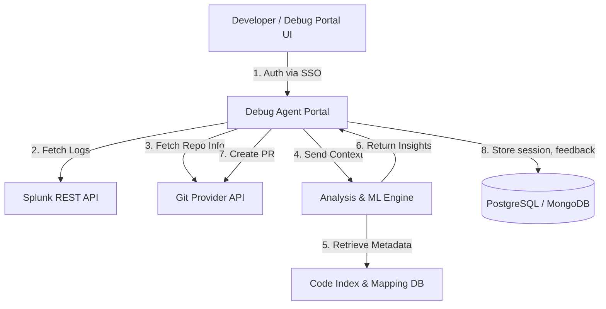

Got it 👍 — so you’re describing a **“Debug Agent Portal”** — a **web-based system** (no local agent install) that integrates **Git repositories** and **Splunk logs** to help engineers **diagnose issues**, **analyze root causes**, and even **create pull requests with fixes** directly from the UI.

Let’s design this system step by step.

---

## 🧩 High-Level Goals

* No installation required — runs as a **web portal** (SaaS or internal web app).
* User connects:

  * **Git repository** (e.g., GitHub, GitLab, Bitbucket)
  * **Splunk account / search query**
* The system:

  1. Fetches relevant logs based on error signatures or time ranges.
  2. Maps them to corresponding **code commits or files**.
  3. Runs **analysis / ML models** for likely cause & fix suggestion.
  4. Allows creating a **Pull Request (PR)** to apply or suggest a fix.

---

## 🏗️ System Design Overview (Architecture)

---

## ⚙️ Major Components

| Component                           | Description                                                                                                     |
| ----------------------------------- | --------------------------------------------------------------------------------------------------------------- |
| **Frontend (React/Next.js)**        | UI for connecting Splunk & Git, running analysis, showing insights, and creating PRs.                           |
| **Backend (Spring Boot / Node.js)** | Orchestrates API calls to Git & Splunk, manages user sessions, triggers ML analysis.                            |
| **Splunk Integration Service**      | Uses Splunk REST API or saved searches to pull logs based on query/time window.                                 |
| **Git Integration Service**         | Connects via GitHub/GitLab REST API to fetch code files, branches, diffs, and create PRs.                       |
| **Analysis Engine**                 | Core intelligence — performs log-to-code correlation, static code analysis, and recommends fixes (AI-assisted). |
| **Metadata / Code Index DB**        | Stores repo structure, commit history, log correlation metadata. (Can use ElasticSearch or Neo4j).              |
| **Auth & Security Layer**           | SSO (SAML/OAuth2) + API tokens for Git/Splunk + RBAC (role-based access).                                       |

---

## 🧠 Key Data Flow

1. **User login**

   * Authenticated via company SSO or OAuth (GitHub OAuth App).
2. **Connect services**

   * User selects or connects:

     * Splunk workspace + query or saved search.
     * Git repository and branch.
3. **Run analysis**

   * System fetches recent logs → extracts error traces or stack traces.
   * Matches function/file names with Git codebase.
   * Runs pattern recognition or static analysis to infer possible issues.
4. **Show insights**

   * Visual timeline of logs vs commits.
   * Root cause suggestions.
   * Potential fix snippets (optional AI model).
5. **Create Pull Request**

   * System generates patch file or code change suggestion.
   * Uses Git API to open PR with analysis context attached.

---

## 🧰 Tech Stack Suggestion

| Layer                 | Tools / Frameworks                                           |
| --------------------- | ------------------------------------------------------------ |
| **Frontend**          | React / Next.js / TypeScript                                 |
| **Backend API**       | Spring Boot (Java) or NestJS (Node.js)                       |
| **Storage**           | PostgreSQL / MongoDB / Redis                                 |
| **Search / Indexing** | ElasticSearch / OpenSearch                                   |
| **ML/AI Engine**      | Python (FastAPI) for log parsing, NLP-based error clustering |
| **Integration**       | Splunk REST API, GitHub GraphQL/REST API                     |
| **Auth**              | OAuth2 + JWT + Git Provider Tokens                           |
| **Deployment**        | Docker + Kubernetes + Helm                                   |

---

## 🔍 Example Flow

1. **User selects:**
   Splunk Query = “error OR exception past 2 hours”
   Repo = `github.com/org/payment-service`
2. **Portal fetches logs** and identifies multiple `NullPointerException` traces.
3. **Analyzer correlates** traces to lines in `PaymentService.java` from recent commits.
4. Suggests probable cause: missing null check after API response.
5. **Generates PR** automatically adding the null check + test case.
6. User reviews → clicks “Create Pull Request”.

---

## 🔒 Security Considerations

* All API calls use **OAuth tokens scoped per user**.
* Sensitive data (logs, code diffs) encrypted at rest and in transit (TLS 1.3).
* Use **Vault / Secrets Manager** for Git & Splunk tokens.
* Optional **audit logs** for every analysis and PR action.

---

Would you like me to **add a detailed component diagram (microservice-level)** showing the interaction between the portal backend, analysis service, Splunk, and Git APIs? That would show how data and requests flow between each service.
