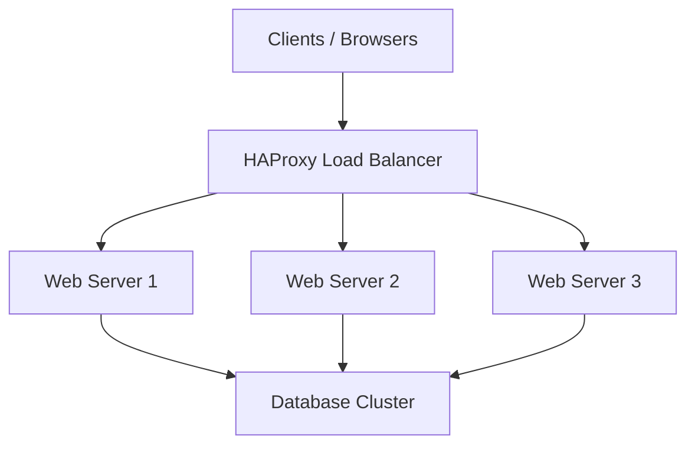
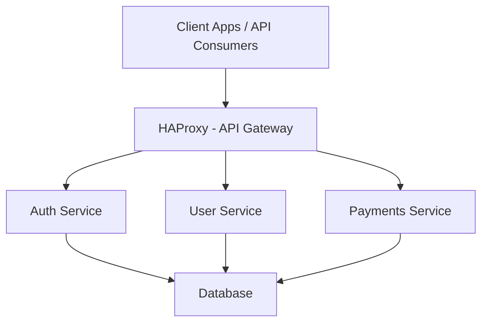
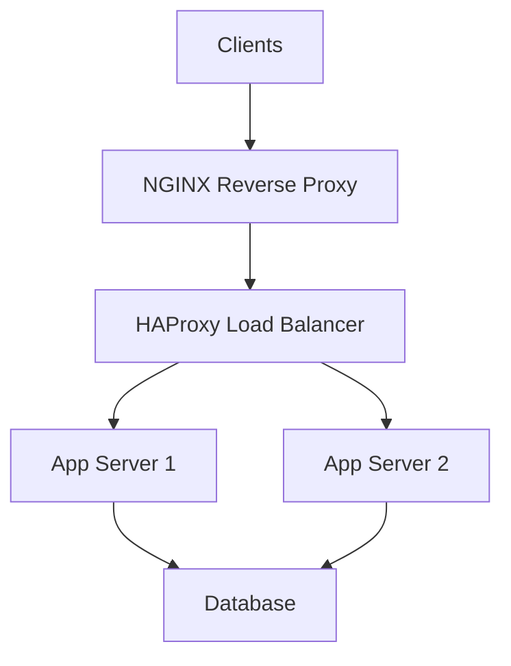
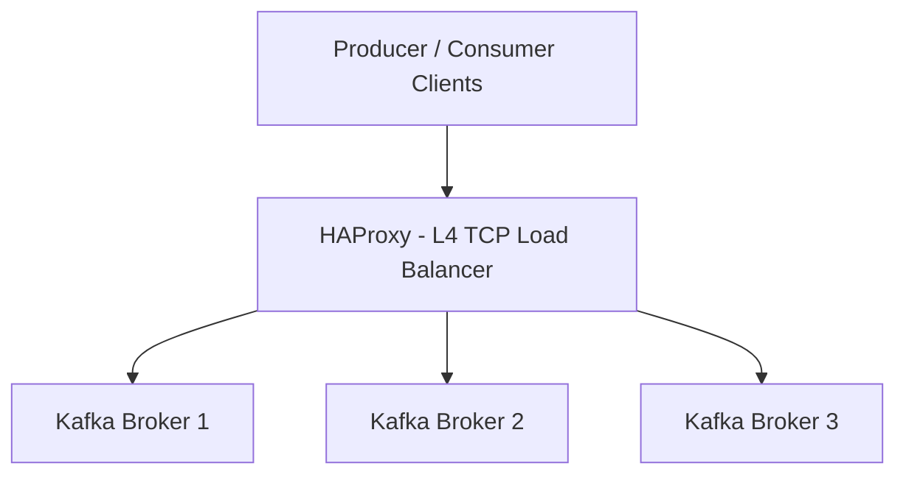
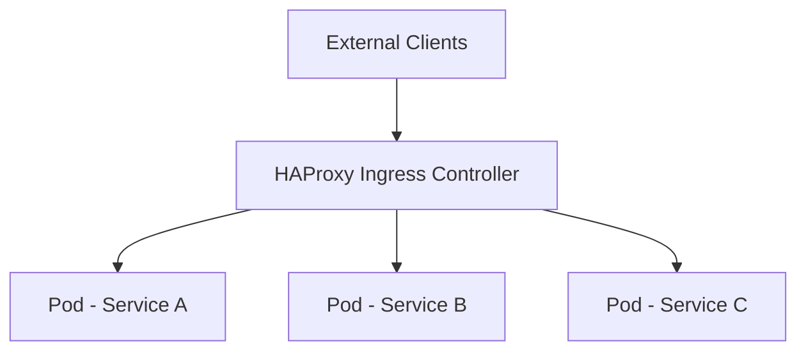
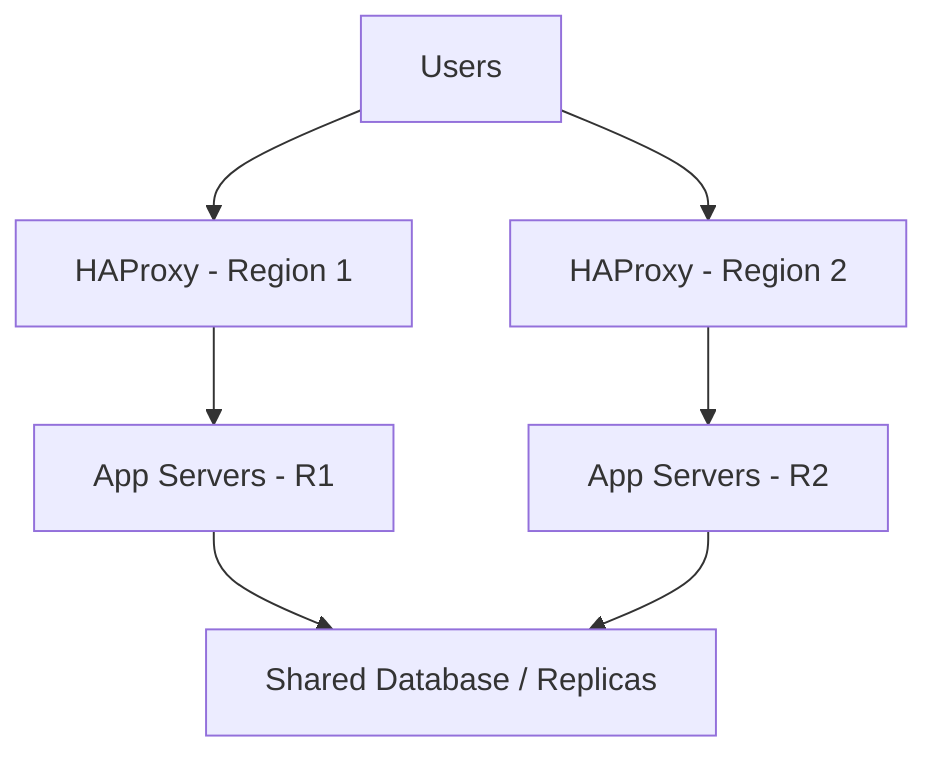

Excellent question — this gets into how **HAProxy** fits into **real-world system designs** and what types of architectures use it.
Let’s look at this from a **system design** and **use-case** perspective.

---

## 🧩 1. What role does HAProxy play in system design?

HAProxy sits **in front of application servers** to manage:

* Load balancing
* High availability
* Failover and health checking
* SSL termination
* Traffic routing (L4 or L7 proxy)

Essentially, it acts as a **“traffic director”** that ensures requests are distributed efficiently, securely, and reliably to backend services.

---

## 🧱 2. Typical system designs using HAProxy

Here are some common architectures:

---

### **A. Web Application Load Balancer**

**Use case:** High-traffic websites (e.g., e-commerce, social networks, SaaS apps)

**Purpose:** Distribute web traffic (HTTP/HTTPS) to multiple application servers.

**Architecture:**



✅ **Used by:**
Amazon, GitHub, Stack Overflow (for internal balancing layers)

---

### **B. API Gateway / Microservices Routing**

**Use case:** Microservices systems where one entry point routes requests to multiple backend APIs.

**Purpose:**

* Route based on URL, headers, or request type
* Offload TLS termination
* Enforce rate limiting and ACLs

**Architecture:**



✅ **Used by:**
Fintechs, SaaS platforms, and API-based startups.

---

### **C. Reverse Proxy for Web + App Tier**

**Use case:** When you have both a web server (static files) and app server (dynamic requests).

**Purpose:**

* Serve static content from NGINX
* Proxy dynamic requests to app servers via HAProxy

**Architecture:**



✅ **Used by:**
Large-scale websites like LinkedIn, Wikipedia-style platforms.

---

### **D. Database Load Balancing / Read-Write Splitting**

**Use case:** Distribute read queries among replicas while writing only to the primary.

**Purpose:**

* Improve DB read scalability
* Provide transparent failover

**Architecture:**

```mermaid
graph TD
A[App Servers] --> B[HAProxy]
B --> C1[Primary DB (Write)]
B --> C2[Replica DB 1 (Read)]
B --> C3[Replica DB 2 (Read)]
```

✅ **Used by:**
MySQL, PostgreSQL, and Redis deployments in high-load systems.

---

### **E. High Availability for Redis / Kafka / MQ**

**Use case:** Load balancing TCP-based services (not just HTTP)

**Purpose:**

* Handle failover for message queues, cache servers, etc.
* Maintain connection pooling at Layer 4 (TCP)

**Architecture:**



✅ **Used by:**
Data pipelines, stream processing, analytics platforms.

---

### **F. Kubernetes Ingress / Edge Proxy**

**Use case:** In containerized environments.

**Purpose:**

* Act as ingress controller or external load balancer
* Route traffic into cluster
* Perform TLS termination and health checks

**Architecture:**



✅ **Used by:**
Kubernetes clusters (HAProxy Ingress Controller), OpenShift, and hybrid cloud setups.

---

### **G. CDN Edge Caching Layer**

**Use case:** Large-scale content delivery networks (e.g., video streaming, images)

**Purpose:**

* Cache static assets at the edge
* Balance load between regional servers
* Serve cached responses quickly

**Architecture:**

```mermaid
graph TD
A[Users Worldwide] --> B[HAProxy Edge Servers (CDN Nodes)]
B --> C1[Regional Cache Node 1]
B --> C2[Regional Cache Node 2]
C1 --> D[Origin Server]
C2 --> D
```

✅ **Used by:**
Cloudflare (early versions), private CDNs, streaming platforms.

---

## 🧠 3. Advanced design patterns with HAProxy

| Pattern                            | Description                                           |
| ---------------------------------- | ----------------------------------------------------- |
| **Blue-Green Deployment**          | Route a percentage of traffic to a new version safely |
| **Canary Release**                 | Gradually shift traffic to a new service version      |
| **Geo-based Routing**              | Route users to nearest data center                    |
| **Rate Limiting + DoS Protection** | Limit requests per IP or API key                      |
| **Circuit Breaker / Retry**        | Fail fast on bad servers, retry on healthy ones       |

---

## ⚙️ 4. Example: Multi-region HA setup



✅ Purpose:
Provide **geo-redundancy** and **automatic failover** between data centers.

---

## 🧩 5. Who uses HAProxy (real examples)

| Company                      | Use Case                                      |
| ---------------------------- | --------------------------------------------- |
| **GitHub**                   | Layer 4 load balancing and health checks      |
| **Booking.com**              | Handles millions of requests/sec              |
| **Reddit**                   | Frontend load balancing                       |
| **Airbnb**                   | Service discovery + routing for microservices |
| **DigitalOcean**             | Balancing load between hypervisors and APIs   |
| **Cloudflare (early stack)** | As initial proxy before their custom system   |

---

## ✅ Summary

| Feature                   | Benefit in System Design               |
| ------------------------- | -------------------------------------- |
| Load balancing            | Scale horizontally across many servers |
| Health checking           | Automatic failover                     |
| SSL termination           | Offload crypto from backend            |
| Reverse proxy             | Hide internal architecture             |
| Layer 4 & Layer 7 support | Works for HTTP, TCP, WebSocket, gRPC   |
| Logging/Monitoring        | Central visibility                     |

---

Would you like me to draw a **comprehensive system design diagram** showing a **modern architecture** using HAProxy (Load Balancer + API Gateway + microservices + database + cache)?
It would show how HAProxy fits in at each layer (edge → API → service → DB).


Excellent question — this gets into how **HAProxy** fits into **real-world system designs** and what types of architectures use it.
Let’s look at this from a **system design** and **use-case** perspective.

---

## 🧩 1. What role does HAProxy play in system design?

HAProxy sits **in front of application servers** to manage:

* Load balancing
* High availability
* Failover and health checking
* SSL termination
* Traffic routing (L4 or L7 proxy)

Essentially, it acts as a **“traffic director”** that ensures requests are distributed efficiently, securely, and reliably to backend services.

---

## 🧱 2. Typical system designs using HAProxy

Here are some common architectures:

---

### **A. Web Application Load Balancer**

**Use case:** High-traffic websites (e.g., e-commerce, social networks, SaaS apps)

**Purpose:** Distribute web traffic (HTTP/HTTPS) to multiple application servers.

**Architecture:**


✅ **Used by:**
Amazon, GitHub, Stack Overflow (for internal balancing layers)

---

### **B. API Gateway / Microservices Routing**

**Use case:** Microservices systems where one entry point routes requests to multiple backend APIs.

**Purpose:**

* Route based on URL, headers, or request type
* Offload TLS termination
* Enforce rate limiting and ACLs

**Architecture:**


✅ **Used by:**
Fintechs, SaaS platforms, and API-based startups.

---

### **C. Reverse Proxy for Web + App Tier**

**Use case:** When you have both a web server (static files) and app server (dynamic requests).

**Purpose:**

* Serve static content from NGINX
* Proxy dynamic requests to app servers via HAProxy

**Architecture:**


✅ **Used by:**
Large-scale websites like LinkedIn, Wikipedia-style platforms.

---

### **D. Database Load Balancing / Read-Write Splitting**

**Use case:** Distribute read queries among replicas while writing only to the primary.

**Purpose:**

* Improve DB read scalability
* Provide transparent failover

**Architecture:**

```mermaid
graph TD
A[App Servers] --> B[HAProxy]
B --> C1[Primary DB (Write)]
B --> C2[Replica DB 1 (Read)]
B --> C3[Replica DB 2 (Read)]
```

✅ **Used by:**
MySQL, PostgreSQL, and Redis deployments in high-load systems.

---

### **E. High Availability for Redis / Kafka / MQ**

**Use case:** Load balancing TCP-based services (not just HTTP)

**Purpose:**

* Handle failover for message queues, cache servers, etc.
* Maintain connection pooling at Layer 4 (TCP)

**Architecture:**


✅ **Used by:**
Data pipelines, stream processing, analytics platforms.

---

### **F. Kubernetes Ingress / Edge Proxy**

**Use case:** In containerized environments.

**Purpose:**

* Act as ingress controller or external load balancer
* Route traffic into cluster
* Perform TLS termination and health checks

**Architecture:**


✅ **Used by:**
Kubernetes clusters (HAProxy Ingress Controller), OpenShift, and hybrid cloud setups.

---

### **G. CDN Edge Caching Layer**

**Use case:** Large-scale content delivery networks (e.g., video streaming, images)

**Purpose:**

* Cache static assets at the edge
* Balance load between regional servers
* Serve cached responses quickly

**Architecture:**

```mermaid
graph TD
A[Users Worldwide] --> B[HAProxy Edge Servers (CDN Nodes)]
B --> C1[Regional Cache Node 1]
B --> C2[Regional Cache Node 2]
C1 --> D[Origin Server]
C2 --> D
```

✅ **Used by:**
Cloudflare (early versions), private CDNs, streaming platforms.

---

## 🧠 3. Advanced design patterns with HAProxy

| Pattern                            | Description                                           |
| ---------------------------------- | ----------------------------------------------------- |
| **Blue-Green Deployment**          | Route a percentage of traffic to a new version safely |
| **Canary Release**                 | Gradually shift traffic to a new service version      |
| **Geo-based Routing**              | Route users to nearest data center                    |
| **Rate Limiting + DoS Protection** | Limit requests per IP or API key                      |
| **Circuit Breaker / Retry**        | Fail fast on bad servers, retry on healthy ones       |

---

## ⚙️ 4. Example: Multi-region HA setup


✅ Purpose:
Provide **geo-redundancy** and **automatic failover** between data centers.

---

## 🧩 5. Who uses HAProxy (real examples)

| Company                      | Use Case                                      |
| ---------------------------- | --------------------------------------------- |
| **GitHub**                   | Layer 4 load balancing and health checks      |
| **Booking.com**              | Handles millions of requests/sec              |
| **Reddit**                   | Frontend load balancing                       |
| **Airbnb**                   | Service discovery + routing for microservices |
| **DigitalOcean**             | Balancing load between hypervisors and APIs   |
| **Cloudflare (early stack)** | As initial proxy before their custom system   |

---

## ✅ Summary

| Feature                   | Benefit in System Design               |
| ------------------------- | -------------------------------------- |
| Load balancing            | Scale horizontally across many servers |
| Health checking           | Automatic failover                     |
| SSL termination           | Offload crypto from backend            |
| Reverse proxy             | Hide internal architecture             |
| Layer 4 & Layer 7 support | Works for HTTP, TCP, WebSocket, gRPC   |
| Logging/Monitoring        | Central visibility                     |

---

Would you like me to draw a **comprehensive system design diagram** showing a **modern architecture** using HAProxy (Load Balancer + API Gateway + microservices + database + cache)?
It would show how HAProxy fits in at each layer (edge → API → service → DB).


