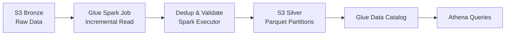

### Answer: Incremental Processing in AWS Medallion Data Lake (Bronze → Silver)

**Bronze Storage (Raw Ingestion)**

* Data lands in **Amazon S3 Bronze** as immutable objects (JSON/CSV/Avro).
* **Kafka producer → Kafka broker → Glue streaming job / Firehose** writes data.
* S3 object creation events are handled by **AWS S3 API + Linux kernel I/O**.

**Incremental Read Mechanism**

* **AWS Glue Spark job** tracks last processed watermark (max event_ts or S3 object path).
* Spark executors (JVM) read only **new S3 partitions or objects** using partition predicates.
* Glue Data Catalog provides table metadata for partition pruning.

**Idempotency Guarantee**

* Each record carries a **business key + event_ts**.
* Spark performs **deduplication** using window functions before write.

```sql
ROW_NUMBER() OVER (PARTITION BY device_id, event_ts ORDER BY ingest_ts DESC) = 1
```

**Late-Arriving Data Handling**

* Bronze keeps raw data indefinitely for replay.
* Silver reprocesses a **sliding time window** (for example, last 2 days).
* Spark overwrites only affected partitions using dynamic partition overwrite mode.

**Write to Silver Layer**

* Cleaned data is written to **S3 Silver** in Parquet with time-based partitions.
* Spark executor commits files via **S3 multipart upload API**.
* Glue updates partitions in **Glue Data Catalog**.

**Cost and Performance Optimizations**

* Partition pruning via `event_date` reduces Athena and Spark scan costs.
* Columnar Parquet minimizes I/O.
* Incremental processing avoids full reprocessing.

**End-to-End Flow**



**Key Components Performing Actions**

* Kafka producer / broker: event ingestion
* Glue Spark driver & executors (JVM): transformation and deduplication
* Glue Data Catalog: schema and partition management
* S3 API: object storage and retrieval

**Final Outcome**
The Silver layer remains **accurate, deduplicated, and incrementally updated**, while Bronze enables **safe reprocessing** at minimal cost.
