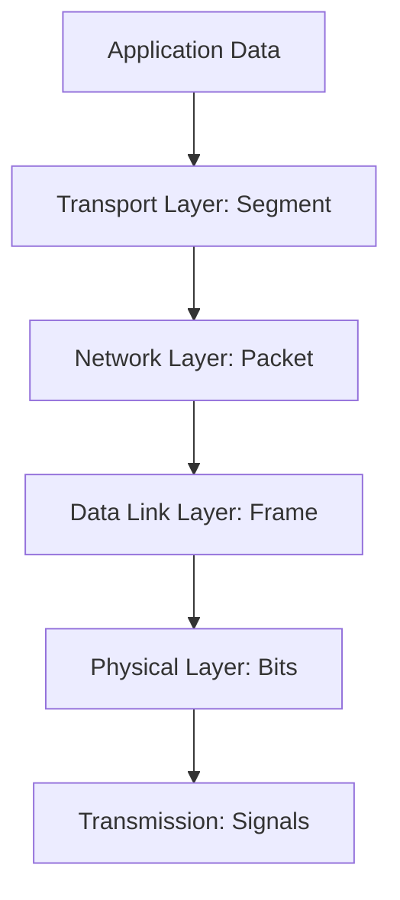

# Packets:

Data goes through OSI layers like this (when sending):

```
Application → Transport → Network → Data Link → Physical
```

When *receiving*, it goes in reverse.

---

##  Step-by-Step: Bits → Frames → Packets

| Layer                   | What It Handles                      | Data Unit            | Key Function                                                               |
| ----------------------- | ------------------------------------ | -------------------- | -------------------------------------------------------------------------- |
| **Layer 1 – Physical**  | Electrical / optical / radio signals | **Bits (1s and 0s)** | Convert digital bits to physical signals and transmit them over the medium |
| **Layer 2 – Data Link** | Frames (organized bits)              | **Frames**           | Add MAC addresses, detect/correct errors, control access to the medium     |
| **Layer 3 – Network**   | Packets (organized frames)           | **Packets**          | Add IP addresses and routing info                                          |

---

## 🧩 Let’s follow the transformation

### **1️⃣ At Layer 1 – Physical layer (Bits)**

* Data is just a **stream of 1s and 0s**.
* These bits are **encoded** into physical signals depending on the medium:

  * Copper wire → voltage pulses
  * Fiber → light pulses
  * Wi-Fi → radio waves

🧠 Example:

```
Bits: 10110010
→ Voltage transitions on wire
→ Receiver measures voltage levels → reconstructs bits
```

There’s **no concept of frames or addresses** here — just raw bit transmission.

---

### **2️⃣ At Layer 2 – Data Link layer (Frames)**

* Takes a chunk of data from Layer 3 (called a **packet**) and wraps it in a **frame**.
* Adds headers and trailers for delivery **within the same local network**.

**Frame Structure (Ethernet example):**

| Section                        | Purpose                               |
| ------------------------------ | ------------------------------------- |
| **Preamble**                   | Helps receiver synchronize timing     |
| **Destination MAC**            | Hardware address of receiver          |
| **Source MAC**                 | Hardware address of sender            |
| **Type / Length**              | Identifies what’s inside (e.g., IPv4) |
| **Payload**                    | The Layer 3 packet (IP packet)        |
| **FCS (Frame Check Sequence)** | CRC for error detection               |

🧩 Example:

```
| Preamble | Dest MAC | Src MAC | Type | IP Packet | FCS |
```

* Layer 2 breaks the packet into frames and sends them as bits down to Layer 1.
* When the receiver’s Layer 2 reconstructs the frame, it verifies the FCS, then passes the IP packet up to Layer 3.

---

### **3️⃣ How bits → packet connection works**

```
Application Data
   ↓
Transport Layer (adds ports)
   ↓
Network Layer (adds IP headers → Packet)
   ↓
Data Link Layer (adds MAC headers → Frame)
   ↓
Physical Layer (encodes as bits/signals)
```

On receiving side:

```
Bits → Frame → Packet → Segment → Data
```

---

### ⚡ Summary Diagram (in mermaid)



---

### ✅ Quick Recap

| Concept    | Created at      | Contains                       | Purpose                            |
| ---------- | --------------- | ------------------------------ | ---------------------------------- |
| **Bits**   | Physical Layer  | Electrical/light/radio signals | Actual transmission                |
| **Frame**  | Data Link Layer | MAC headers + IP packet        | Local delivery (same network)      |
| **Packet** | Network Layer   | IP headers + payload           | Logical delivery (across networks) |

---

Would you like a **real Ethernet example** (hexadecimal form) showing exactly how an IP packet looks when wrapped into a frame and turned into bits?


# Packet diagram (Mermaid)

Below are two Mermaid diagrams: 1) layered encapsulation (how a packet is wrapped into a frame and into bits), and 2) a detailed Ethernet frame with an IP packet and TCP segment inside.

```mermaid
flowchart LR
  A[Application Data (HTTP payload)]
  B[Transport: TCP Segment<br/>Src Port / Dst Port / Seq / Ack]
  C[Network: IP Packet<br/>Src IP / Dst IP / TTL / Protocol]
  D[Data Link: Ethernet Frame<br/>Preamble / Dest MAC / Src MAC / EtherType / Payload / FCS]
  E[Physical: Bits / Signals]

  A --> B
  B --> C
  C --> D
  D --> E
```

```mermaid
flowchart TB
  subgraph Ethernet_Frame["Ethernet Frame (example)"]
    direction TB
    pre[Preamble (7 bytes) + SFD (1 byte)]
    dst[Destination MAC (6 bytes)]
    src[Source MAC (6 bytes)]
    ethertype[Type/Length (2 bytes)]
    payload[Payload (46-1500 bytes) → contains IP packet]
    fcs[FCS (4 bytes)]
  end

  subgraph IP_Packet["IP Packet (inside payload)"]
    version[Version + IHL (1 byte)]
    tos[TOS (1 byte)]
    totlen[Total Length (2 bytes)]
    id[Identification (2 bytes)]
    flags_offset[Flags + Fragment Offset (2 bytes)]
    ttl[TLL (1 byte)]
    proto[Protocol (1 byte) — e.g., TCP=6]
    hdrchksum[Header Checksum (2 bytes)]
    srcip[Source IP (4 bytes)]
    dstip[Destination IP (4 bytes)]
    ip_payload[IP Payload → contains TCP segment]
  end

  subgraph TCP_Segment["TCP Segment (inside IP payload)"]
    srcport[Src Port (2 bytes)]
    dstport[Dst Port (2 bytes)]
    seq[Sequence Number (4 bytes)]
    ack[Ack Number (4 bytes)]
    offset_flags[Data Offset + Flags (2 bytes)]
    window[Window (2 bytes)]
    chksum[Checksum (2 bytes)]
    urgptr[Urgent Pointer (2 bytes)]
    tcp_payload[Application data (HTTP etc.)]
  end

  Ethernet_Frame --> pre
  Ethernet_Frame --> dst
  Ethernet_Frame --> src
  Ethernet_Frame --> ethertype
  Ethernet_Frame --> payload
  Ethernet_Frame --> fcs

  payload --> IP_Packet
  IP_Packet --> version
  IP_Packet --> tos
  IP_Packet --> totlen
  IP_Packet --> id
  IP_Packet --> flags_offset
  IP_Packet --> ttl
  IP_Packet --> proto
  IP_Packet --> hdrchksum
  IP_Packet --> srcip
  IP_Packet --> dstip
  IP_Packet --> ip_payload

  ip_payload --> TCP_Segment
  TCP_Segment --> srcport
  TCP_Segment --> dstport
  TCP_Segment --> seq
  TCP_Segment --> ack
  TCP_Segment --> offset_flags
  TCP_Segment --> window
  TCP_Segment --> chksum
  TCP_Segment --> urgptr
  TCP_Segment --> tcp_payload
```

If you want, I can:

* produce a compact single-line ASCII diagram with byte offsets, or
* show a hex example of a real Ethernet frame containing an IP/TCP packet. Which would you like next?

