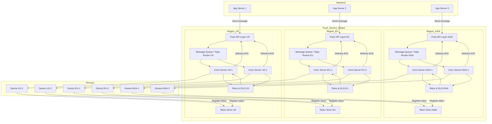

Excellent — this is one of the **most important large-scale distributed systems** in modern mobile infrastructure. Let’s do a **deep system design of a Push Notification System** like **Firebase Cloud Messaging (FCM)** or **Apple Push Notification Service (APNS)**.

We’ll cover architecture, components, protocols, reliability, scaling, and optimizations — all at a **system design interview level of depth**.

---

## 🧭 1. **Overview**

**Goal:** Deliver notifications (messages) from backend servers to user devices **reliably**, **in real time**, and **at scale**.

**Example use cases:**

* Chat message alerts (WhatsApp, Messenger)
* Promotional notifications (Amazon, Flipkart)
* Background updates (email sync, app data refresh)

---

## 🏗️ 2. **High-Level Architecture**

```mermaid
graph TD
    A[App Server / Backend] -->|Sends Message| B[Push Notification Service API (FCM)]
    B --> C[Message Queue / Topic Router]
    C --> D[Connection Server Layer]
    D --> E[Persistent Connections to Devices]
    E --> F[Mobile Devices (Android/iOS/Web)]

    F -->|Token Registration| B
    B -->|Acknowledgment| A
```

---

### 🔹 Components Breakdown

| Component                           | Description                                                                                          |
| ----------------------------------- | ---------------------------------------------------------------------------------------------------- |
| **App Server (Developer Backend)**  | The business app backend that wants to notify users — e.g., “New order shipped.”                     |
| **Push Service API (like FCM API)** | Receives messages from developers, authenticates via API key or OAuth.                               |
| **Message Queue / Topic Router**    | Stores and routes messages based on device tokens, topics, or user groups. Ensures ordering & retry. |
| **Connection Server**               | Maintains long-lived TCP connections to millions of devices. Handles delivery, retry, ACK.           |
| **Device Client SDK**               | Handles registration (device token), background reception, and message display.                      |
| **Token Store**                     | Maps `user_id → device_token(s)` securely. Tokens are periodically refreshed.                        |

---

## ⚙️ 3. **Lifecycle of a Push Message**

| Step                         | Description                                                                                      |
| ---------------------------- | ------------------------------------------------------------------------------------------------ |
| **1. Registration**          | Device SDK contacts FCM to register → gets a **device token** (unique ID). App server stores it. |
| **2. Message Send**          | App server sends message via FCM API with device token and payload.                              |
| **3. Queueing & Routing**    | FCM validates token, queues message, picks the nearest data center for delivery.                 |
| **4. Persistent Connection** | FCM uses long-lived **HTTP/2 or XMPP** connections to devices.                                   |
| **5. Delivery & ACK**        | Device ACKs receipt → FCM updates delivery status. Retries if offline.                           |
| **6. Display**               | App or OS shows notification using payload metadata (title, body, sound, image).                 |

---

## 🌐 4. **Protocols Used**

| Protocol                     | Use Case                                                | Notes                                    |
| ---------------------------- | ------------------------------------------------------- | ---------------------------------------- |
| **HTTP/2 (FCM HTTP v1 API)** | App → FCM (message send)                                | Secure, multiplexed                      |
| **XMPP / MQTT**              | FCM → Device                                            | For persistent, bi-directional messaging |
| **TLS**                      | Encryption                                              | Ensures privacy and authenticity         |
| **QUIC (Optional)**          | Experimental optimization for low-latency reconnections |                                          |

---

## 💡 5. **Key Design Challenges**

| Challenge                      | Solution                                                          |
| ------------------------------ | ----------------------------------------------------------------- |
| **Billions of devices online** | Use regional shards of connection servers with horizontal scaling |
| **Device offline handling**    | Message stored with TTL (time-to-live); retries on reconnect      |
| **Network efficiency**         | Use **topic-based** push (e.g., all “Sports Updates” subscribers) |
| **Battery optimization**       | OS wakes the app only for relevant notifications                  |
| **Security**                   | Use **OAuth 2.0**, per-app tokens, signed payloads                |
| **Ordering guarantees**        | Use message IDs, timestamps, or sequence numbers                  |
| **Data privacy**               | Payload encrypted; often only metadata visible to FCM             |

---

## 🧱 6. **Storage & Queuing Layer**

| Function                      | Technology Used                      |
| ----------------------------- | ------------------------------------ |
| **Message queueing**          | Kafka / PubSub / SQS                 |
| **Token mapping**             | Redis / DynamoDB / Spanner           |
| **Delivery logs**             | Bigtable / S3 / Cloud Storage        |
| **Retry & dead-letter queue** | Separate topic for failed deliveries |

---

## 📊 7. **Scalability Techniques**

| Technique                           | Purpose                                |
| ----------------------------------- | -------------------------------------- |
| **Sharding by device token prefix** | Distribute load evenly across servers  |
| **Regional data centers**           | Deliver closer to user (lower latency) |
| **Persistent TCP connection pools** | Reduce connection setup overhead       |
| **Batched notifications**           | Aggregate similar notifications        |
| **Backoff retry algorithm**         | Avoid overload during mass reconnects  |

---

## 🔒 8. **Reliability & Security**

| Mechanism                    | Description                               |
| ---------------------------- | ----------------------------------------- |
| **Acknowledgements**         | Devices send ACKs; FCM retries on failure |
| **Idempotent message IDs**   | Avoid duplicate notifications             |
| **JWT-based Authentication** | App server authenticated to FCM           |
| **Payload encryption**       | Ensures confidentiality of message        |
| **Rate limiting & quota**    | Prevents abuse by rogue clients           |

---

## 📱 9. **Example JSON Payload**

```json
{
  "message": {
    "token": "DEVICE_TOKEN_123",
    "notification": {
      "title": "Order Shipped!",
      "body": "Your package is on the way."
    },
    "data": {
      "orderId": "78910",
      "priority": "high"
    },
    "android": {
      "priority": "HIGH",
      "ttl": "3600s"
    }
  }
}
```

---

## 🔄 10. **End-to-End Flow Summary**

| Stage            | System Involved         | Responsibility             |
| ---------------- | ----------------------- | -------------------------- |
| 1️⃣ Registration | Device + FCM            | Get token                  |
| 2️⃣ Send         | App server + FCM API    | Queue message              |
| 3️⃣ Route        | FCM Router              | Select region & connection |
| 4️⃣ Deliver      | FCM Connection Server   | Push to device             |
| 5️⃣ ACK          | Device SDK              | Confirm receipt            |
| 6️⃣ Display      | OS Notification Service | Show message               |

---

## 🧠 11. **Design Enhancements (Advanced)**

| Enhancement           | Description                                       |
| --------------------- | ------------------------------------------------- |
| **Edge caching**      | Store last notifications regionally               |
| **Multimodal push**   | Include image/video previews                      |
| **Priority channels** | Separate system-critical vs. marketing pushes     |
| **User segmentation** | Target by topic, region, device type              |
| **Observability**     | Metrics: delivery latency, drop rate, retry count |

---

## 🧩 12. **Example: Google FCM Real System**

| Layer            | Technology (Google Internal) |
| ---------------- | ---------------------------- |
| Connection Layer | XMPP over TCP                |
| Routing Layer    | Pub/Sub, Spanner             |
| Storage Layer    | Bigtable                     |
| Edge Cache       | Cloud CDN                    |
| Monitoring       | Borgmon / Stackdriver        |

---

Would you like me to draw the **detailed system design diagram (Mermaid)** showing **message flow, queues, connection servers, retries, and token stores** for this Push Notification system (like a distributed architecture view)?


Perfect — let’s visualize the **distributed system architecture of a push notification system** like Firebase Cloud Messaging (FCM) in a **Mermaid diagram**, showing all key components, message flow, and reliability mechanisms.

---

```mermaid
graph TD
    %% Clients / Devices
    subgraph Devices
        D1[Mobile Device 1]
        D2[Mobile Device 2]
        D3[Mobile Device 3]
    end

    %% App Servers / Backends
    subgraph Backend
        A1[App Server 1]
        A2[App Server 2]
    end

    %% Push Notification Service
    subgraph FCM_Service
        API[Push API / Auth Layer]
        MQ[Message Queue / Topic Router]
        ConnSrv[Connection Servers Layer<br/>(Persistent TCP/HTTP2 connections)]
        TokenStore[Device Token Store<br/>(Redis / DB)]
        Retry[Retry & Dead Letter Queue]
    end

    %% Data Flow
    A1 -->|Send message with token| API
    A2 -->|Send message with token| API

    API --> TokenStore
    API --> MQ
    MQ --> ConnSrv
    ConnSrv --> D1
    ConnSrv --> D2
    ConnSrv --> D3

    %% Device registration
    D1 -->|Register token| TokenStore
    D2 -->|Register token| TokenStore
    D3 -->|Register token| TokenStore

    %% ACK / Retry
    D1 -->|ACK / NACK| ConnSrv
    D2 -->|ACK / NACK| ConnSrv
    D3 -->|ACK / NACK| ConnSrv
    ConnSrv --> Retry
    Retry --> ConnSrv

    %% Delivery status
    ConnSrv -->|Delivery Status| API
    API -->|Status update| A1
    API -->|Status update| A2
```

---

### 🔍 Explanation of Flow

1. **Device Registration**

   * Each device registers with the push service → receives a unique token.
   * Token stored in `TokenStore` for mapping to user/device.

2. **Message Send**

   * App server sends a message via `Push API` with device token and payload.

3. **Message Queue / Topic Router**

   * Queues messages for delivery.
   * Handles topics, user groups, and prioritization.
   * Ensures ordering, TTL, and retries.

4. **Connection Server Layer**

   * Maintains **persistent TCP/HTTP2 connections** to millions of devices.
   * Pushes messages immediately if device is online.

5. **Device Delivery**

   * Device SDK receives message and ACK/NACK is sent back.
   * Retries handled if NACK or device offline.

6. **Retry / Dead Letter Queue**

   * Stores failed messages for retry or logging.
   * Helps achieve **reliability at scale**.

7. **Delivery Status Feedback**

   * Push service informs backend about successful/failed deliveries.

---

### ⚡ Key System Design Highlights

| Feature                  | How It Works                                                          |
| ------------------------ | --------------------------------------------------------------------- |
| **Scalability**          | Shard connection servers by device token prefix or region.            |
| **Reliability**          | Retries, persistent queues, ACK/NACK mechanism, TTL on messages.      |
| **Security**             | TLS-encrypted channels, OAuth or API keys for app server.             |
| **Latency Optimization** | Regional edge servers; topic-based multicast; persistent connections. |
| **Offline Handling**     | Messages stored until device reconnects.                              |
| **Monitoring**           | Track message drops, latency, queue backlog.                          |

---

This diagram **captures the end-to-end flow**, from app server → FCM → queue → connection server → device, including **registration, retry, and delivery status**.

---

If you want, I can also create a **more detailed diagram showing multiple regions, horizontal scaling of connection servers, and topic-based routing** — which is how **Firebase handles billions of devices globally**.

Do you want me to draw that version too?


Perfect — let’s design the **fully-scaled, global push notification architecture** like Firebase, showing **regional sharding, horizontal scaling, topic routing, queues, and device connections**. This gives a **realistic view for billions of devices**.

---



---

### 🔍 Architecture Highlights

1. **Regional Sharding**

   * Each region has its own **API layer, message queue, connection servers, token store**.
   * Reduces latency and failure domain.

2. **Horizontal Scaling**

   * Multiple connection servers per region handle **millions of concurrent persistent connections**.

3. **Topic / Group Routing**

   * Message queues support **topic-based delivery** (broadcast to thousands/millions of devices).

4. **Retry & Dead Letter Queue**

   * Ensures **reliable delivery**, even if devices are offline temporarily.
   * Failed messages are retried based on TTL and delivery policy.

5. **Token Store**

   * Maintains device tokens mapped to users for targeted or multicast notifications.

6. **Delivery Feedback**

   * Connection servers send ACKs back to regional API → app server notified of delivery success/failure.

7. **Global Coordination**

   * Regions are loosely coupled; messages for local devices stay within that region.
   * Multi-region devices receive notifications from the closest region.

---

### ⚡ Advantages of This Design

* **Low Latency:** Devices connect to nearest regional connection server.
* **High Reliability:** Retries, queues, DLQs prevent message loss.
* **Massive Scalability:** Horizontal scaling + sharding supports billions of devices.
* **Topic-Based Efficiency:** Broadcast messages without sending individually.
* **Seamless Offline Handling:** TTL and retry ensure eventual delivery.

---

If you want, I can also make a **sequence diagram** showing **exact message lifecycle** from **App Server → FCM Queue → Connection Server → Device → ACK → App Server**, including retries and offline handling.

Do you want me to do that next?
