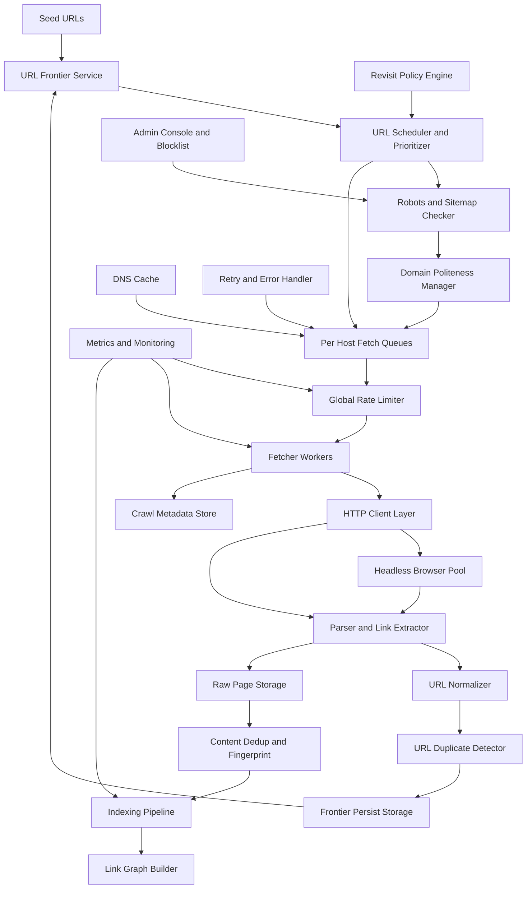

Nice — let’s design a production grade **web crawler** (the part of Google that fetches web pages). I’ll show a clean **Mermaid diagram** (no parentheses in labels) and then walk through each component, the end-to-end flow, scaling choices, and important trade offs like freshness vs coverage, politeness, and deduplication.

# System diagram

---

# High level flow (step by step)

1. **Seed URLs**

   * Start with a feed of seed URLs from sitemaps, user submissions, known sites, previous index.

2. **URL Frontier Service**

   * Central component that holds the global set of URLs to crawl, partitioned for scale.
   * Supports many operations: enqueue, dequeue, re-enqueue, persist state.

3. **URL Scheduler and Prioritizer**

   * Decides which URLs to fetch next based on priority signals:

     * Domain importance, PageRank, crawl depth, freshness recency, last-modified, politeness.
   * Uses revisit policy to balance freshness vs coverage.

4. **Robots and Sitemap Checker**

   * Before fetching a host, check robots txt and sitemaps, obey disallow and crawl-delay. Cache robots results.

5. **Domain Politeness Manager**

   * Enforces per-host and per-domain rate limits, maximum concurrent connections per host, per IP backoff.
   * Keeps per-host queues to avoid overloading a single site.

6. **DNS Cache / Resolver**

   * Resolve hostnames with caching to avoid repeated DNS lookups. Respect TTL and handle DNS failures.

7. **Per Host Fetch Queues**

   * Scheduler pushes URLs into per-host queues; these queues are the unit of politeness and connection control.

8. **Global Throttler**

   * Global governors enforce cluster-wide limits, e.g., overall fetch RPS and safety circuits for overload or spikes.

9. **Fetcher Workers**

   * Distributed pool of workers across machines that pull from host queues when allowed.
   * Each worker opens connections, manages keep-alive, supports HTTP/1.1, HTTP/2, QUIC where supported.

10. **HTTP Client Layer**

    * Handles conditional GETs with If-Modified-Since and ETag to save bandwidth.
    * Supports redirect handling, cookies, TLS handshake, retries with exponential backoff.

11. **JS Renderer (Headless Browser Pool)**

    * For pages requiring JS to render (SPA), workers optionally route to headless browser pool (Chrome headless) for rendering and collecting the fully rendered HTML.
    * Use render queue and detect when JS rendering is needed to save resources.

12. **Parser and Link Extractor**

    * Parse HTML, extract links, canonical link tags, rel alternate, meta robots noindex/nofollow, structured data.
    * Extract content for indexing and signals for dedup.

13. **URL Normalizer**

    * Normalize extracted URLs (lowercase host, remove default ports, sort query params per policy, handling fragments) and resolve relative links.

14. **Duplicate URL Detection**

    * Before re-adding a URL to the frontier, check canonicalization and existing visited set to avoid re-crawling same URL unnecessarily.

15. **Frontier Persist**

    * If URL is new and allowed, persist into frontier (backed by distributed queue database like Kafka, or key value store), partitioned across workers.

16. **Raw Page Storage**

    * Store raw fetched bytes (compressed) in durable storage (HDFS S3 or object store) for downstream reprocessing and compliance.

17. **Content Deduplication and Fingerprinting**

    * Compute content fingerprints (simhash, md5, shingles) to detect near duplicates and exact duplicates. Helps save indexing and storage.

18. **Indexing Pipeline**

    * Pages pass to the indexer: parse content, generate tokens, produce inverted index fragments, store in index cluster.

19. **Link Graph Builder**

    * Store extracted links into link graph store for ranking signals and to seed the next wave.

20. **Crawl Metadata Store**

    * Stores crawl status, last fetch time, response codes, bytes downloaded, errors for each URL.

21. **Retry and Error Handler**

    * Handles transient errors, 5xx, timeouts, and schedules retries with backoff. Permanent errors mark URL as failed.

22. **Admin Console and Blocklist**

    * Operators can add domain blocks, adjust politeness, or supply rules (e.g., remove content due to legal requests).

23. **Metrics and Monitoring**

    * Monitor latency, error rates, throughput, per-domain errors, robots changes, bandwidth usage, costs.

---

# Key design choices and scalability patterns

### Partitioning and throughput

* **Partition frontier by host or by domain hash** so same domain goes to the same politeness manager and reduces cross-host collisions.
* Use a distributed queue system (Kafka style) or sharded frontier DB to handle billions of URLs.
* Fetchers horizontally scale; add more workers to increase parallelism.

### Politeness and fairness

* Per-host queues make sure you never fetch too fast from one domain.
* Respect robots and crawl-delay.
* Adaptive backoff when site returns 429 or slow responses.

### Freshness vs Coverage

* Revisit policy engine controls re-crawl frequency. High-value sites are crawled more often.
* Use change detection from If-Modified-Since and content fingerprint diffs to prioritize.

### Deduplication

* Exact duplicates via strong hash (md5).
* Near duplicates via SimHash or MinHash on shingles to avoid indexing the same content multiple times.

### JS Rendering

* Expensive; route only those pages requiring JS. Use heuristics (presence of heavy scripts) or previously known domains requiring rendering.

### Storage

* Raw pages stored compressed in object store for reprocessing.
* Index stored in distributed index cluster (sharded inverted index).
* Link graph stored in graph DB or key value stores for ranking.

### DNS, SSL, HTTP protocol support

* Cache DNS, reuse TLS sessions, support HTTP/2 and QUIC for faster fetches where supported.

### Fault tolerance

* Frontier persists progress; fetchers can fail and resume.
* Checkpointing ensures no URL is lost.
* Use idempotent storage operations and write-ahead logs.

### Polices, legality, and opt-out

* Robots is required; also implement blacklists, legal takedown, and do-not-crawl lists.

---

# Algorithms and data structures used

* **Frontier**: priority queues partitioned by domain.
* **Visited set**: probabilistic filters (Bloom filters) for initial filtering plus persistent DB for authoritative visited flag.
* **Dedup**: SimHash for near-dup detection.
* **URL Canonicalization**: normalization rules and canonical tag handling.
* **Scheduling**: priority queue with score = f(importance, freshness urgency, domain quota, denylist).
* **Rate limiting**: token buckets per host and global.

---

# Operational concerns

* **Bandwidth costs** are huge; use conditional requests and compression.
* **Politeness and legal compliance** to avoid being blocked or sued.
* **Monitoring and alerting** for crawler health, per-domain errors, and spammy hosts.
* **Backpressure** from index and storage systems should throttle the fetch rate automatically.

---

# Mini checklist for a starter crawler

* Frontier with persistent queue
* Per-host polite fetch queues
* HTTP client with conditional GET and retry/backoff
* HTML parser and URL normalizer
* Basic robots.txt checker and sitemap fetcher
* Raw storage for fetched pages
* Simple indexer or pipeline to store extracted content
* Metrics and admin UI to control domain blocking and re-crawl frequency

---

If you want, I can:

* Produce a **detailed Mermaid sequence diagram** for a single URL fetch lifecycle (robots check, DNS, fetch, parse, store).
* Write a **small prototype crawler** in Python that demonstrates frontier, politeness per host, and basic parsing.
  Which would you like next?
