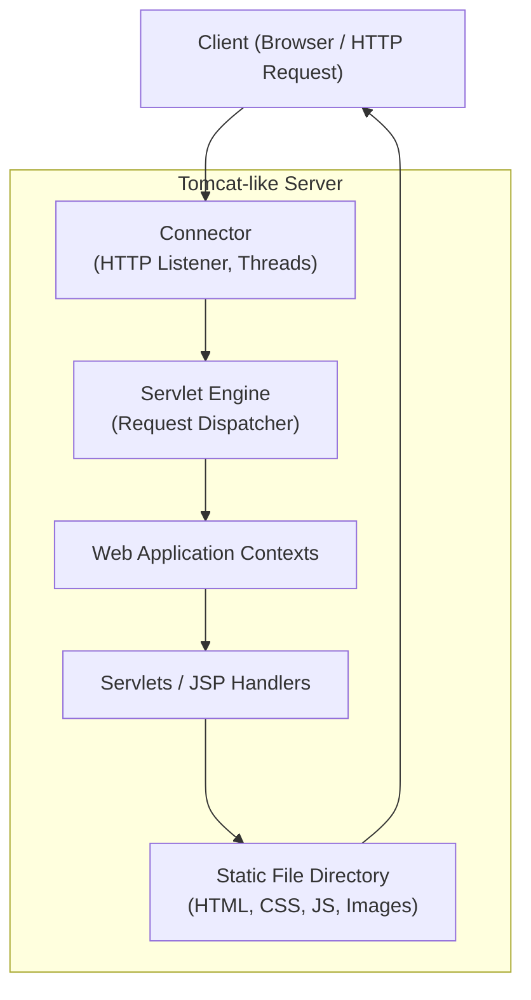
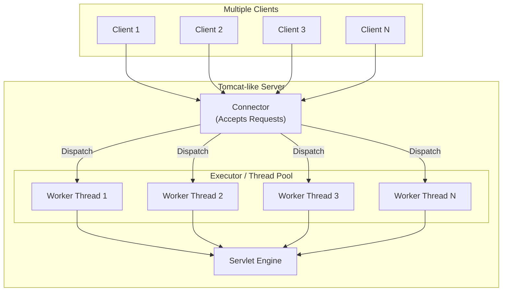
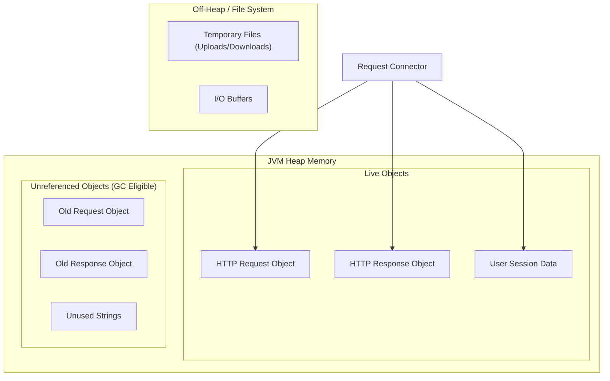
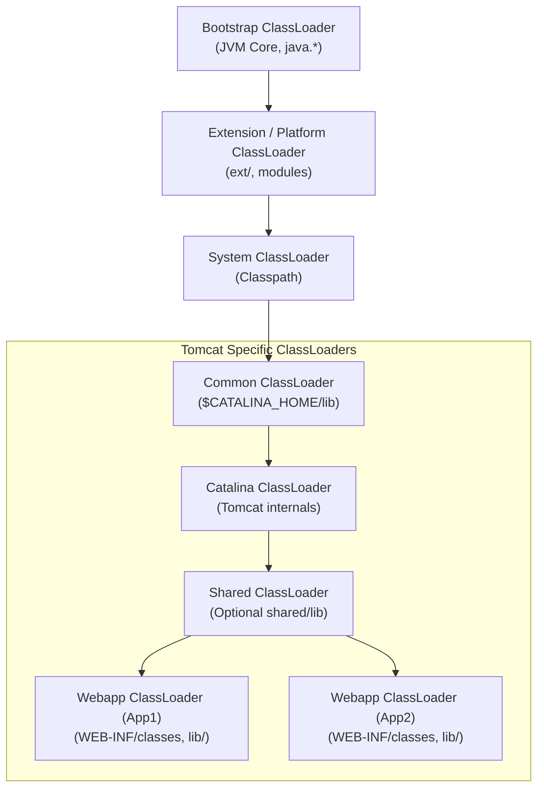

# Server

## High Level Diagram

```mermaid
flowchart TD

    Client["Client (Browser / HTTP Request)"]

    subgraph Tomcat["Tomcat-like Server"]
        Connector["Connector<br/>(HTTP Listener, Threads)"]
        Engine["Servlet Engine<br/>(Request Dispatcher)"]
        Context["Web Application Contexts"]
        Servlet["Servlets / JSP Handlers"]
        StaticDir["Static File Directory<br/>(HTML, CSS, JS, Images)"]
    end

    Client --> Connector --> Engine --> Context --> Servlet ---> StaticDir --> Client
```

## Multiple Users

```mermaid
flowchart TD

    subgraph Clients["Multiple Clients"]
        C1["Client 1"]
        C2["Client 2"]
        C3["Client 3"]
        C4["Client N"]
    end

    subgraph Tomcat["Tomcat-like Server"]
        Connector["Connector<br/>(Accepts Requests)"]
        
        subgraph ThreadPool["Executor / Thread Pool"]
            T1["Worker Thread 1"]
            T2["Worker Thread 2"]
            T3["Worker Thread 3"]
            TN["Worker Thread N"]
        end

        Engine["Servlet Engine"]
    end

    C1 --> Connector
    C2 --> Connector
    C3 --> Connector
    C4 --> Connector

    Connector -->|Dispatch| T1
    Connector -->|Dispatch| T2
    Connector -->|Dispatch| T3
    Connector -->|Dispatch| TN

    T1 --> Engine
    T2 --> Engine
    T3 --> Engine
    TN --> Engine
```

## Memory Management 

```mermaid
flowchart TD

    subgraph Heap["JVM Heap Memory"]
        subgraph LiveObjects["Live Objects"]
            Req1["HTTP Request Object"]
            Resp1["HTTP Response Object"]
            Session["User Session Data"]
        end

        subgraph Unreferenced["Unreferenced Objects (GC Eligible)"]
            OldReq["Old Request Object"]
            OldResp["Old Response Object"]
            TempStr["Unused Strings"]
        end
    end

    subgraph OffHeap["Off-Heap / File System"]
        TmpFiles["Temporary Files (Uploads/Downloads)"]
        Buffers["I/O Buffers"]
    end

    Connector["Request Connector"] --> Req1
    Connector --> Resp1
    Connector --> Session
```

 

## Classloaders

```mermaid
flowchart TD

    Bootstrap["Bootstrap ClassLoader<br/>(JVM Core, java.*)"]
    Ext["Extension / Platform ClassLoader<br/>(ext/, modules)"]
    System["System ClassLoader<br/>(Classpath)"]

    subgraph Tomcat["Tomcat Specific ClassLoaders"]
        Common["Common ClassLoader<br/>($CATALINA_HOME/lib)"]
        Catalina["Catalina ClassLoader<br/>(Tomcat internals)"]
        Shared["Shared ClassLoader<br/>(Optional shared/lib)"]
        Webapp1["Webapp ClassLoader (App1)<br/>(WEB-INF/classes, lib/)"]
        Webapp2["Webapp ClassLoader (App2)<br/>(WEB-INF/classes, lib/)"]
    end

    Bootstrap --> Ext --> System --> Common --> Catalina --> Shared
    Shared --> Webapp1
    Shared --> Webapp2
```
