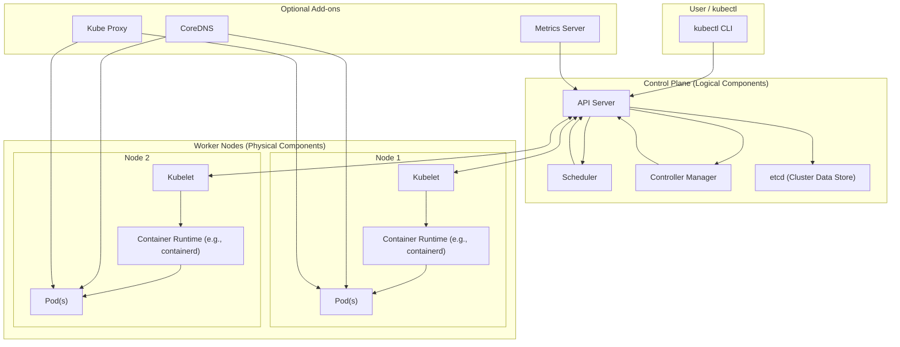

**Kubernetes** (often abbreviated as **K8s**) is an open-source container orchestration platform designed to automate the deployment, scaling, and management of containerized applications. Initially developed by Google and now maintained by the **Cloud Native Computing Foundation (CNCF)**, Kubernetes simplifies managing clusters of containers across multiple environments, including cloud, on-premises, and hybrid setups.

---

### **Key Features of Kubernetes**

1. **Container Orchestration**  
   - Automates deployment and management of containers (e.g., Docker containers).
   - Ensures applications run efficiently and reliably across distributed systems.

2. **Self-Healing**  
   - Automatically restarts failed containers.
   - Replaces and reschedules containers when a node fails.

3. **Scaling**  
   - Automatically scales applications up or down based on resource usage or custom metrics.

4. **Load Balancing**  
   - Distributes traffic evenly across containers to ensure high availability and performance.

5. **Service Discovery**  
   - Enables automatic discovery of services without needing manual configuration.

6. **Configuration Management**  
   - Manages application configuration using **ConfigMaps** and **Secrets** to decouple configuration from the application code.

7. **Rolling Updates and Rollbacks**  
   - Allows seamless updates to applications with no downtime.
   - Supports rolling back to previous versions in case of failures.

8. **Multi-Cloud and Hybrid Support**  
   - Runs across various environments, including AWS, Azure, Google Cloud, and on-premises setups.

9. **Resource Management**  
   - Allocates CPU and memory resources to containers using quotas and limits.

10. **Storage Orchestration**  
    - Provides persistent storage to containers via integration with cloud providers, NFS, or custom storage solutions.

---
# Design 
 **Kubernetes architecture** — separating **Control Plane (logical)** and **Worker Nodes (physical)** components

---

### Kubernetes Architecture — Control Plane and Nodes



---

###  Explanation

| Layer                       | Components                                      | Role                                       |
| --------------------------- | ----------------------------------------------- | ------------------------------------------ |
| **Control Plane (Logical)** | API Server, etcd, Scheduler, Controller Manager | Manages and orchestrates cluster state     |
| **Worker Nodes (Physical)** | Kubelet, Container Runtime, Pods                | Run workloads (containers)                 |
| **Add-ons**                 | CoreDNS, Kube Proxy, Metrics Server             | Provide networking, DNS, and observability |
| **User**                    | kubectl                                         | Interacts with cluster via API Server      |

---

### Architecture


### **How Kubernetes Works**

Kubernetes operates as a **cluster** of nodes. Each node runs containers and is managed by a centralized control plane.

#### Core Components:

1. **Control Plane**:  
   - **API Server**: Handles communication between users and the cluster.  
   - **Scheduler**: Assigns workloads to available nodes based on resource availability.  
   - **Controller Manager**: Manages cluster state and enforces desired configurations.  
   - **etcd**: A distributed key-value store that stores cluster state.  

2. **Worker Nodes**:  
   - **Kubelet**: Runs on each node and ensures containers are running as specified.  
   - **Kube-proxy**: Manages networking and ensures connectivity between containers and services.  
   - **Container Runtime**: Software like Docker or containerd that runs the containers.  

---

### **Key Concepts in Kubernetes**

1. **Pods**:  
   - The smallest deployable unit in Kubernetes.
   - Represents one or more containers that share the same network namespace and storage.

2. **Services**:  
   - A stable endpoint to access a group of pods, even if pod IPs change.
   - Enables load balancing between pods.

3. **Deployments**:  
   - Manages the deployment of pods.
   - Handles rolling updates and rollbacks.

4. **Namespaces**:  
   - Logical partitions within a cluster to isolate resources and applications.

5. **ConfigMaps and Secrets**:  
   - Used to manage configuration data and sensitive information (e.g., API keys) separately from application code.

6. **Volumes**:  
   - Persistent storage for pods, supporting multiple backend types like NFS, AWS EBS, and more.

7. **Ingress**:  
   - Manages external HTTP and HTTPS access to services in the cluster.

8. **DaemonSets**:  
   - Ensures that a copy of a pod runs on all or specific nodes.

9. **StatefulSets**:  
   - Manages stateful applications like databases, ensuring persistent identities and storage.

10. **Jobs and CronJobs**:  
    - **Jobs**: Run a task until completion.
    - **CronJobs**: Schedule tasks to run periodically.

---

### **Why Use Kubernetes?**

1. **Automates Manual Processes**  
   Kubernetes automates application deployment, scaling, and management, reducing operational overhead.

2. **High Availability**  
   Self-healing, load balancing, and rolling updates ensure application availability even during failures or updates.

3. **Portability**  
   Kubernetes runs on any platform, making it easy to deploy applications in multi-cloud or hybrid environments.

4. **Efficient Resource Utilization**  
   Allocates resources dynamically to ensure efficient usage and cost-effectiveness.

5. **Extensibility**  
   Supports custom extensions using APIs and plugins for networking, storage, and monitoring.

---

### **Use Cases of Kubernetes**

1. **Microservices Architecture**  
   - Deploy and manage distributed microservices efficiently.

2. **CI/CD Pipelines**  
   - Automate application builds, testing, and deployment processes.

3. **Hybrid Cloud Management**  
   - Manage workloads across multiple cloud providers and on-premises.

4. **Batch Processing**  
   - Run computational tasks or data processing jobs using Kubernetes jobs.

5. **High-Traffic Applications**  
   - Handle fluctuating traffic by auto-scaling pods dynamically.

---

### **Comparison with Alternatives**

- **Docker Swarm**: Easier to set up but less feature-rich compared to Kubernetes.
- **OpenShift**: Built on Kubernetes with additional enterprise features.
- **Nomad**: Lightweight and simpler but lacks advanced features like service discovery and autoscaling.

---

### **Getting Started with Kubernetes**

1. **Install Kubernetes**:  
   - Use tools like **Minikube**, **Kind**, or a managed service (e.g., GKE, EKS, AKS).

2. **Basic Commands**:
   - View nodes:  
     ```bash
     kubectl get nodes
     ```
   - Deploy an app:  
     ```bash
     kubectl create deployment my-app --image=nginx
     ```
   - Expose it as a service:  
     ```bash
     kubectl expose deployment my-app --type=LoadBalancer --port=80
     ```

3. **Learn YAML Files**:  
   - Define deployments, services, and other resources declaratively using YAML.

4. **Explore Tools**:  
   - Use tools like Helm (package manager), Kustomize (templating), and Prometheus (monitoring).

---

Kubernetes is the de facto standard for managing containerized applications, offering scalability, portability, and automation. It is a critical tool for modern DevOps and cloud-native architectures.
