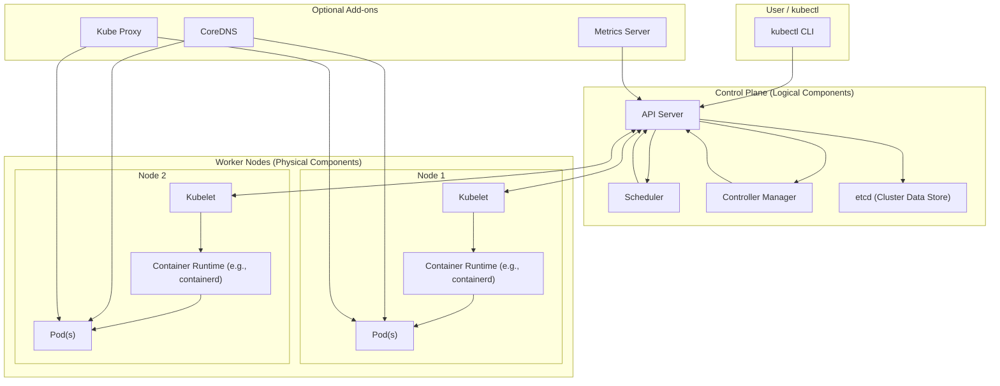

# Kubernetes

**Kubernetes** (often abbreviated as **K8s**) is an open-source container orchestration platform designed to automate the deployment, scaling, and management of containerized applications. Initially developed by Google and now maintained by the **Cloud Native Computing Foundation (CNCF)**, Kubernetes simplifies managing clusters of containers across multiple environments, including cloud, on-premises, and hybrid setups.


### **Key Features of Kubernetes**

1. **Container Orchestration**  
   - Automates deployment and management of containers (e.g., Docker containers).
   - Ensures applications run efficiently and reliably across distributed systems.

2. **Self-Healing**  
   - Automatically restarts failed containers.
   - Replaces and reschedules containers when a node fails.

3. **Scaling**  
   - Automatically scales applications up or down based on resource usage or custom metrics.

4. **Load Balancing**  
   - Distributes traffic evenly across containers to ensure high availability and performance.

5. **Service Discovery**  
   - Enables automatic discovery of services without needing manual configuration.

6. **Configuration Management**  
   - Manages application configuration using **ConfigMaps** and **Secrets** to decouple configuration from the application code.

7. **Rolling Updates and Rollbacks**  
   - Allows seamless updates to applications with no downtime.
   - Supports rolling back to previous versions in case of failures.

8. **Multi-Cloud and Hybrid Support**  
   - Runs across various environments, including AWS, Azure, Google Cloud, and on-premises setups.

9. **Resource Management**  
   - Allocates CPU and memory resources to containers using quotas and limits.

10. **Storage Orchestration**  
    - Provides persistent storage to containers via integration with cloud providers, NFS, or custom storage solutions.

 
 

### Kubernetes Architecture — Control Plane and Nodes


 

| Layer                       | Components                                      | Role                                       |
| --------------------------- | ----------------------------------------------- | ------------------------------------------ |
| **Control Plane (Logical)** | API Server, etcd, Scheduler, Controller Manager | Manages and orchestrates cluster state     |
| **Worker Nodes (Physical)** | Kubelet, Container Runtime, Pods                | Run workloads (containers)                 |
| **Add-ons**                 | CoreDNS, Kube Proxy, Metrics Server             | Provide networking, DNS, and observability |
| **User**                    | kubectl                                         | Interacts with cluster via API Server      |

 - [API Versions](api_version.md)
 - [Resources](kind/)
 - [Scope of Resources](scope.md)
 - [Authentication](Authentication.md)
 - [Monitoring](logging/logging.md)
 - [Networking](networking/)
 - [Service Mesh](service-mesh/)  Internal API Communication and External Endpoint 
 - [Internal Operations](operations/)
 

### Architecture


### **How Kubernetes Works**

Kubernetes operates as a **cluster** of nodes. Each node runs containers and is managed by a centralized control plane.

#### Core Components:

1. [**Control Plane**](control_plane/)  
   - **API Server**: Handles communication between users and the cluster.  
   - **Scheduler**: Assigns workloads to available nodes based on resource availability.  
   - **Controller Manager**: Manages cluster state and enforces desired configurations.  
   - **etcd**: A distributed key-value store that stores cluster state.  

2. [**Worker Nodes**](worker_node/)
   - **Kubelet**: Runs on each node and ensures containers are running as specified.  
   - **Kube-proxy**: Manages networking and ensures connectivity between containers and services.  
   - **Container Runtime**: Software like Docker or containerd that runs the containers.  

3. [Other Planes](Plane.md)
4. [Other Nodes](nodes.md)

### **Key Concepts in Kubernetes**

1. **Pods**:  
   - The smallest deployable unit in Kubernetes.
   - Represents one or more containers that share the same network namespace and storage.

2. **Services**:  
   - A stable endpoint to access a group of pods, even if pod IPs change.
   - Enables load balancing between pods.

3. **Deployments**:  
   - Manages the deployment of pods.
   - Handles rolling updates and rollbacks.

4. [**Namespaces**](namespaces/):  
   - Logical partitions within a cluster to isolate resources and applications.

5. **ConfigMaps and Secrets**:  
   - Used to manage configuration data and sensitive information (e.g., API keys) separately from application code.

6. **Volumes**:  
   - Persistent storage for pods, supporting multiple backend types like NFS, AWS EBS, and more.

7. **Ingress**:  
   - Manages external HTTP and HTTPS access to services in the cluster.

8. **DaemonSets**:  
   - Ensures that a copy of a pod runs on all or specific nodes.

9. **StatefulSets**:  
   - Manages stateful applications like databases, ensuring persistent identities and storage.

10. **Jobs and CronJobs**:  
    - **Jobs**: Run a task until completion.
    - **CronJobs**: Schedule tasks to run periodically.

 

### **Why Use Kubernetes?**

1. **Automates Manual Processes**  
   Kubernetes automates application deployment, scaling, and management, reducing operational overhead.

2. **High Availability**  
   Self-healing, load balancing, and rolling updates ensure application availability even during failures or updates.

3. **Portability**  
   Kubernetes runs on any platform, making it easy to deploy applications in multi-cloud or hybrid environments.

4. **Efficient Resource Utilization**  
   Allocates resources dynamically to ensure efficient usage and cost-effectiveness.

5. **Extensibility**  
   Supports custom extensions using APIs and plugins for networking, storage, and monitoring.

 

### **Use Cases of Kubernetes**

1. **Microservices Architecture**  
   - Deploy and manage distributed microservices efficiently.

2. **CI/CD Pipelines**  
   - Automate application builds, testing, and deployment processes.

3. **Hybrid Cloud Management**  
   - Manage workloads across multiple cloud providers and on-premises.

4. **Batch Processing**  
   - Run computational tasks or data processing jobs using Kubernetes jobs.

5. **High-Traffic Applications**  
   - Handle fluctuating traffic by auto-scaling pods dynamically.
 
### **Comparison with Alternatives**

- **Docker Swarm**: Easier to set up but less feature-rich compared to Kubernetes.
- **OpenShift**: Built on Kubernetes with additional enterprise features.
- **Nomad**: Lightweight and simpler but lacks advanced features like service discovery and autoscaling.

 

### **Getting Started with Kubernetes**

1. **Install Kubernetes**:  
   - Use tools like **Minikube**, **Kind**, or a managed service (e.g., GKE, EKS, AKS).

2. **Basic Commands**:
   - View nodes:  
     ```bash
     kubectl get nodes
     ```
   - Deploy an app:  
     ```bash
     kubectl create deployment my-app --image=nginx
     ```
   - Expose it as a service:  
     ```bash
     kubectl expose deployment my-app --type=LoadBalancer --port=80
     ```

3. **Learn YAML Files**:  
   - Define deployments, services, and other resources declaratively using YAML.

4. **Explore Tools**:  
   - Use tools like Helm (package manager), Kustomize (templating), and Prometheus (monitoring).
 

Kubernetes is the de facto standard for managing containerized applications, offering scalability, portability, and automation. It is a critical tool for modern DevOps and cloud-native architectures.


The Kubernetes kube-scheduler assigns Pods to nodes through a two-phase process: filtering and scoring. 
In the filtering phase, the scheduler removes all nodes that cannot host the Pod based on resource requests (CPU/memory), node conditions (Ready, DiskPressure), taints and tolerations, affinity/anti-affinity rules, and topology constraints. 

After filtering, the scoring phase evaluates the remaining nodes using scoring plugins—such as resource balance, spreading, and node affinity—to assign a weighted score to each node. The scheduler then selects the node with the highest score and binds the Pod to it, ensuring an optimal placement based on health, capacity, and policy constraints.


A Deployment manages stateless workloads by creating a desired number of identical Pods and allowing Kubernetes to schedule them on any suitable node. It supports strategies like rolling updates and ensures replicas can scale up or down as needed. 

A DaemonSet, by contrast, ensures exactly one Pod runs on every node (or on specific nodes using node selectors or tolerations), making it ideal for system-level agents like log collectors or network plugins. Unlike Deployments, DaemonSets focus on node coverage rather than replica count, and Pods are created automatically on node join events, ensuring continuous presence across the cluster.


A Kubernetes StatefulSet maintains stable Pod identity and storage by assigning each Pod a fixed ordinal index, which becomes part of its persistent DNS name (such as pod-0, pod-1). This stable naming ensures ordered startup and shutdown, allowing distributed systems to maintain membership consistency. 


Each Pod is also associated with its own dedicated PersistentVolumeClaim (PVC), ensuring that storage remains attached even if the Pod is rescheduled to a different node. Together, the deterministic identity, stable network address, and persistent storage allow StatefulSets to run stateful applications like databases and quorum-based systems reliably.


Pods communicate directly using Pod IPs, which are routable across the entire cluster. Kubernetes requires that every Pod can reach every other Pod without NAT, even if they live on different nodes. This cross-node routing is provided by the CNI plugin (like Calico, Flannel, Cilium), which configures node-level routes and network interfaces. kube-proxy programs iptables or IPVS rules only for Service IPs, enabling stable virtual IPs for Services and load balancing traffic to Pods, not between Pods. So Pod-to-Pod communication uses Pod IPs through CNI networking, while Service IPs are used only when accessing a Service abstraction, not for direct Pod communication.


A readiness probe determines when a container is ready to receive traffic; only after it succeeds does the Pod get added to the Service endpoints so traffic can reach it. 

A liveness probe is a continuous health check—if it fails, kubelet restarts the container, and repeated failures lead to CrashLoopBackOff.

 A startup probe is used for applications that take a long time to initialize; during this period, Kubernetes ignores liveness and readiness failures. Once the startup probe succeeds, Kubernetes begins evaluating liveness and readiness normally. This prevents slow-starting applications from being killed prematurely by liveness checks.


ConfigMaps store non-sensitive configuration data in plain text and are not encrypted by default, meaning their values can be easily viewed. They are intended for application configuration but can be reused across multiple Deployments or services if referenced properly.


 Secrets, on the other hand, are designed for sensitive data such as passwords and tokens; they are stored in etcd in a base64-encoded form and can be encrypted at rest using Kubernetes encryption providers. Secrets can also be reused across many workloads, but kubelet treats them with stricter controls—such as not writing them to disk unless explicitly required—making them more secure than ConfigMaps.


The Horizontal Pod Autoscaler (HPA) continuously checks Pod metrics—such as CPU, memory, or custom application metrics—collected by the Metrics Server or external metric providers. Based on the target thresholds defined in the HPA, Kubernetes compares the current utilization with the desired utilization and computes the required number of replicas using a control loop formula. If the observed metric exceeds the threshold, HPA increases the number of Pods; if it drops below, HPA scales them down. This ensures that the Deployment automatically matches workload demand by adjusting replicas in real time.

Here is the exact HPA control loop formula explained clearly and concisely:

HPA Control Loop Formula

Kubernetes calculates the desired number of replicas using:

\text{Desired Replicas} = \text{Current Replicas} \times \frac{\text{Current Metric Value}}{\text{Target Metric Value}}

What this means

Current Metric Value = actual CPU/memory/custom metric observed per Pod

Target Metric Value = value you defined in the HPA (ex: target CPU = 50%)

If the current metric is higher than the target → scale up

If the current metric is lower than the target → scale down


Example

Assume:

Current replicas = 5

Target CPU = 50%

Observed average CPU = 80%


\text{Desired Replicas} = 5 \times \frac{80}{50} = 5 \times 1.6 = 8

So HPA increases Pods from 5 → 8.

Another Example (scale down)

Current replicas = 10

Target CPU = 60%

Observed CPU = 30%


\text{Desired Replicas} = 10 \times \frac{30}{60} = 10 \times 0.5 = 5

HPA scales down from 10 → 5.

In one line

HPA scales replicas proportionally based on how far the current metric deviates from the target metric, using a continuous feedback loop.


A PersistentVolume (PV) is a cluster-level storage resource provisioned by an administrator or through dynamic provisioning using a StorageClass, and it represents the actual physical or cloud-backed storage. 


A PersistentVolumeClaim (PVC) is a user request for storage that specifies requirements such as size and access mode. When a PVC is created, Kubernetes finds a matching PV (or dynamically provisions one) and binds them together in a one-to-one relationship. The Pod then mounts the PVC, and Kubernetes ensures the underlying PV remains attached even if the Pod is rescheduled, providing durable and portable storage.


The kubelet is the node-level agent responsible for ensuring that all Pods assigned to its node are running and healthy. It constantly communicates with the API server to receive Pod specs and report Pod status, and it uses the container runtime (such as containerd or CRI-O) to create, start, stop, and delete containers. The kubelet also executes liveness, readiness, and startup probes, and restarts containers when probes fail. Alongside this, it integrates with cAdvisor to collect CPU, memory, and filesystem metrics for each container. Through these actions, the kubelet manages the full lifecycle of Pods on a node and keeps the local state aligned with the desired state defined by the control plane.
