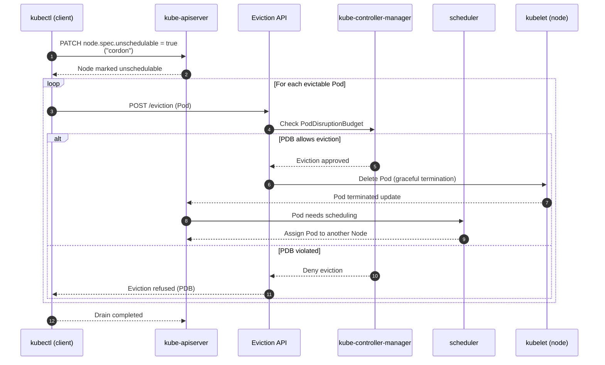

### What Is `kubectl drain`

`kubectl drain` is a Kubernetes command used to **safely evict all Pods from a node** before performing maintenance such as upgrades, reboot, scaling down, or node replacement. The eviction process is handled by the **Eviction API** and enforced by the **kube-controller-manager**, not the kubelet.
The command ensures that only Pods that can be safely moved—based on **PodDisruptionBudgets (PDBs)**, DaemonSets, local storage usage, and pod types—are evicted. It marks the node as **unschedulable** so no new Pods are placed on it.

### Key Actions Performed Internally

1. **Marks the node unschedulable**
   Component: **kube-apiserver** updates `node.spec.unschedulable = true`.

2. **For each evictable Pod**, sends an eviction request
   Component: **Eviction API** within **kube-apiserver**.

3. **Checks PodDisruptionBudget**
   Component: **kube-controller-manager** allows or denies eviction based on PDB rules.

4. **Waits until Pods terminate and reschedule elsewhere**
   Component: **scheduler** places new Pods on other nodes.

5. **Skips Pods that cannot be evicted** unless `--force` and related flags are used.

### Common Pod Types That Block `drain`

* Pods without a controller (bare Pods)
* Pods using `emptyDir` with local storage
* DaemonSet Pods (ignored by default using `--ignore-daemonsets`)
* Pods that violate PDB constraints

### Basic Usage

```bash
kubectl drain node-1 \
  --ignore-daemonsets \
  --delete-emptydir-data
```

### Undo / Re-enable Scheduling

```bash
kubectl uncordon node-1
```

### Workflow Summary

* **kubectl (client)** makes API calls
* **kube-apiserver** receives drain/eviction requests
* **Eviction API** checks for PodDisruptionBudget
* **kube-controller-manager** approves evictions
* **scheduler** reschedules evicted Pods
* **kubelet** terminates Pods gracefully on the drained node

If you want, I can also draw a mermaid sequence diagram showing the full `kubectl drain` lifecycle.


Here is a **concise and accurate Kubernetes mermaid sequence diagram** showing the full lifecycle of a **kubectl drain** operation, highlighting the exact components involved (kube-apiserver, kube-controller-manager, scheduler, kubelet, Eviction API).

### Mermaid Sequence Diagram of `kubectl drain`



### What the Diagram Shows

* **kubectl** issues drain and eviction requests.
* **kube-apiserver** updates node state (cordon) and manages Pod termination events.
* **Eviction API** performs disruption checks.
* **kube-controller-manager** enforces PodDisruptionBudget rules.
* **kubelet** terminates Pods gracefully.
* **scheduler** assigns replacement Pods to other nodes.

If you want, I can also generate:

* A diagram for `kubectl cordon`
* A diagram for `kubectl uncordon`
* A diagram showing how PDB interacts with ReplicaSets during drain
