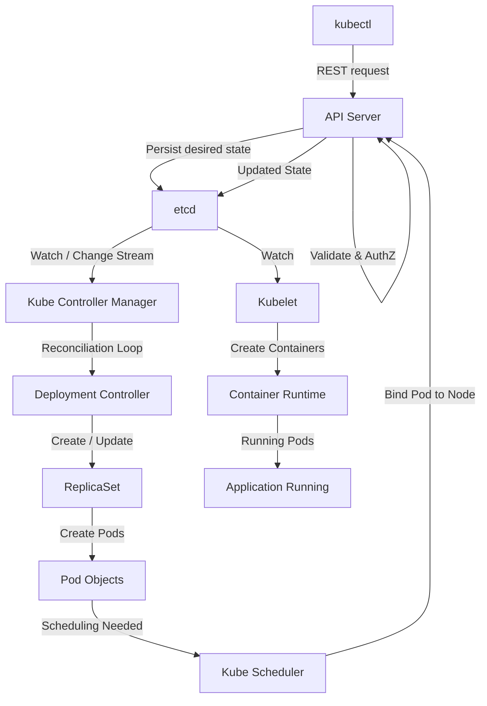
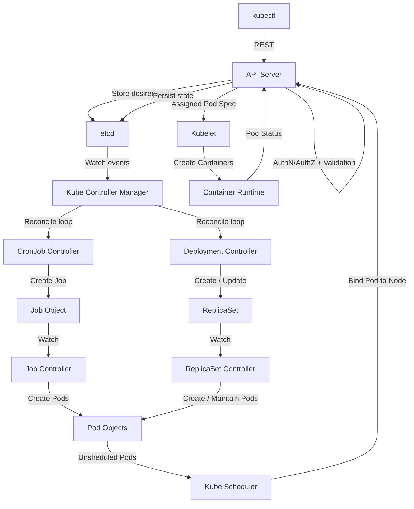

The **control plane** and **worker plane** (or nodes) are two key components of a Kubernetes cluster. They work together to manage and run containerized applications. Here's a detailed comparison:

---

### **1. Control Plane**
The control plane is the **brain** of the Kubernetes cluster. It manages and orchestrates all the activities within the cluster, such as scheduling workloads, maintaining the desired state, and monitoring cluster health.

#### **Key Components of the Control Plane:**
1. **`kube-apiserver`**:
   - Acts as the entry point to the cluster.
   - Exposes the Kubernetes API, allowing users and components to communicate with the cluster.
   - Validates and processes API requests.

2. **`etcd`**:
   - A distributed key-value store that stores the entire state of the cluster.
   - Includes information about Pods, Services, ConfigMaps, Secrets, and more.
   - Critical for cluster functionality—if `etcd` is lost, the cluster state is lost.
   - All updates done via API server

3. **`kube-scheduler`**:
   - Assigns Pods to appropriate worker nodes based on resource availability, constraints, and policies.
   - Ensures efficient resource utilization.

4.  [kube-controller-manager](kube-controller-manager.md):
   - Runs various controllers that maintain the desired state of the cluster.
   - Examples:
     - Node Controller: Handles node availability.
     - Deployment Controller: Manages the desired number of replicas for Deployments.
     - Service Account Controller: Manages Service accounts and tokens.

5. **Cloud Controller Manager (optional)**:
   - Manages cloud-provider-specific resources, such as load balancers and persistent volumes.
> Deployment Controller


> Job Controller


#### **Responsibilities of the Control Plane:**
- Scheduling Pods to worker nodes.
- Monitoring and maintaining the desired state of resources.
- Managing networking and service discovery.
- Handling API requests from users or components (via `kubectl` or other tools).

---

### **2. Worker Plane (Nodes)**
The worker plane consists of **worker nodes** that run the actual containerized applications. These nodes handle the execution of workloads (Pods) and provide the computing resources required for the applications.

#### **Key Components of Worker Nodes:**
1. **`kubelet`**:
   - An agent running on each worker node.
   - Ensures that containers defined in the PodSpec are running and healthy.
   - Communicates with the control plane to receive instructions and send status updates.

2. **`kube-proxy`**:
   - Handles network communication for the node.
   - Manages network rules to route traffic to the appropriate Pods and services.

3. **Container Runtime**:
   - Software responsible for running containers (e.g., Docker, containerd, or CRI-O).
   - Pulls container images, starts, stops, and manages containers.

4. **Pods**:
   - The smallest deployable unit in Kubernetes.
   - Runs one or more containers with shared storage and networking.

 

#### **Responsibilities of Worker Nodes:**
- Run application workloads (containers inside Pods).
- Report resource usage and status to the control plane.
- Ensure network traffic flows correctly between services, Pods, and external clients.

 

| **Aspect**                 | **Control Plane**                                     | **Worker Plane (Nodes)**                       |
|----------------------------|-----------------------------------------------------|-----------------------------------------------|
| **Role**                   | Orchestrates the cluster and maintains its state.    | Executes workloads (application Pods).         |
| **Key Components**         | API Server, etcd, Scheduler, Controller Manager.     | Kubelet, Kube-proxy, and the container runtime.|
| **Workloads**              | Does not run application Pods (except static Pods).  | Runs all application Pods.                     |
| **Networking**             | Manages cluster-wide networking and service discovery. | Handles Pod and service networking locally.    |
| **State Storage**          | Stores the cluster state in `etcd`.                  | Does not store any state (stateless workers).  |
| **Interaction**            | Interfaces with users/admins via `kubectl`.          | Executes tasks assigned by the control plane.  |
| **Scaling**                | Typically fewer nodes (1-3 for HA).                  | Scales horizontally to support workloads.      |

 

### **How They Work Together**
1. **Control Plane Responsibilities**:
   - A user or admin submits a request (e.g., deploy an application) to the Kubernetes API via `kubectl`.
   - The control plane schedules the workload onto the appropriate worker node.
   - It continuously monitors the cluster and ensures the workload is running as expected.

2. **Worker Plane Responsibilities**:
   - Worker nodes receive instructions from the control plane.
   - The `kubelet` ensures the Pods are running and healthy.
   - `kube-proxy` routes network traffic for the Pods.

 

### **High Availability (HA) Considerations**
- **Control Plane**:
  - For production clusters, it is recommended to run multiple control plane nodes (HA setup) to avoid a single point of failure.
- **Worker Nodes**:
  - The number of worker nodes can scale horizontally to meet workload demands.
 
 

```
Controller
   ↓ (REST call)
API Server
   ↓ (persist)
etcd
```


### What controllers actually do

Controllers (CronJob, Deployment, ReplicaSet, Job, etc.):

1. **Watch** resources via the API Server (which streams changes from etcd)
2. **Compare** actual state vs desired state (reconciliation loop)
3. **Make changes** by sending **REST requests to the API Server**
4. API Server **validates + authorizes**
5. API Server **writes updates to etcd**


### Example: ReplicaSet Controller

```
1. Watches ReplicaSet and Pods
2. Sees desired replicas = 3, actual = 2
3. Sends POST /api/v1/pods to API Server
4. API Server stores Pod spec in etcd
```
 

 
