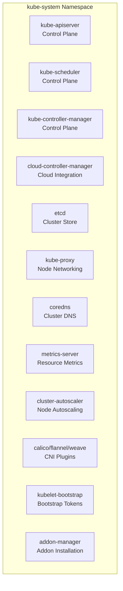
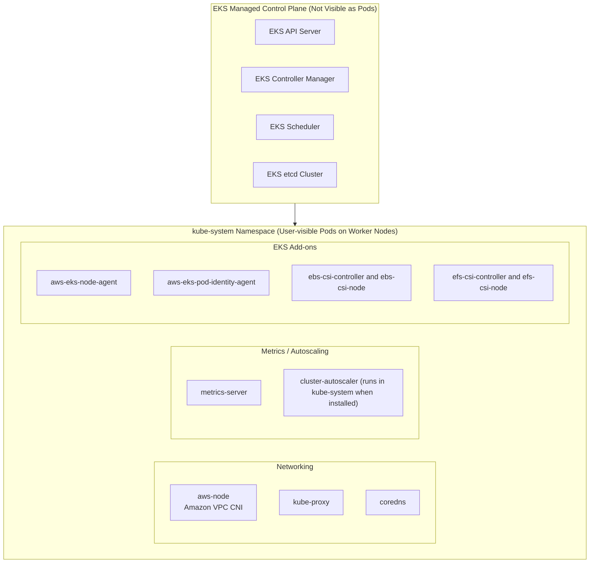
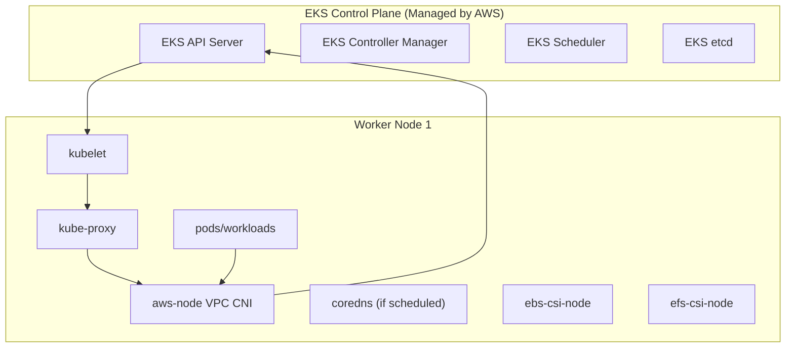

# Kube System Namespace

### Eks 

### **node-level diagram for Amazon EKS**

 showing exactly **which kube-system components run on each worker node**, how they interact with the **control plane**, and how **network traffic flows**.

### What This Diagram Shows

* **kubelet** on each worker node communicates directly with the **EKS API Server**.
* **aws-node (VPC CNI)** manages ENIs and pod IP allocation on EC2 nodes.
* **kube-proxy** programs iptables rules for cluster networking.
* **coredns**, **CSI drivers**, and **workload pods** run as regular pods in `kube-system` or other namespaces.
* All pod-to-service and pod-to-pod traffic flows through **VPC CNI + kube-proxy**.

More :  **traffic flow from ALB → Node → Pod via VPC CNI**, or the **EKS IAM + Pod Identity integration flow**.
