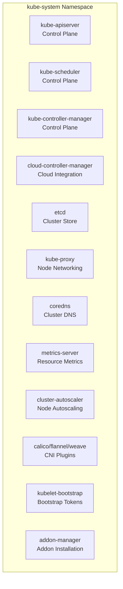

# Kube System Namespace




### Eks 

```mermaid 
flowchart TD

    subgraph CP["EKS Managed Control Plane (Not Visible as Pods)"]
        A[EKS API Server]
        B[EKS Controller Manager]
        C[EKS Scheduler]
        D[EKS etcd Cluster]
    end

    subgraph KS["kube-system Namespace (User-visible Pods on Worker Nodes)"]
        subgraph NET["Networking"]
            E[aws-node<br>Amazon VPC CNI]
            F[kube-proxy]
            G[coredns]
        end

        subgraph MET["Metrics / Autoscaling"]
            H[metrics-server]
            I[cluster-autoscaler<br>(runs in kube-system when installed)]
        end

        subgraph ADD["EKS Add-ons"]
            J[aws-eks-node-agent]
            K[aws-eks-pod-identity-agent]
            L[ebs-csi-controller<br>and ebs-csi-node]
            M[efs-csi-controller<br>and efs-csi-node]
        end
    end

    CP --> KS
```


### **node-level diagram for Amazon EKS**

 showing exactly **which kube-system components run on each worker node**, how they interact with the **control plane**, and how **network traffic flows**.

```mermaid
flowchart TD

    subgraph CP["EKS Control Plane (Managed by AWS)"]
        A[EKS API Server]
        B[EKS Controller Manager]
        C[EKS Scheduler]
        D[EKS etcd]
    end

    subgraph N1["Worker Node 1"]
        E1[kubelet]
        F1[kube-proxy]
        G1[aws-node<br>VPC CNI]
        H1[coredns (if scheduled)]
        I1[pods/workloads]
        J1[ebs-csi-node]
        K1[efs-csi-node]
    end

    subgraph N2["Worker Node 2"]
        E2[kubelet]
        F2[kube-proxy]
        G2[aws-node<br>VPC CNI]
        H2[coredns (if scheduled)]
        I2[pods/workloads]
        J2[ebs-csi-node]
        K2[efs-csi-node]
    end

    subgraph N3["Worker Node 3"]
        E3[kubelet]
        F3[kube-proxy]
        G3[aws-node<br>VPC CNI]
        H3[coredns (if scheduled)]
        I3[pods/workloads]
        J3[ebs-csi-node]
        K3[efs-csi-node]
    end

    A --> E1
    A --> E2
    A --> E3

    E1 --> F1
    E2 --> F2
    E3 --> F3

    F1 --> G1
    F2 --> G2
    F3 --> G3

    I1 --> G1
    I2 --> G2
    I3 --> G3

    G1 --> A
    G2 --> A
    G3 --> A
```

### What This Diagram Shows

* **kubelet** on each worker node communicates directly with the **EKS API Server**.
* **aws-node (VPC CNI)** manages ENIs and pod IP allocation on EC2 nodes.
* **kube-proxy** programs iptables rules for cluster networking.
* **coredns**, **CSI drivers**, and **workload pods** run as regular pods in `kube-system` or other namespaces.
* All pod-to-service and pod-to-pod traffic flows through **VPC CNI + kube-proxy**.

More :  **traffic flow from ALB → Node → Pod via VPC CNI**, or the **EKS IAM + Pod Identity integration flow**.
