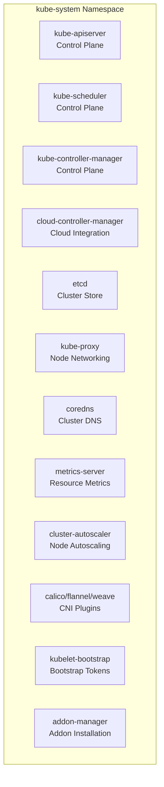
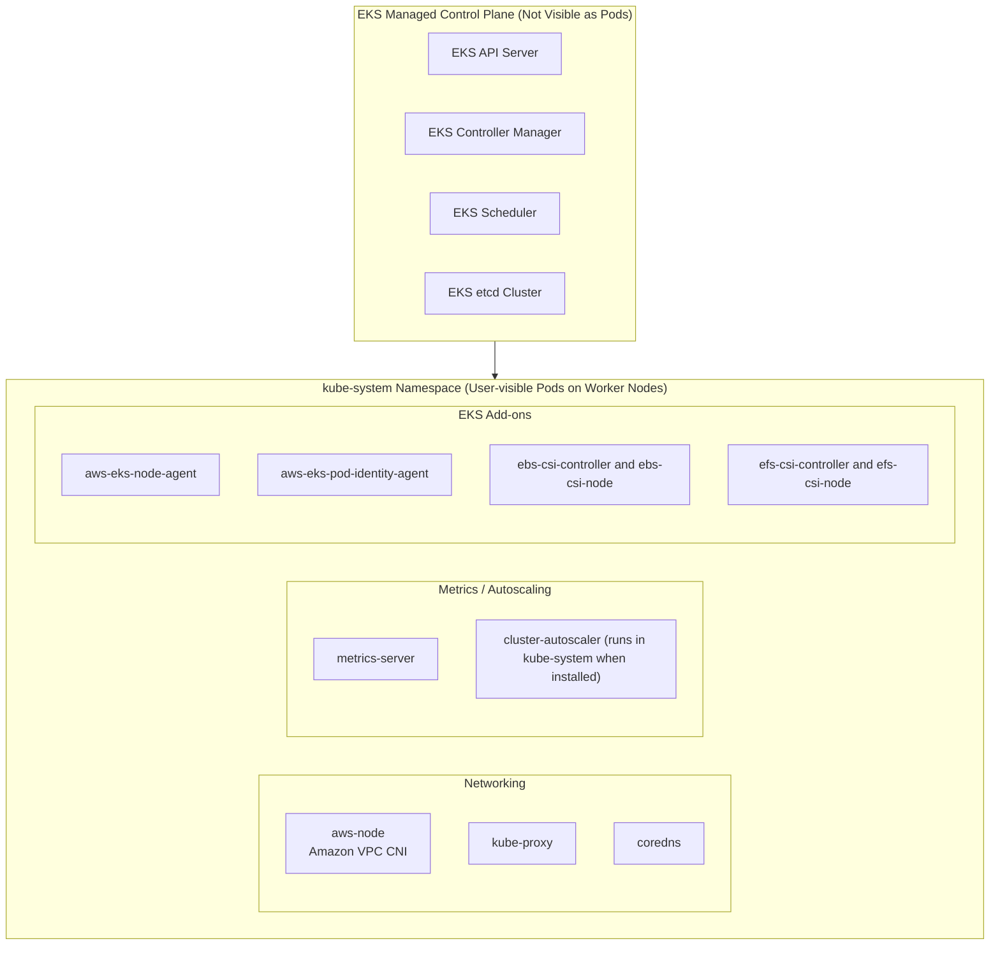
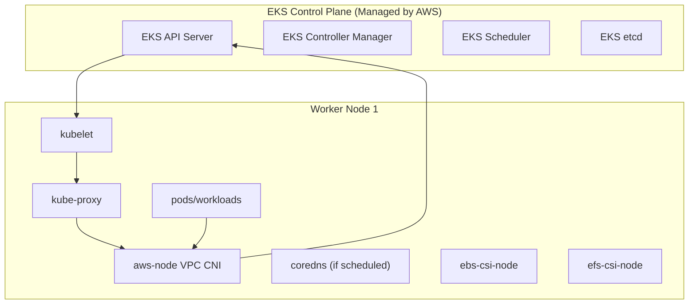

# Kube System Namespace




### Eks 




### **node-level diagram for Amazon EKS**

 showing exactly **which kube-system components run on each worker node**, how they interact with the **control plane**, and how **network traffic flows**.



### What This Diagram Shows

* **kubelet** on each worker node communicates directly with the **EKS API Server**.
* **aws-node (VPC CNI)** manages ENIs and pod IP allocation on EC2 nodes.
* **kube-proxy** programs iptables rules for cluster networking.
* **coredns**, **CSI drivers**, and **workload pods** run as regular pods in `kube-system` or other namespaces.
* All pod-to-service and pod-to-pod traffic flows through **VPC CNI + kube-proxy**.

More :  **traffic flow from ALB → Node → Pod via VPC CNI**, or the **EKS IAM + Pod Identity integration flow**.
The **`kube-system`** namespace is a special Kubernetes namespace used to manage system components that are essential for the functioning of a Kubernetes cluster. It contains critical infrastructure components, controllers, and services that are necessary for cluster operations.

### Key Aspects of the `kube-system` Namespace:

1. **Purpose**:
   - The `kube-system` namespace is reserved for Kubernetes system services and components. It ensures that these essential services are logically separated from user-deployed applications and workloads, providing better organization and management.

2. **Common Components Deployed in `kube-system`**:
   - **API Server**: The Kubernetes API server that handles all REST operations and provides the interface for cluster interactions.
   - **Controller Manager**: Manages controllers that regulate the state of the cluster, such as the replication controller and endpoint controller.
   - **Scheduler**: Schedules pods on nodes based on resource availability and policies.
   - **etcd**: A key-value store that holds the entire cluster's state.
   - **CoreDNS**: Provides DNS services within the cluster for service discovery.
   - **Kube-proxy**: Maintains network rules on nodes to allow communication between pods and services.
   - **Metrics Server**: Provides resource metrics (CPU and memory) for pods and nodes used by Horizontal Pod Autoscaler and Kubernetes dashboard.

3. **Networking**:
   - Components like **CoreDNS** and **kube-proxy** help manage internal networking and service discovery, ensuring that pods can communicate with each other and with external services.

4. **Cluster Management**:
   - The controllers in the `kube-system` namespace handle various cluster management tasks such as node lifecycle management, maintaining desired states of resources, and managing the deployment of critical pods.

5. **Logging and Monitoring**:
   - Add-ons like **Fluentd**, **Heapster** (deprecated), and **Metrics Server** for cluster-level logging and resource monitoring are often found in the `kube-system` namespace.

6. **Security**:
   - Critical security components, such as network policies and cluster role bindings, may also be managed within the `kube-system` namespace to ensure secure operations of system components.

7. **Default Namespace for Cluster Add-ons**:
   - Many Kubernetes add-ons and plugins that enhance cluster capabilities, such as network plugins (Calico, Flannel), storage plugins, and Ingress controllers, are often deployed in the `kube-system` namespace.

### Managing `kube-system` Namespace:

- **Listing Resources**: You can inspect the resources running in the `kube-system` namespace with the following command:
  ```bash
  kubectl get all -n kube-system
  ```

- **Monitoring and Troubleshooting**: Since the `kube-system` namespace contains essential components, it's important to monitor and troubleshoot any issues in this namespace to ensure the cluster's health and stability.

### Best Practices:

1. **Avoid Manual Changes**: Be cautious when making changes in the `kube-system` namespace, as it can affect the entire cluster's functionality.
2. **Monitoring**: Regularly monitor the health and performance of components in the `kube-system` namespace.
3. **Isolation**: Keep application workloads and custom resources separate from the `kube-system` namespace to avoid conflicts and accidental disruptions.

The `kube-system` namespace is vital for the proper functioning of a Kubernetes cluster, as it hosts all the necessary system services and components that keep the cluster operational.