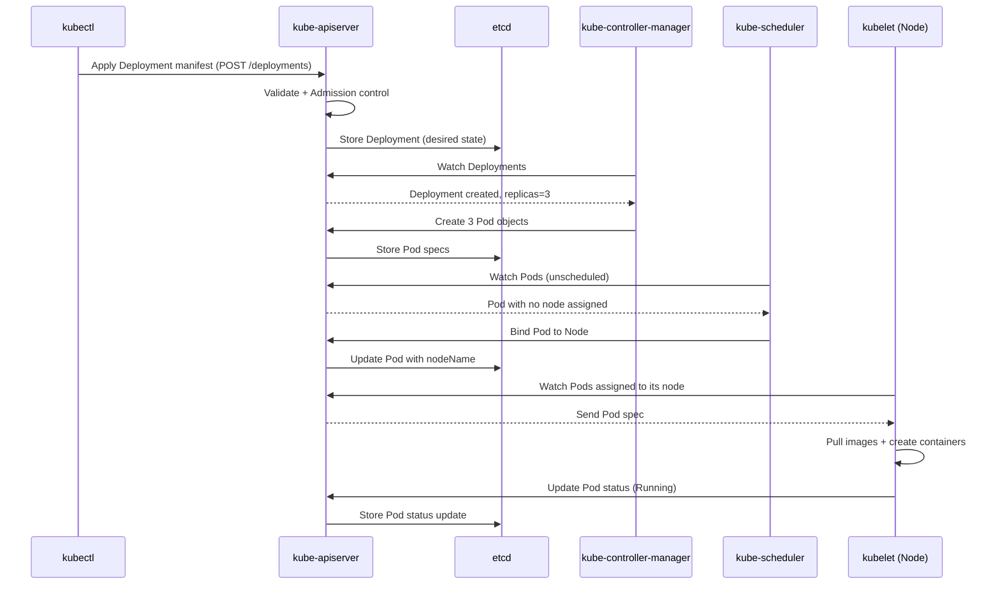

Here is a clear, accurate, mental-model-based explanation of how kube-controller-manager, etcd, and kube-apiserver interact inside Kubernetes.

---

🔵 The Three Components (Roles)

1️⃣ kube-apiserver

The gateway to the entire cluster

All components talk only to the API server

Validates requests, stores the desired cluster state in etcd, and returns responses

2️⃣ etcd

The database of Kubernetes

Stores the entire cluster state
(Pods, Deployments, ConfigMaps, Nodes, Services…)

3️⃣ kube-controller-manager

A set of controllers (replication, node, job, endpoints, HPA controller)

Each controller reads the desired state from the API server and tries to make the actual state match it.

---

🔥 High-Level Interaction Flow

Step-by-step, with clear responsibilities:

---

🟦 1. A change enters Kubernetes through the API server

Example:
You run:

kubectl apply -f deployment.yaml

What happens?

1. kubectl → API Server
Makes a REST call with your manifest.

2. API Server validates:

Schema

RBAC

Admission controllers (mutating/validating)

3. Once valid → API Server writes the desired state into etcd.

👉 API Server = front door + validator + writer to etcd

---

🟩 2. etcd stores the new desired state

Example record in etcd:

Deployment replicas = 3

👉 etcd does nothing actively.
It only stores and notifies watchers.

Kube-controller-manager is one of the watchers.

---

🟧 3. Controllers watch API server for changes

Controllers never watch etcd directly.
They watch API server watch streams.

Deployment controller notices:

“New deployment with 3 replicas requested.”

Node controller notices:

“A node is NotReady.”

Endpoint controller notices:

“A new Service exists.”

Each controller acts to drive current state toward desired state.

---

🟥 4. Controller takes action by calling the API Server again

Example for Deployment:

1. Deployment controller sees desired 3 replicas.

2. It checks actual pods:

maybe only 1 is running

3. It creates 2 more Pods by calling:

POST /api/v1/namespaces/default/pods

4. API server stores new Pod objects in etcd.

5. kubelet picks them up → schedules containers → runs them.

👉 Controller does not modify etcd directly
Controller always talks to API server.

---

🔷 Summary Diagram

(All reads/writes go through API server)
                      ┌─────────────┐
                      │  kubectl    │
                      └──────┬──────┘
                             │
                             ▼
                     ┌──────────────┐
                     │ API SERVER   │◀───── Other components
                     └──────┬──────┘         (kube-scheduler,
                             │                kubelet, kube-proxy)
                             ▼
                         ┌───────┐
                         │ etcd  │   (DB)
                         └───────┘
                             ▲
                             │ (watch)
                     ┌──────────────┐
                     │ CONTROLLERS  │
                     │ (kube-ctrl)  │
                     └──────────────┘

---

🔥 One Real Example End-to-End

You apply a Deployment with 5 replicas:

1. kubectl → API Server

2. API Server validates + stores desired replicas=5 in etcd

3. Deployment controller sees the new deployment

4. Controller calculates difference:

want 5

have 0

create 5 replicas via API Server

5. API Server stores pod objects → etcd

6. Scheduler sees unscheduled pods → assigns nodes

7. Kubelet runs containers on nodes

---

🔑 Key Principles (very important for interviews)

✔ Controllers only talk to API server, not etcd

✔ API server is the only component that reads/writes etcd

✔ Controllers reconcile:

desired state (from etcd) ↔ actual state (from cluster)

✔ etcd is passive: only stores and notifies

---

If you want, I can also explain the interaction between scheduler, kubelet, API server, kube-proxy, and CNI in the same clear way.

Here is a clean Mermaid sequence diagram showing the interaction between
kube-apiserver, etcd, kube-controller-manager, scheduler, kubelet when a Deployment is created.

You can paste this directly into any Mermaid renderer.

---

✅ Mermaid Diagram: Kubernetes Internal Interactions

If you want, I can also draw a second diagram for:

Service + kube-proxy + CNI interactions

Ingress + LoadBalancer + Service flow

Control plane only interactions

Just tell me which one!

Here is the clear, precise, interview-quality explanation of how the kube-apiserver and kube-scheduler interact.

---

🔵 High-Level Idea

The kube-scheduler never talks to etcd and never talks directly to nodes.
It interacts only with the API Server.

The scheduler’s job:

1. Watch for Pods that need scheduling (no nodeName)

2. Choose the best node

3. Write the binding decision back to the API Server

---

🟦 Step-by-Step Interaction Flow

1️⃣ Pod is created → API Server stores it in etcd

When you apply a Deployment, controller creates Pods:

POST /api/v1/pods

API Server stores the Pod object in etcd.

Pod initially has:

nodeName: null

---

2️⃣ Scheduler watches API Server for unscheduled Pods

Scheduler continuously maintains a watch stream:

GET /api/v1/pods?watch=true&fieldSelector=spec.nodeName=

Meaning:
“Tell me every time a pod appears that has no node assigned.”

API Server sends scheduler events like:

Pod: myapp-123  (Status: Pending)
nodeName: null

---

3️⃣ Scheduler runs its scheduling logic

For each unscheduled Pod:

✔ Filter Phase

Remove nodes that don’t satisfy requirements:

CPU/memory insufficient

NodeSelector mismatch

Taints not tolerated

Volume constraints

Pod affinity/anti-affinity

✔ Score Phase

Rank remaining nodes based on:

Resource balance

Topology spread

Image locality

Custom plugins

Scheduler selects best node, e.g.:

node-3

---

4️⃣ Scheduler writes back the binding to the API Server

Scheduler does not modify Pods directly.
Instead, it sends:

POST /api/v1/namespaces/default/pods/myapp-123/binding

API Server updates the Pod’s nodeName and writes it to etcd.

Example final Pod:

spec:
  nodeName: node-3

---

5️⃣ Scheduler's job is DONE

After assigning the Pod to a node, scheduler is finished with that Pod.
It does not start containers.
It does not interact with kubelet or CNI.

---

6️⃣ Kubelet takes over

Once scheduler assigns nodeName, the kubelet on that node sees:

“Pod assigned to me.”

Then:

Pulls images

Creates containers

Writes status back to API server

---

🔷 Sequence Diagram (short)

Scheduler → API Server: Watch for unscheduled Pods
API Server → Scheduler: Pod (Pending, nodeName=null)
Scheduler → Scheduler: Filter + Score nodes
Scheduler → API Server: Bind Pod to node (nodeName=worker-1)
API Server → etcd: Store updated Pod state

---

🔑 Key Interview Points

✔ Scheduler never talks to etcd

✔ Scheduler only watches API Server

✔ API Server is the single source of truth

✔ Scheduling is just writing nodeName

✔ kubelet handles the actual container creation

---

If you'd like, I can also draw the Mermaid diagram specifically for scheduler–API server interaction.

Here is the clean, accurate, interview-ready explanation of how kubectl interacts with the kube-apiserver.

---

🔵 High-Level Concept

kubectl is just a client.

API Server is the only entry point to Kubernetes.
All operations — create, list, delete, watch, logs, exec — flow through the API Server via REST API calls.

kubectl → API Server → etcd / controllers / scheduler / kubelet (as needed)

---

🟦 Step-by-Step: How kubectl talks to API Server

1️⃣ You run a kubectl command

Example:

kubectl get pods

or

kubectl apply -f deployment.yaml

kubectl reads:

Your kubeconfig file (~/.kube/config)

The current context (cluster, user, namespace)

The cluster’s API Server endpoint

https://<api-server-endpoint>:6443

Client certs / tokens for authentication

---

2️⃣ kubectl builds an HTTP REST request

Examples:

For kubectl get pods:

GET /api/v1/namespaces/default/pods

For creating a Deployment:

POST /apis/apps/v1/namespaces/default/deployments

For watching resources:

GET /api/v1/pods?watch=true

kubectl sends this over HTTPS.

---

3️⃣ API Server receives the request

API Server performs multiple checks:

✔ Authentication

Client certificate

Bearer token

OIDC

ServiceAccount token

TLS verification

✔ Authorization (RBAC/ABAC/webhook)

“Is this user allowed to GET pods?”

✔ Admission Controllers

Mutating webhooks (modify object)

Validating webhooks (accept/reject)

---

4️⃣ API Server reads/writes data in etcd

Based on the request:

✔ For GET

API Server reads data from etcd and returns JSON.

✔ For POST/PUT/PATCH/DELETE

API Server updates the object in etcd.

API Server is the only component that talks directly to etcd.

---

5️⃣ API Server sends a response back to kubectl

JSON list of pods

Status of applied manifest

Error (403, 404, invalid YAML, admission webhook rejection)

kubectl prints the response in a human-friendly format (table, YAML, JSON).

---

🟧 kubectl → API Server Detailed Flow Example (Apply Manifest)

You run:

kubectl apply -f deployment.yaml

Flow:

1. kubectl opens YAML → converts to JSON

2. Sends PATCH or POST to API Server

3. API Server validates

4. API Server → stores Deployment in etcd

5. API Server → returns success, desired state stored

6. Controllers later read this via API Server and act

kubectl only waits for API Server response, not for pods to actually start.

---

🟩 kubectl exec, logs, port-forward: Special Interactions

These also go through the API Server:

kubectl logs

API server → kubelet → container runtime → logs streamed → API server → kubectl

kubectl exec

Websocket is upgraded via API server

API server proxies to kubelet

kubelet connects to container runtime

Output is streamed back via API server

kubectl port-forward

API server opens SPDY/websocket

Proxies traffic to kubelet

kubelet forwards to pod IP

⚠ kubectl never talks directly to nodes or pods.

---

🔷 Summary Diagram

kubectl
   │ (REST HTTPS)
   ▼
kube-apiserver
   │
   ├── AuthN/AuthZ
   ├── Admission
   ▼
etcd  (for storing/retrieving resources)

Controllers, Scheduler, Kubelet
   ↑
   │ (Watch/Sync via API Server)
   │
API Server (central point)

---

🔥 Key Interview Points

✔ kubectl never contacts etcd

✔ kubectl communicates ONLY with API Server

✔ All operations are HTTP REST calls

✔ API Server performs authentication, authorization, validation

✔ API Server is the single entry point for cluster state

---

If you want, I can also draw a Mermaid diagram specifically for:
kubectl ↔ API Server interaction flow.

Here is the clean, complete, interview-ready explanation of Authentication (AuthN) and Authorization (AuthZ) inside the Kubernetes API Server.

---

🔵 Overview

Every request to Kubernetes goes through this order:

Request → API Server → AuthN → AuthZ → Admission → Etcd / Respond

So AuthN happens first, then AuthZ.

---

1️⃣ AUTHENTICATION (AuthN) — “Who are you?”

Authentication verifies identity.

The API Server checks who is making the request.

✔ Supported AuthN Methods:

🔹 1. Client Certificates (kubeconfig)

Most common for admins.
kubectl passes:

client certificate

client key

API server verifies it using CA.

🔹 2. Bearer Tokens

Typical for automation:

ServiceAccount tokens (JWT signed by Kubernetes)

Static tokens (legacy)

Bootstrap tokens

🔹 3. OpenID Connect (OIDC)

Login via:

Google

Azure AD

Okta

Keycloak
API Server validates the OAuth/JWT token.

🔹 4. Webhook Token Authentication

API Server forwards the token to an external service to validate.

---

🟥 Very Important AuthN Point

After Authentication succeeds, the user becomes something like:

User = "alice"
Groups = ["dev-team"]

If AuthN fails → request rejected immediately.

---

2️⃣ AUTHORIZATION (AuthZ) — “What are you allowed to do?”

Authorization checks permissions.

Now that API Server knows who the user is, it checks whether they are allowed to perform the action.

✔ Supported AuthZ Modes:

🔹 1. RBAC (Role-Based Access Control) — most used

Checks:

Role / ClusterRole

RoleBinding / ClusterRoleBinding

RBAC checks verb, resource, namespace.

Example:

Can user "alice" delete pods in namespace "dev"?

If a matching rule exists → allowed
Else → Forbidden (403)

---

🔹 2. Node Authorization

For kubelet only
Allows:

read pods assigned to the node

update node status

read configmaps related to workloads

---

🔹 3. ABAC (legacy, not used in production)

Uses local JSON policy files.

---

🔹 4. Webhook Authorization

API Server sends an authorization request to an external system.
Used when companies want custom security.

---

🟩 How API Server Processes AuthZ

Example request:

kubectl delete pod mypod

API Server checks:

Step 1: What is the identity?

(AuthN)

User: alice
Groups: [dev-team]
Authenticated? Yes

Step 2: Is she allowed to do this?

(AuthZ, RBAC)

Check if any rule allows:

verbs: ["delete"]
resources: ["pods"]
namespaces: ["default"]

If yes → proceed to admission
If no → return:

Error: Forbidden — user "alice" cannot delete pods

---

🟦 KEY DIFFERENCE

✔ Authentication = Identity

✔ Authorization = Permissions

Or:

AuthN: Who are you?
AuthZ: What can you do?

---

🟧 API Server Auth Flow Diagram (Very Useful in Interviews)

Request (kubectl, pod, controller)
                        │
                        ▼
                ┌────────────────┐
                │ Authentication  │  (client certs, tokens, OIDC)
                └────────────────┘
                        │
                        ▼
                ┌────────────────┐
                │ Authorization   │  (RBAC, Node, Webhook)
                └────────────────┘
                        │
                        ▼
                ┌────────────────┐
                │ Admission       │  (mutating + validating)
                └────────────────┘
                        │
                        ▼
                     etcd

---

🔥 Short Interview Answer

> The API server first authenticates the request using client certificates, service account tokens, OIDC, or webhooks. After the identity is confirmed, Kubernetes performs authorization using RBAC, Node Authorization, ABAC, or webhook authorization to check if the authenticated user has permissions for the requested action. Authentication answers ‘who are you,’ Authorization answers ‘what are you allowed to do.’ Only after both succeed does the request go to admission and then to etcd.

---

If you want, I can draw a Mermaid sequence diagram for the full AuthN + AuthZ flow.

Here’s a clear, detailed explanation of how authentication and authorization work for kubectl in AWS EKS:

---

1️⃣ Authentication in AWS EKS

In EKS, kubectl never directly talks to etcd. It communicates with the EKS-managed kube-apiserver. AWS handles authentication differently than self-managed clusters.

✔ How kubectl authenticates:

1. AWS IAM Authenticator (EKS uses aws-iam-authenticator logic built into aws eks get-token)

The kubeconfig for EKS contains a command plugin:

users:
- name: eks-user
  user:
    exec:
      apiVersion: client.authentication.k8s.io/v1beta1
      command: aws
      args:
        - "eks"
        - "get-token"
        - "--cluster-name"
        - "my-cluster"

2. When you run kubectl get pods, the plugin runs:

aws eks get-token --cluster-name my-cluster

This generates a short-lived JWT token signed by AWS IAM.

The token contains your IAM identity (user or role).

3. API Server validates the token:

It verifies the signature against AWS IAM.

Confirms identity (user, role).

✅ So authentication is done via IAM credentials in EKS.

---

2️⃣ Authorization in AWS EKS

Once API Server knows who you are (IAM identity), it checks what you are allowed to do using RBAC.

Steps:

1. Map IAM user or role to Kubernetes user/group:

The aws-auth ConfigMap in the kube-system namespace contains this mapping:

mapRoles: |
  - rolearn: arn:aws:iam::123456789012:role/Admin
    username: admin
    groups:
      - system:masters
mapUsers: |
  - userarn: arn:aws:iam::123456789012:user/alice
    username: alice
    groups:
      - dev-team

2. API Server converts the IAM identity into a Kubernetes user + groups according to aws-auth.

3. API Server applies Kubernetes RBAC rules:

Does this user/group have permission for the resource and verb?

Example: alice can get pods in default namespace but cannot delete deployments.

4. If allowed → request proceeds to admission controllers → etcd
If denied → kubectl gets 403 Forbidden

---

3️⃣ Summary of Kubectl Flow on AWS EKS

kubectl
   │
   ├─> Runs `aws eks get-token` (IAM authentication)
   │
   ▼
kube-apiserver (EKS-managed)
   │
   ├─> AuthN: validate JWT token via IAM
   │
   ├─> AuthZ: map IAM identity to Kubernetes user/group via aws-auth ConfigMap
   │
   ├─> RBAC: check permission for requested resource/verb
   │
   ├─> Admission Controllers (mutating/validating webhooks)
   │
   ▼
etcd (store / retrieve resources)

---

4️⃣ Key Points About AWS EKS Authentication and Authorization

Feature	How EKS Handles It

Authentication (AuthN)	IAM via aws eks get-token plugin
Mapping IAM → Kubernetes	aws-auth ConfigMap (mapUsers and mapRoles)
Authorization (AuthZ)	Kubernetes RBAC (system:masters, custom roles)
kube-apiserver access	Only via HTTPS with token from IAM
Admission & validation	Standard Kubernetes admission controllers apply

---

🔥 Notes

IAM handles identity, Kubernetes RBAC handles permissions.

Tokens from aws eks get-token expire every ~15 minutes, so kubeconfig does not store long-lived credentials.

You cannot bypass RBAC: even aws eks get-token only authenticates, the API server enforces permissions.

---

If you want, I can draw a Mermaid sequence diagram showing kubectl → AWS IAM → API Server → RBAC → etcd specifically for EKS.

Do you want me to do that?