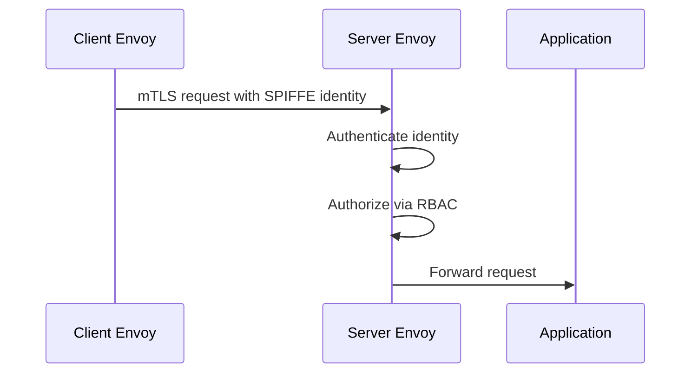

### What Is Security in Istio Service Mesh

Istio security provides **zero-trust networking** for microservices by enforcing **identity-based authentication, authorization, and encryption** at the service-to-service level without changing application code.

---

### Core Security Pillars in Istio

Istio security is built on:

* **Authentication** (who you are)
* **Authorization** (what you can do)
* **Encryption** (how data is protected in transit)

---

### Service Identity and SPIFFE

Each workload gets a **cryptographic identity** using SPIFFE format.

Example identity:

```
spiffe://cluster.local/ns/payments/sa/payment-service
```

Components involved:

* Istiod (control plane)
* Envoy sidecar (data plane)
* Kubernetes ServiceAccount
* kubelet (mounts identity secrets)

---

### Mutual TLS (mTLS)

Istio enables **automatic mTLS** between services.

What happens:

* Envoy sidecars terminate TLS
* Certificates are workload-specific
* Traffic is encrypted and authenticated

Flow:

```text
Envoy (client) -> TLS handshake -> Envoy (server)
```

Key components:

* Envoy proxy (TLS, cert rotation)
* Istiod (CA, cert issuance)
* Linux kernel (TLS socket operations)

---

### Authentication Policies

Authentication defines **how identities are verified**.

Types:

* PeerAuthentication (service-to-service)
* RequestAuthentication (JWT-based end-user auth)

Example:

```yaml
apiVersion: security.istio.io/v1beta1
kind: PeerAuthentication
spec:
  mtls:
    mode: STRICT
```

Effect:

* Only mTLS traffic allowed
* Plaintext traffic rejected by Envoy

---

### Authorization Policies

Authorization controls **who can access what**.

Enforced by:

* Envoy RBAC filter

Example:

```yaml
apiVersion: security.istio.io/v1beta1
kind: AuthorizationPolicy
spec:
  rules:
  - from:
    - source:
        principals:
        - "cluster.local/ns/payments/sa/order-service"
```

Execution:

```text
Envoy -> RBAC filter -> allow/deny decision
```

---

### End-User Authentication (JWT)

Istio validates JWTs at the edge or service level.

Use case:

* API Gateway authentication
* Browser or mobile clients

Components involved:

* Envoy JWT filter
* OIDC provider (Keycloak, Cognito)

Example:

```yaml
kind: RequestAuthentication
spec:
  jwtRules:
  - issuer: "https://keycloak/auth"
```

JWT validation happens **inside Envoy**, not the application.

---

### Certificate Management and Rotation

Istio handles:

* Certificate issuance
* Automatic rotation
* Short-lived certs

Flow:

```text
Istiod CA -> issues cert -> kubelet mounts -> Envoy reloads
```

No JVM, application, or keystore management required.

---

### Zero-Trust Network Model

Istio assumes:

* Network is untrusted
* Every request must be authenticated
* Identity > IP address

Implications:

* No reliance on Kubernetes network policies alone
* Strong protection against lateral movement

---

### Ingress and Egress Security

Ingress:

* Envoy Ingress Gateway terminates TLS
* Validates JWT
* Applies authorization rules

Egress:

* Envoy Egress Gateway controls outbound access
* Prevents data exfiltration
* Enforces allow-listed destinations

---

### Observability for Security

Istio provides:

* Mutual TLS metrics
* Authentication failures
* Authorization denials

Components:

* Envoy telemetry
* Prometheus
* Kiali security graph

---

### Kubernetes Components Involved

* kubelet: mounts certificates and secrets
* Istiod: CA, policy distribution
* Envoy sidecar: enforcement point
* Kubernetes API Server: policy storage

---

### Performance Impact

* TLS handled by Envoy, not JVM
* Negligible latency per hop
* Hardware acceleration via Linux kernel TLS where available

---

### Common Security Misconfigurations

* PERMISSIVE mTLS left in production
* Overly broad AuthorizationPolicy
* Missing JWT audience validation
* Bypassing sidecars via host networking

---

### Typical Secure Request Flow



---

### When Istio Security Is Most Valuable

* Large microservice landscapes
* Multi-team Kubernetes clusters
* Compliance-heavy environments
* Zero-trust mandates

---

### Key Takeaway

Istio security **moves trust from the application to the infrastructure**, using **identity-based mTLS, fine-grained authorization, and automatic certificate management** enforced by Envoy proxies at runtime.
