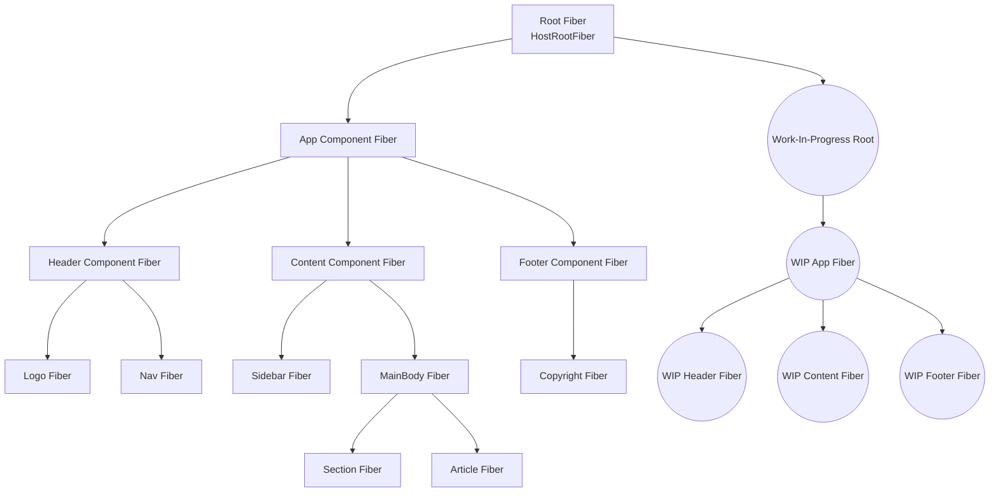

Here is a **clean and accurate Mermaid diagram** showing the structure of the **React Fiber Tree**—how work-in-progress fibers relate to the current Fiber tree, parents, children, and siblings.

---

# 🌳 **React Fiber Tree — Mermaid Diagram**



---

# 🔍 **Explanation (Very Concise)**

### **React maintains two Fiber trees:**

1. **Current Fiber Tree** — what is currently rendered on the screen.
2. **Work-In-Progress Fiber Tree (WIP)** — the new tree being built during reconciliation.

### **Each Fiber node contains:**

* `child` → first child Fiber
* `sibling` → next sibling Fiber
* `return` → parent Fiber
* `stateNode` → DOM node or component instance
* `alternate` → pointer to the mirrored node in the other tree (current ↔ wip)

### **During render:**

React builds the **WIP tree** fiber-by-fiber.

### **During commit:**

The WIP tree becomes the new **current** tree.

---

If you want, I can also draw:
✅ Fiber node internal fields
✅ How alternate pointers work (current ↔ wip)
✅ How reconciliation walks the fiber tree
Just tell me!
Here is a **clear and very concise explanation** of every component shown in the Fiber Tree diagram.
I will explain their role **in a real React app** *and* how they appear in the **Fiber tree**.

---

# 🌳 **Fiber Tree Components Explained**

The Fiber tree mirrors your React component hierarchy.
Each component in the UI becomes a **Fiber node**.

Below is the explanation of each component from the diagram.

---

## **1. Root Fiber (HostRootFiber)**

**Role in App:**

* The invisible root created by React inside `ReactDOM.createRoot()`.
* Represents the entire React application.

**In Fiber Tree:**

* Top-most node.
* Parent of your `<App />` component.
* Holds pointers to:

  * Current fiber tree
  * Work-in-progress tree

---

## **2. App Component**

**Role in App:**

* Your main application component.
* Contains high-level layout (Header, Content, Footer).

**In Fiber Tree:**

* Child of Root Fiber.
* Parent of Header, Content, Footer fibers.

---

# 🧩 **Layout Components**

## **3. Header Component**

**Role in UI:**

* Typically contains:

  * Logo
  * Navigation bar
  * User profile section

**In Fiber Tree:**

* Child of `<App />`.
* Parent to `Logo` and `Nav` fibers.

---

## **4. Content Component**

**Role in UI:**

* The main content area.
* Could contain:

  * Sidebar
  * Main body
  * Different sections of the page

**In Fiber Tree:**

* Sibling of Header and Footer.
* Parent of Sidebar and MainBody fibers.

---

## **5. Footer Component**

**Role in UI:**

* Usually contains:

  * Copyright
  * Links
  * Footer branding

**In Fiber Tree:**

* Sibling of Header and Content.
* Parent of a `Copyright`.

---

# 🔹 **Subcomponents**

## **6. Logo Component**

**Role in UI:**

* Displays company/app logo inside header.

**In Fiber Tree:**

* Child of Header Fiber.

---

## **7. Nav Component**

**Role in UI:**

* Navigation menu (links or buttons).

**In Fiber Tree:**

* Sibling of Logo Fiber.

---

## **8. Sidebar Component**

**Role in UI:**

* Left or right sidebar for navigation or filters.

**In Fiber Tree:**

* Child of Content Component.

---

## **9. MainBody Component**

**Role in UI:**

* The main section of the page.
* Contains text, cards, images, or forms.

**In Fiber Tree:**

* Sibling of Sidebar.
* Parent of Section and Article fibers.

---

## **10. Section Component**

**Role in UI:**

* Represents a section of the page inside MainBody.

**In Fiber Tree:**

* Child of MainBody.

---

## **11. Article Component**

**Role in UI:**

* Represents a piece of content (blog, card, item).

**In Fiber Tree:**

* Sibling of Section.

---

## **12. Copyright**

**Role in UI:**

* Text or links at the bottom of page.

**In Fiber Tree:**

* Child of Footer.

---

# 🧠 **Important Notes**

* Every React component = one Fiber node.

* Fiber nodes store:

  * Component type (function/class/host/fragment)
  * Props
  * State
  * Returned element
  * DOM links
  * Effect tags
  * Alternate pointer (to WIP fiber)

* The Fiber tree is not the DOM tree.
  It is a **Data structure React uses to schedule, reconcile, and commit changes**.

---

If you want, I can also draw:
✅ Fiber node internal fields
✅ How fiber child/sibling/return pointers work
✅ How reconciliation walks the fiber tree step-by-step
Just ask!
React renders the **root component**, but the **root component alone cannot describe the whole UI**.
The root is just the *entry point* — the rest of the UI must be broken into smaller components for React to work efficiently.

Here is the **short, precise explanation**:

---

# ✅ **Why do we need Header, Footer, and other components if React already renders the Root?**

### **1. Root component only returns a tree. It does not *create* the tree.**

`<App />` is just a single function.
To describe the whole page, it must return a hierarchy:

```jsx
return (
  <>
    <Header />
    <Content />
    <Footer />
  </>
);
```

React needs these components to **build the Fiber tree** that represents the whole UI.

---

# ✅ 2. To break UI into reusable, manageable pieces (Separation of Concerns)

You do NOT want one huge component like this:

```jsx
function App() {
  // 2000 lines of JSX
}
```

Instead:

* `<Header />` handles navigation
* `<Footer />` handles bottom info
* `<Content />` handles your main logic
* `<Sidebar />`, `<Article />`, etc. break things further

This makes the UI **maintainable, testable, reusable**.

---

# ✅ 3. React rendering is component-driven — the Fiber tree needs many nodes

React creates a **Fiber node for every component**, not just for the root.

If there were no child components:

* No nested fibers
* No scheduling
* No diffing
* No partial updates

You would lose all benefits of React’s architecture.

---

# ✅ 4. Each component can update independently

If `Content` updates (because state changed), React re-renders only:

```
Content → Sidebar → MainBody → Section → Article
```

**Header and Footer do NOT re-render**.

If everything was in a single root component:

* One state change → everything re-renders → slow and wasteful

Child components optimize updates.

---

# ✅ 5. Compose the UI like LEGO blocks

React is built on **component composition**, not on rendering one large object.

Like building a house:

* App = building
* Header = door
* Sidebar = wall
* Content = rooms
* Footer = foundation

React builds the UI from these parts.

---

# 🔥 **Summary (Very Short)**

Even though React renders just the root component:

✔ The root component must return all UI parts
✔ Breaking UI into components makes it reusable, testable, maintainable
✔ Each component gets its own Fiber node
✔ React can update only the parts that changed
✔ React uses components to build the virtual DOM and Fiber tree

Without Header/Footer/etc., React would lose its ability to **reconcile, optimize, and scale**.

---

If you want, I can explain:
➡ How React converts `<App />` → element tree → Fiber tree → DOM tree
➡ What happens during reconciliation for each subcomponent
➡ How React avoids rendering unchanged components

Just tell me!
