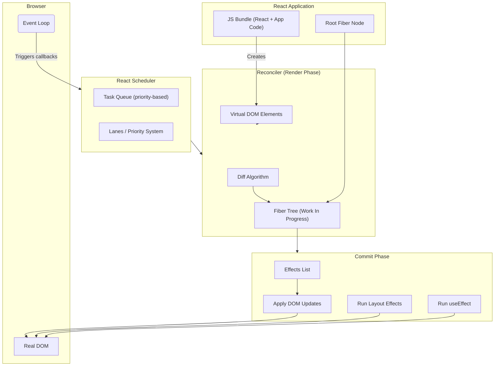
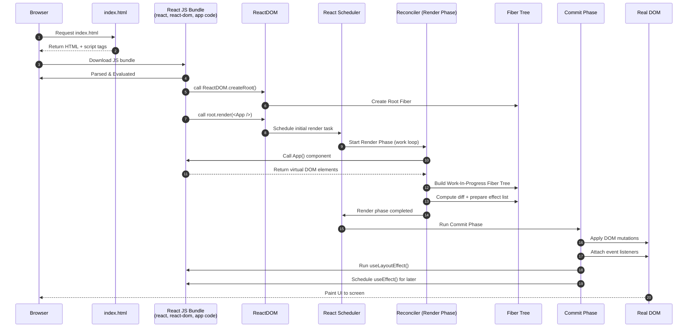

# React js

 **Scheduler → Reconciler → Fiber Tree → Commit Phase / DOM**.


##  **React Internal Architecture**




## **Components**

###  Scheduler

React’s cooperative scheduler decides:

* Which update to run first
* Which updates can be interrupted
* Assigns priorities using **Lanes**
* Breaks work into small chunks to keep UI responsive

###  Reconciler (Render Phase)

Creates the **Virtual DOM**, compares it with the previous one, and builds a **work-in-progress Fiber Tree**:

* Runs render functions
* Diffing algorithm
* Prepares effects list
* Produces minimal required DOM changes

*This phase is pure and does not touch the DOM.*

### **3. Fiber Tree**

A tree data structure where:

* Each Fiber = one UI component
* Tracks: props, state, hooks, lanes, effects
* Has links: `child`, `sibling`, `return`
* Supports pausing, resuming, and interrupting work

### **4. Commit Phase**

This is synchronous and cannot be interrupted:

* DOM updates are applied
* Layout effects (`useLayoutEffect`)
* Passive effects (`useEffect`)
* Browser paints next frame


### Sequence diagram of React render → commit



✅ A diagram of Fiber structure
✅ A diagram showing what causes a re-render


### what happens when you hit a URL of a React application (SPA).


**Browser sends HTTP request to the server**


```
GET /dashboard
```

**Server returns the same `index.html` for **all routes** (SPA behavior)**


In typical React deployments:

* You use **NGINX**, **Apache**, **Vercel**, **Netlify**, etc.
* All unknown paths are rewritten to `/index.html`.

This is because **routing is handled in the browser**, not on the server.

So server returns:

```
index.html
```


### **Browser downloads JavaScript bundles**

Inside `index.html`, the `<script>` tags load:

* `main.js`
* Runtime scripts
* CSS bundles

These are fetched from the server or CDN.


### **React app boots in the browser**

The JavaScript bundle:

* Initializes React
* Loads React Router
* Mounts your root component (`<App />`) into `<div id="root">`

```js
ReactDOM.render(<App />, document.getElementById('root'));
```


### **React Router interprets the URL**

The router checks the current URL path:

```
/dashboard
```

And decides **which component to render** (e.g., `<Dashboard />`) **without asking the server again**.

No page reload happens.
Only the DOM is updated.


### **React renders the component using Virtual DOM**

* Virtual DOM tree is computed
* Diffed with previous virtual DOM
* Browser DOM is updated efficiently


### **If the component needs data, it fetches it from an API**

Example:

```js
useEffect(() => {
  fetch('/api/user').then(...)
}, []);
```

This creates **separate** network requests to backend APIs (not related to routing).


### Steps

1. Browser sends request → server returns `index.html`
2. React JS bundles load
3. React initializes and mounts app
4. React Router matches URL → renders correct component
5. Virtual DOM updates the UI
6. API calls happen if required

The server is only responsible for serving static files; **React handles all routing on the client side**.


## Events in React

### **Browser generates a native DOM event**

Example:

* `click`
* `keydown`
* `change`
* `input`

This event is captured by the browser’s native event system.


### **React’s event delegation system intercepts it**

React attaches **one listener per event type** at the **root** (document or root DOM node).

So React doesn’t attach listeners to every JSX element.

This gives:

* Better performance
* Lower memory usage
* Faster cleanup


### **React converts the native event → SyntheticEvent**

React wraps the native event inside a **SyntheticEvent**, which:

* Normalizes behavior across browsers
* Provides pooled objects for performance (React 17 and below)

SyntheticEvent contains:

* `target`
* `currentTarget`
* `preventDefault()`
* `stopPropagation()`


### **React determines which component should receive the event**

React uses its **internal fiber tree** to identify which component’s handler corresponds to the event target.

Example:

```jsx
<button onClick={handleClick}>Submit</button>
```


### **React calls your event handler function**

Your function is called with the SyntheticEvent.

```jsx
function handleClick(e) {
  setCount(count + 1);
}
```


###  **If `setState` is called, React schedules an update**

React doesn’t update the UI immediately.

It:

* Schedules a state update
* Batches multiple updates (in React 18 always concurrent)
* Marks components as “dirty”


### **React runs reconciliation (diffing)**

React:

* Creates a new Virtual DOM for affected components
* Diffs it with previous Virtual DOM
* Finds minimal changes required


### **React commits changes to the real DOM**

Only the changed nodes are updated.

This is the **commit phase**.


### When a click/keypress happens:

1. Browser fires native DOM event
2. React catches it at root via event delegation
3. Native event → SyntheticEvent
4. React finds the component listener
5. Calls your handler
6. `setState` schedules render
7. Reconciliation runs
8. DOM updates minimally


## **What Causes a Render in React 

### **State changes (`setState`, `useState`)**

Any time state updates, the component re-renders.


###  **Props change**

If a parent passes new props → child re-renders.

Even if value is **structurally same but a new reference**, e.g.:

```js
<MyComp data={{ x: 1 }} />   // new object → new render
```


###  **Context value changes**

Any component consuming a context re-renders if:

```js
value in <MyContext.Provider value={...}>  // changes
```

even if deep inside the tree.


###  **Parent re-render**

When a parent renders, all of its children render **by default**.

Even if child props did not change.


### **Force update**

Using:

* `this.forceUpdate()` (class components)
* Calling a reducer with a new object
* Using a dummy state toggle


### **Redux / Zustand / Recoil store updates**

If a component selects part of global store that changed → re-renders.


### **React Strict Mode (dev only)**

In development, StrictMode **intentionally double-invokes**:

* render
* effects cleanup
* constructors

To detect side effects.

Production does not double-render.


###  **Component key changes**

Changing a component’s `key` forces React to recreate it:

```js
<MyComp key={Math.random()} />  // re-created every render
```


###  **Unstable references created inside render**

Each render re-creates:

* Arrays
* Objects
* Inline functions

Causing child re-renders:

```js
<MyComp fn={() => {}} arr={[1,2]} />
```

Use `useCallback` / `useMemo` to avoid this.


###  **Suspense boundary resolution**

When Suspense finishes loading a component (lazy import, data fetching), it triggers render.


###  **React router navigation**

When route changes, the router re-renders relevant components.


###  **Error boundaries catching errors**

If an error boundary catches an error in child tree, it re-renders with fallback UI.


### component re-renders when:

* **its state changes**
* **its props change**
* **its context changes**
* **its parent re-renders**
* **its key changes**
* **external stores change**
* **React effects (StrictMode, Suspense, errors) cause it**


