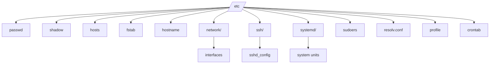

Excellent question — `/etc` is one of the **most important directories** in Linux.

Let’s break it down clearly 👇

---

## 🗂️ What is `/etc` in Linux?

`/etc` stands for **“editable text configuration”** (historically “et cetera”).
It contains **system-wide configuration files** that control how the Linux system behaves.

It is **not** for user data or binaries — only for **system configuration**.

---

## 🧠 Purpose

* Holds configuration files for the **operating system**, **daemons**, and **applications**.
* Used by **init/systemd** during boot.
* Any change here typically requires **root privileges**.

---

## 📁 Common Directories and Files Inside `/etc`

| File / Folder      | Purpose                                                              |
| ------------------ | -------------------------------------------------------------------- |
| `/etc/passwd`      | User account information (username, UID, GID, home directory, shell) |
| `/etc/shadow`      | Encrypted passwords for users                                        |
| `/etc/group`       | Defines user groups                                                  |
| `/etc/hosts`       | Local hostname to IP mapping                                         |
| `/etc/hostname`    | The system’s hostname                                                |
| `/etc/resolv.conf` | DNS resolver configuration                                           |
| `/etc/fstab`       | Filesystems to mount automatically at boot                           |
| `/etc/ssh/`        | SSH server and client configuration files                            |
| `/etc/systemd/`    | Systemd service units and targets                                    |
| `/etc/network/`    | Network configuration scripts (used by `ifupdown`)                   |
| `/etc/sysctl.conf` | Kernel parameter configuration (via `sysctl`)                        |
| `/etc/sudoers`     | Defines sudo privileges                                              |
| `/etc/crontab`     | System-wide cron jobs                                                |
| `/etc/profile`     | System-wide shell initialization                                     |
| `/etc/environment` | Environment variables for all users                                  |

---

## ⚙️ Types of Files

| Type             | Description                      | Example                                         |
| ---------------- | -------------------------------- | ----------------------------------------------- |
| System Config    | Controls kernel or OS subsystems | `/etc/sysctl.conf`                              |
| Service Config   | Config files for daemons         | `/etc/nginx/nginx.conf`, `/etc/ssh/sshd_config` |
| User Environment | Shells, login defaults           | `/etc/profile`, `/etc/bashrc`                   |
| Network          | IP, DNS, hostname settings       | `/etc/network/interfaces`, `/etc/resolv.conf`   |

---

## 🧩 Hierarchy Diagram (Mermaid)

---

## 🧰 Best Practices

* Always **take backups** before modifying `/etc` files.
* Use tools like `visudo` (for `/etc/sudoers`) to avoid syntax errors.
* Many applications keep default configs in `/usr/share` and system-wide overrides in `/etc`.

---

Would you like me to show how `/etc` is used during **boot** (for example: how `/etc/systemd`, `/etc/fstab`, and `/etc/network` work together when Linux starts)?
