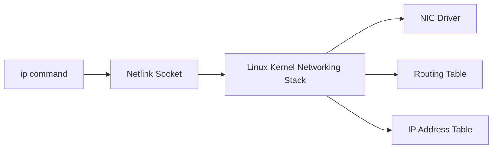

### What is the ip Command

`ip` is the primary Linux networking command used to view and modify network interfaces, routing tables, addresses, and link-layer settings. It interacts with the **Linux kernel networking stack** through **netlink sockets**.

### Components Involved

* **Linux Kernel Network Stack**: Stores routing tables, interface states, addresses.
* **Netlink API**: Kernel-user space communication mechanism used by `ip`.
* **iproute2 Userspace Tool**: The `ip` binary is part of this suite.
* **NIC Driver**: Applies link-layer changes (UP/DOWN, MTU).

### Core Operations

### Show Interfaces

```bash
ip link show
```

Netlink retrieves interface metadata (name, state, MTU) from the kernel.

### Bring Interface Up/Down

```bash
ip link set eth0 up
ip link set eth0 down
```

Netlink updates interface state and kernel notifies NIC driver.

### Assign IP Address

```bash
ip addr add 192.168.1.10/24 dev eth0
```

Kernel updates the interface’s IP address table.

### View IP Addresses

```bash
ip addr show
```

Displays addresses stored in the kernel's inet/inet6 structures.

### View Routing Table

```bash
ip route show
```

Queries the kernel routing subsystem (FIB – Forwarding Information Base).

### Add Route

```bash
ip route add 10.0.0.0/24 via 192.168.1.1 dev eth0
```

Kernel updates routing rules through netlink.

### View Neighbor Table (ARP)

```bash
ip neigh show
```

Displays kernel ARP/ND entries.

### Real Use Case Example

Debug microservices connectivity:

```bash
ip route get 10.0.2.15
```

Kernel shows which interface and next-hop it will use for that IP.

### Mermaid Diagram of ip Command Flow



If you want, I can also explain advanced features like policy routing, network namespaces, or how ip interacts with tc for traffic control.

