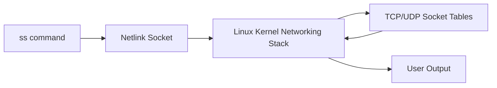

### ss: Overview

The `ss` command (Socket Statistics) is a modern Linux utility that displays detailed information about TCP, UDP, UNIX, RAW, and other sockets. It is faster than `netstat` because it reads data directly from **Linux kernel Netlink sockets** instead of parsing older `/proc` files. Tools like `ss` interact with the kernel via **netlink API**, which is more efficient and accurate.

### Why ss is preferred

* Uses **netlink** instead of older `/proc/net/*` APIs
* Provides detailed TCP metrics (cwnd, rtt, retransmits)
* Faster output due to kernel-level socket dumping
* More filters than netstat

### Basic usage examples

```bash
ss -tuln
```

Show TCP/UDP listening sockets.

```bash
ss -ant state established
```

Show only established TCP connections.

```bash
ss -tnlp | grep 8080
```

Find which process is listening on port 8080.
Internally, this queries **kernel socket tables** + **/proc/<pid>/fd** information.

### Key options

* `-t` TCP
* `-u` UDP
* `-l` listening
* `-n` no DNS lookup
* `-p` show process (kernel links PID to socket inode)
* `-s` protocol statistics from kernel netlink

---

### netstat: Overview

`netstat` is part of the deprecated **net-tools** package. It gathers socket information by reading older kernel interfaces such as:

* `/proc/net/tcp`
* `/proc/net/udp`
* `/proc/net/dev`
* `/proc/net/snmp`

Because these files are text-based, `netstat` is slower and provides less depth.

### netstat usage examples

```bash
netstat -tuln
```

List listening sockets (reads `/proc/net/tcp*`).

```bash
netstat -antp | grep java
```

Show TCP sockets and the Java JVM process using them.

### What performs the action

* Netstat relies on the **Linux VFS layer** to read `/proc` virtual files.
* Socket to process mapping is resolved via **/proc/<pid>/fd** symlinks.

---

### Differences between ss and netstat (concise)

| Feature            | ss                             | netstat              |
| ------------------ | ------------------------------ | -------------------- |
| Backend            | Netlink kernel API             | /proc/net text files |
| Speed              | Very fast                      | Slower               |
| Detail             | More TCP internals (rtt, cwnd) | Limited              |
| Filters            | Advanced filters               | Basic                |
| Accuracy           | Real-time                      | Sometimes stale      |
| Package            | iproute2                       | Deprecated net-tools |
| Kernel interaction | Direct syscalls via netlink    | Procfs parsing (VFS) |

---

### Example: Finding slow TCP connections using ss

Use case: Debug high latency for Kubernetes pod-to-pod traffic.

```bash
ss -ti src 10.0.1.15
```

Output fields (directly from **kernel TCP struct**):

* rtt
* rttvar
* retrans
* cwnd

Example interpretation:
If `retrans=5` and `rtt=300ms`, the issue is likely on the **Linux network stack** or underlying NIC, not Kubernetes.
Kubernetes components (kube-proxy, CNI plugin like Calico) just route packets; the latency is measured by **TCP kernel subsystem**.

---

### Mermaid diagram: How ss interacts with the kernel



---

### Pseudo-case: Identifying which service owns a port

Requirement: Find which Java JVM service on a Kubernetes node is using port 9092 (Kafka broker).

```bash
ss -tnlp | grep 9092
```

If output shows:

```
java  pid=3245  users:(("java",pid=3245))
```

This means:

* The **Linux kernel socket layer** maps port 9092 → PID 3245
* JVM is hosting the Kafka broker
* kubelet/kube-proxy play no role; this is OS-level socket binding

This is how you would validate a Kafka port conflict or health check failure.
