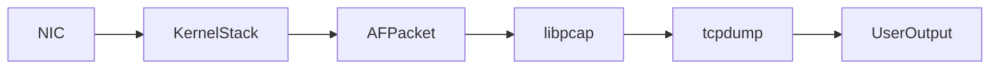

### What is tcpdump

`tcpdump` is a Linux packet-capture command used to capture and inspect network packets. It relies on **libpcap** and the **Linux kernel network stack** to tap into packets at the **AF_PACKET socket** layer before they reach user-space applications.

### Components Involved

* **Linux Kernel Network Stack**: Captures packets at the data-link layer.
* **AF_PACKET Socket**: Kernel API allowing raw packet capture.
* **libpcap**: User-space library that `tcpdump` uses to read packets from the kernel.
* **tcpdump CLI Tool**: Converts packet bytes into human-readable protocol information.

### Basic Usage

```bash
tcpdump -i eth0
```

Linux kernel delivers packets from NIC → kernel network stack → AF_PACKET → libpcap → tcpdump.

### Common Filters

```bash
tcpdump -i eth0 port 80
tcpdump -i eth0 host 10.0.0.5
tcpdump -i eth0 tcp
tcpdump -i eth0 udp
```

Filters are evaluated by the **libpcap BPF engine** (Berkeley Packet Filter) in the kernel for performance.

### Capture to File

```bash
tcpdump -i eth0 -w capture.pcap
```

Packets are written in pcap format for tools like Wireshark.

### Read from File

```bash
tcpdump -r capture.pcap
```

### Mermaid Flow Diagram



### Real Use Case Example

Capture only HTTP traffic for debugging a microservice:

```bash
tcpdump -i eth0 tcp port 8080 -vv -X
```

* Kernel captures packets
* BPF filter keeps only TCP:8080 packets
* tcpdump prints headers + payload (`-X`)

If you want, I can also explain how tcpdump interacts with kernel ring buffers and how packet drops happen.

