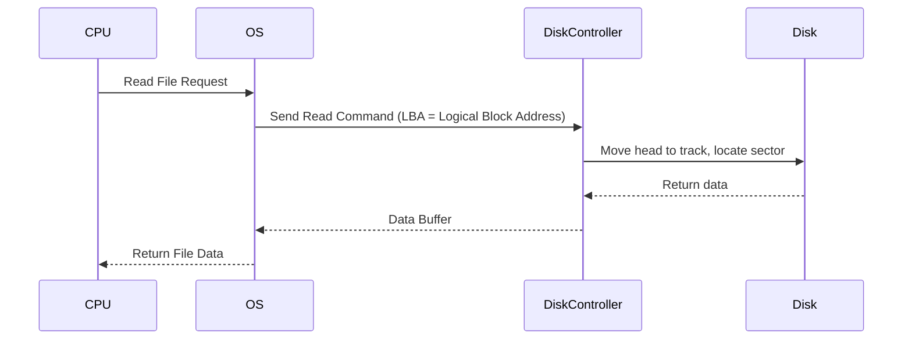

Excellent — let’s go step by step so you’ll understand **disk I/O (input/output)** deeply, along with terms like **diskette, sectors, blocks, seek time, IOPS, etc.**
We’ll cover both *historical (like diskette)* and *modern disk concepts (like SSDs and caching)*.

---

## 🧱 1. What is Disk I/O?

**Disk I/O (Input/Output)** means **reading or writing data** to physical storage devices — such as:

* Hard Disk Drives (HDD)
* Solid State Drives (SSD)
* Floppy disks (old term: *diskette*)

When your OS or database reads/writes data to disk, that’s a disk I/O operation.

---

## 🧩 2. Diskette (Floppy Disk)

A **diskette** is an older form of **magnetic storage**, used before USB and SSDs.

| Property  | Example                              |
| --------- | ------------------------------------ |
| Capacity  | 1.44 MB (3.5-inch floppy)            |
| Material  | Magnetic coating on flexible plastic |
| Access    | Sequential + random                  |
| Interface | Floppy Disk Drive (FDD)              |

**How it worked:**

* Data stored on *concentric circles* called **tracks**.
* Each track divided into **sectors** (smallest readable unit, usually 512 bytes).
* A mechanical **read/write head** moved to the correct track and read the sector.

---

## 💿 3. Key Terms in Disk I/O (still used today)

| Term                   | Meaning                                                 | Analogy / Example                      |
| ---------------------- | ------------------------------------------------------- | -------------------------------------- |
| **Track**              | Circular path on the disk surface                       | Like lanes on a running track          |
| **Sector**             | Smallest addressable unit (typically 512 bytes or 4KB)  | A slice of the circle                  |
| **Cylinder**           | All tracks aligned vertically across platters           | Stack of circular tracks               |
| **Block**              | Group of sectors used by the OS (e.g., 4 KB block size) | One “page” of data                     |
| **Seek Time**          | Time for head to move to correct track                  | Moving to a bookshelf                  |
| **Rotational Latency** | Time for sector to rotate under the head                | Waiting for the book to spin into view |
| **Transfer Time**      | Time to actually read/write data                        | Copying the text                       |
| **Access Time**        | Total = Seek + Latency + Transfer                       | Total time for I/O operation           |
| **IOPS**               | Input/Output Operations Per Second                      | Performance metric                     |
| **Throughput**         | MB/s of data transferred                                | Like “speed” on a highway              |

---

## ⚙️ 4. How Disk I/O Works



---

## 🔄 5. Disk Scheduling Algorithms

Used by OS to **optimize seek time**:

| Algorithm           | Description                                | Example                |
| ------------------- | ------------------------------------------ | ---------------------- |
| **FCFS**            | First Come First Serve                     | Simple but inefficient |
| **SSTF**            | Shortest Seek Time First                   | Pick nearest request   |
| **SCAN (Elevator)** | Head moves back and forth like an elevator | Balanced latency       |
| **C-SCAN**          | Circular SCAN (always in one direction)    | Uniform response time  |

---

## 🚀 6. Modern Disk I/O Concepts

| Concept                        | Description                                                     |
| ------------------------------ | --------------------------------------------------------------- |
| **SSD (Solid State Drive)**    | Flash-based, no moving parts, faster I/O                        |
| **Write Amplification**        | SSDs may write more data internally due to wear leveling        |
| **IO Queue / NCQ**             | Native Command Queuing — optimize read/write order              |
| **Caching / Buffer**           | OS and disk controllers cache frequently used blocks            |
| **Asynchronous I/O**           | Program continues running while disk I/O completes              |
| **DMA (Direct Memory Access)** | Allows disk to send data directly to memory without CPU copying |

---

## 🧠 7. Example: Database and Disk I/O

When Oracle or MySQL writes data:

1. Changes are first written to **redo logs (sequential I/O)**.
2. Data blocks are written to **data files (random I/O)**.
3. Buffer cache helps reduce physical reads/writes.

You’ll often tune:

* **`db_file_multiblock_read_count`**
* **`filesystemio_options`**
* **`DB_WRITER_PROCESSES`**

to balance disk throughput and latency.

---

## 🪶 8. Disk Performance Metrics

| Metric          | Description                      | Typical Range                     |
| --------------- | -------------------------------- | --------------------------------- |
| **IOPS**        | I/O per second                   | HDD: 100–200, SSD: 10K–100K       |
| **Latency**     | Time per I/O operation           | HDD: 5–10 ms, SSD: 0.1 ms         |
| **Throughput**  | Data transfer rate               | HDD: 100 MB/s, SSD: 500–5000 MB/s |
| **Queue Depth** | Number of I/O operations waiting | 32–256 typical for SSD            |

---

## 🧰 9. Tools to Measure Disk I/O

| Tool       | Platform | Usage                                      |
| ---------- | -------- | ------------------------------------------ |
| **iostat** | Linux    | `iostat -x 1` shows IOPS, utilization      |
| **sar -d** | Linux    | Collects historical disk stats             |
| **vmstat** | Linux    | General I/O and memory stats               |
| **fio**    | Linux    | Flexible I/O benchmarking                  |
| **ioping** | Linux    | Measures I/O latency (like ping for disks) |

---

## 📘 10. Example

```bash
# Measure disk read/write performance
sudo fio --name=seqread --rw=read --bs=1M --size=1G --filename=/tmp/testfile --direct=1
```

Output:

```
READ: bw=480MiB/s (503MB/s), iops=480, runt=2132msec
```

---

Would you like me to include a **diagram showing HDD internals (platters, heads, sectors)** and a **comparison with SSD structure (NAND cells, controller, cache)**? It’ll make this even clearer.
