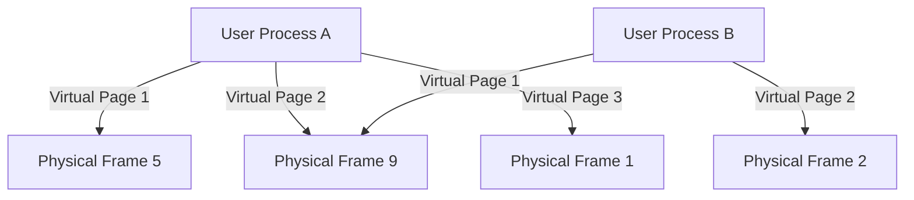

Excellent — this is one of the **most fundamental yet deep topics** in Linux internals.
Let’s unpack it carefully and visually 👇

---

## 🧠 Concept Overview

In Linux (and almost every modern OS), **each process** does **not** directly access physical memory (RAM).
Instead, it works with **virtual memory** — an *abstraction layer* that gives each process the illusion of its own large, contiguous memory space.

The kernel then **maps** parts of this virtual space to **actual physical memory** using **page tables**.

---

## 🧩 Key Terms

| Term                                   | Description                                                      |
| -------------------------------------- | ---------------------------------------------------------------- |
| **Virtual Memory**                     | Per-process address space managed by kernel & MMU                |
| **Physical Memory**                    | Actual RAM chips installed on the system                         |
| **MMU (Memory Management Unit)**       | Hardware in the CPU that translates virtual → physical addresses |
| **Page**                               | Small fixed-size block of memory (commonly 4 KB)                 |
| **Page Table**                         | Kernel structure mapping virtual pages to physical frames        |
| **Swap**                               | Disk area used as overflow when RAM is full                      |
| **TLB (Translation Lookaside Buffer)** | CPU cache that stores recent virtual→physical translations       |

---

## ⚙️ Step-by-Step Interaction

Let’s say a process tries to access variable `int x = 10;`

1. **User Process Creates Virtual Address:**

   * The process uses a virtual address (say `0x7ffd1234`).
   * From the process’s perspective, memory looks continuous.

2. **CPU + MMU Translate It:**

   * The **MMU** (hardware) consults the **page tables** (kernel data) to find which physical memory frame corresponds to that virtual address.

3. **Physical Frame Found:**

   * The kernel ensures that this virtual page points to an actual **physical frame** in RAM (say `0x1a000`).

4. **TLB Cache:**

   * The MMU caches this translation in the **TLB** so the next access is faster.

5. **If Not in RAM (Page Fault):**

   * If the page isn’t mapped (e.g., was swapped out), the CPU triggers a **page fault**.
   * The **kernel’s page fault handler** loads the required data from disk (swap or file) into physical memory, updates the page table, and resumes the process.

---

## 🧭 Diagram — Virtual vs Physical Mapping



👉 Multiple processes can **map to the same physical frame** (e.g., shared libraries, kernel code).

---

## 🗂️ Virtual Memory Layout (for each process)

In Linux, a process’s virtual address space looks like this:

| Memory Region           | Purpose                                                      |
| ----------------------- | ------------------------------------------------------------ |
| **Text segment**        | Executable code (read-only)                                  |
| **Data segment**        | Global/static variables                                      |
| **Heap**                | Dynamically allocated memory (`malloc`, `new`)               |
| **Memory-mapped files** | Shared libs, `mmap` regions                                  |
| **Stack**               | Function call frames                                         |
| **Kernel space**        | Reserved for the kernel (typically top 1/4 of address space) |

Each of these regions maps to **physical frames** (or swap space if evicted).

---

## 📘 Linux Tools to View It

### 🧾 1. View virtual memory layout:

```bash
cat /proc/<pid>/maps
```

### 🧮 2. Show memory statistics:

```bash
free -h
```

### 🧱 3. Show page tables (for experts):

```bash
sudo cat /proc/<pid>/pagemap
```

### 🔍 4. Check physical memory usage:

```bash
cat /proc/meminfo
```

---

## 💡 Shared and Copy-on-Write (COW)

Linux optimizes memory by **sharing physical pages** when possible:

* Multiple processes using the same library share the same physical memory.
* On `fork()`, child and parent share the same pages marked **copy-on-write**.

  * Only when one modifies the page is it copied physically.

This keeps memory usage very efficient.

---

## 🧠 Summary Table

| Concept          | Description                 | Handled By         |
| ---------------- | --------------------------- | ------------------ |
| Virtual Address  | Per-process logical address | CPU + MMU          |
| Physical Address | Actual RAM location         | Hardware           |
| Page Table       | Maps virtual → physical     | Kernel             |
| TLB              | Caches translations         | CPU                |
| Page Fault       | When a page isn’t mapped    | Kernel             |
| Swap             | Disk overflow for memory    | Kernel swap daemon |

---

## 🔄 Analogy

Think of **virtual memory** like a **hotel room number system**:

* Each guest (process) thinks they have room #101 (virtual address).
* The hotel’s reception (MMU) knows that room #101 for Guest A is actually **Room 507 (physical frame)**, and for Guest B it’s **Room 808**.
* Reception (kernel + MMU) keeps the mapping secret and handles translation.

---

## 🧩 Bonus: Why It’s Useful

✅ Process isolation — no one can touch another’s memory
✅ Easier memory allocation — contiguous virtual space, even if physical memory is fragmented
✅ Efficient sharing — same physical pages for shared libs
✅ Swapping support — move inactive pages to disk

---

Would you like me to draw a **detailed diagram showing the Linux memory mapping process** (virtual memory, page tables, TLB, MMU, and swap flow)?
