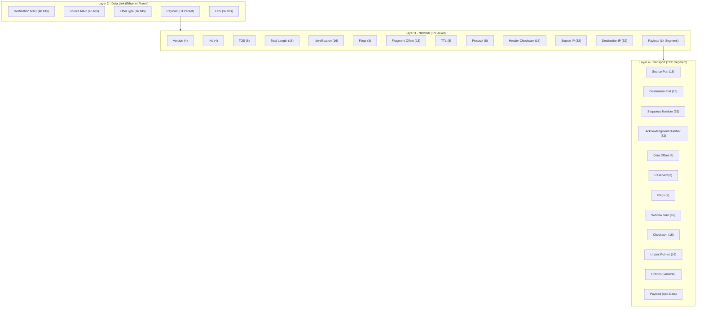
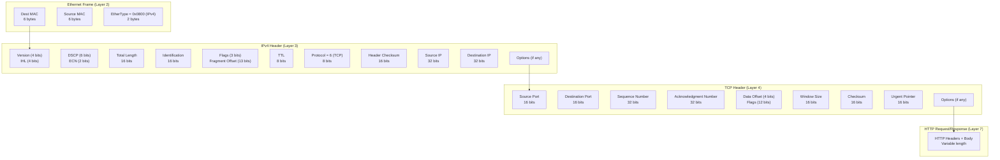

# Network Packet

**packet life cycle** inside a Linux system  from user space → kernel → NIC → network → remote host → back:

```mermaid
sequenceDiagram
    participant App as Application (User Space)
    participant Socket as Socket API
    participant Kernel as Kernel (TCP/IP Stack)
    participant NIC as Network Interface Card
    participant Wire as Network (Switch/Router)
    participant Remote as Remote Host

    App->>Socket: Write data (send())
    Socket->>Kernel: Syscall triggers packet creation
    Kernel->>Kernel: TCP/IP processing\n(segment, headers, checksum)
    Kernel->>NIC: Pass packet to NIC driver (skb)
    NIC->>NIC: Packet queued & DMA transfer
    NIC->>Wire: Transmit frame (Ethernet)
    Wire->>Remote: Route packet to destination

    Remote->>Wire: Send ACK/response
    Wire->>NIC: Deliver incoming frame
    NIC->>Kernel: Interrupt → hand packet to stack
    Kernel->>Socket: Deliver payload to socket buffer
    Socket->>App: Application receives data (read())
```


**Network Interface Card (NIC)**
> A **Network Interface Card (NIC)** in Linux is the hardware (or virtual) component that connects a system to a network and handles the framing, sending, and receiving of packets at Layer 2. Each NIC is represented in Linux as a network device under `/sys/class/net` (e.g., `eth0`, `enp3s0`). The NIC offloads several low-level operations from the CPU, such as checksum calculation, segmentation (TSO/GSO), and packet filtering via hardware queues. The Linux kernel uses the **netdevice** subsystem and **drivers** to communicate with the NIC, managing RX/TX rings, interrupts (or NAPI polling), and buffer allocation through sk_buffs. The NIC advertises capabilities like speed, duplex, and offloads via `ethtool`. Overall, it serves as the bridge between the OS networking stack and the physical network medium, ensuring efficient and reliable packet transmission.

**Network Switch**

>A **network switch** is a Layer 2 device that connects multiple devices within the same local network and forwards Ethernet frames intelligently using MAC addresses. It maintains a **MAC address table** that maps each port to the devices connected behind it, allowing the switch to send frames only to the correct destination port instead of broadcasting to all ports. Switches operate using full-duplex links, support features like VLANs, Spanning Tree Protocol (STP), link aggregation, and QoS, and can be unmanaged or fully managed. By reducing collisions and isolating traffic per port, a switch provides fast, efficient, and secure communication within a LAN.

**Network Router**
>A **network router** is a Layer 3 device responsible for directing packets between different networks using IP addresses. Unlike switches, which forward frames within a single LAN, a router determines the best path for packets to reach destinations across multiple networks or the internet. It maintains a **routing table**, uses protocols like OSPF, BGP, RIP, or static routes, and performs tasks such as NAT, firewall filtering, DHCP, and packet forwarding. Routers break broadcast domains, support inter-VLAN routing, and ensure efficient, secure, policy-driven movement of traffic between internal networks and external networks.

Refer for Details  :
- [Layer 3 Routing Protocols](routing_protocols.md)
- [Layer 3 Protocols](layer_3_protocols.md)
- [Layer 4 Protocols](/design/system-design/load_balancer/layer4_protocols.md)
- [Layer 7 Protocols](/design/system-design/browser/protocols.md)

More :
- Packet life cycle in **reverse (incoming first)**
- Packet life cycle through **iptables/nftables hooks**
- Packet life cycle through **Linux routing and ARP**

## Packet Components at each layer 

Below are **two Mermaid diagrams**:

1. **Side-by-side L2 / L3 / L4 packet structure**
2. **Detailed Ethernet + IP + TCP header fields with exact sizes**

Both diagrams show how the packet is constructed **visually and accurately**.

### L2 / L3 / L4 Structure




### Detailed Ethernet + IP + TCP Packet With Field Sizes**

This diagram presents all three headers **top-to-bottom in order of encapsulation**.

```mermaid
flowchart TD

subgraph Ethernet_Header["Ethernet II Header (L2)"]
    E1[Destination MAC<br/>48 bits]
    E2[Source MAC<br/>48 bits]
    E3[EtherType<br/>16 bits]
end

subgraph IP_Header["IPv4 Header (L3)"]
    I1[Version<br/>4 bits]
    I2[IHL<br/>4 bits]
    I3[DSCP/ECN<br/>8 bits]
    I4[Total Length<br/>16 bits]
    I5[Identification<br/>16 bits]
    I6[Flags<br/>3 bits]
    I7[Fragment Offset<br/>13 bits]
    I8[TTL<br/>8 bits]
    I9[Protocol<br/>8 bits]
    I10[Header Checksum<br/>16 bits]
    I11[Source IP<br/>32 bits]
    I12[Destination IP<br/>32 bits]
    I13["Options (if IHL>5)<br/>0–320 bits"]
end

subgraph TCP_Header["TCP Header (L4)"]
    T1[Source Port<br/>16 bits]
    T2[Destination Port<br/>16 bits]
    T3[Sequence Number<br/>32 bits]
    T4[Acknowledgment Number<br/>32 bits]
    T5[Data Offset<br/>4 bits]
    T6[Reserved<br/>3 bits]
    T7["Flags<br/>9 bits (SYN,ACK,FIN,etc.)"]
    T8[Window Size<br/>16 bits]
    T9[Checksum<br/>16 bits]
    T10[Urgent Pointer<br/>16 bits]
    T11["Options (variable)<br/>0–320 bits"]
end

subgraph Payload[Application Data]
    P1[HTTP / DNS / TLS / Custom Data]
end

E3 --> IP_Header
I13 --> TCP_Header
T11 --> Payload
```




### **Ethernet Frame (L2)** — *Minimum 14 bytes*

| Field           | Size              |
| --------------- | ----------------- |
| Destination MAC | 6 bytes           |
| Source MAC      | 6 bytes           |
| EtherType       | 2 bytes           |
| FCS             | 4 bytes (trailer) |


### **IPv4 Header (L3)** — *Minimum 20 bytes*

| Field                   | Size       |
| ----------------------- | ---------- |
| Version + IHL           | 1 byte     |
| DSCP/ECN                | 1 byte     |
| Total Length            | 2 bytes    |
| Identification          | 2 bytes    |
| Flags + Fragment Offset | 2 bytes    |
| TTL                     | 1 byte     |
| Protocol                | 1 byte     |
| Header Checksum         | 2 bytes    |
| Source IP               | 4 bytes    |
| Destination IP          | 4 bytes    |
| Options                 | 0–40 bytes |

 

### **TCP Header (L4)** — *Minimum 20 bytes*

| Field                          | Size       |
| ------------------------------ | ---------- |
| Source Port                    | 2 bytes    |
| Destination Port               | 2 bytes    |
| Sequence Number                | 4 bytes    |
| Acknowledgment Number          | 4 bytes    |
| Data Offset + Reserved + Flags | 2 bytes    |
| Window Size                    | 2 bytes    |
| Checksum                       | 2 bytes    |
| Urgent Pointer                 | 2 bytes    |
| Options                        | 0–40 bytes |


# More:

✔ Combined full-wire packet (Ethernet + IP + TCP + HTTP)
✔ Example with real hex dump + breakdown
✔ Diagram for UDP instead of TCP
✔ Diagram for IPv6 instead of IPv4
 


### **Full Packet: Ethernet + IP + TCP + HTTP**




You are seeing a **full on-wire packet** exactly as it appears when captured in Wireshark:

```
+-------------------------------------------------------------+
| Ethernet | IPv4 | TCP | HTTP Payload (request/response)     |
+-------------------------------------------------------------+
```

 
| Layer | Protocol    | Typical Header Size | Notes                        |
| ----- | ----------- | ------------------- | ---------------------------- |
| L2    | Ethernet II | 14 bytes            | +4 bytes if VLAN             |
| L3    | IPv4        | 20 bytes            | +options possible            |
| L4    | TCP         | 20 bytes            | +TCP options (MSS, SACK, TS) |
| L7    | HTTP        | Variable            | Can be KBs or MBs            |

Typical bare-minimum overhead:

```
Ethernet (14) + IPv4 (20) + TCP (20) = 54 bytes header before HTTP data
```

  Example Binary Layout

```
[Ethernet Header]
[IPv4 Header]
[TCP Header]
[HTTP Request/Response]
```

For example, a typical HTTP GET packet:

```
GET /index.html HTTP/1.1
Host: example.com
User-Agent: ...
```

More :

- A **bit-level** diagram
- The same structure for **IPv6 + TCP + HTTP/2**
- A **POST request** payload example
- A **full TLS packet** (Ethernet + IP + TCP + TLS + HTTP/2)


## **Packet Flow Through Netfilter Hooks**


Incoming packets hit **PREROUTING** before routing; then based on routing they go to **INPUT** (local) or **FORWARD** (routed). Outgoing packets from applications go through **OUTPUT**, then **POSTROUTING**. NAT typically occurs in **PREROUTING** (DNAT) and **POSTROUTING** (SNAT). All packets finally pass through `netdev` before leaving/after arriving at the NIC.


More :  **only iptables**, **only nftables**, or **with connection tracking (conntrack)** .

 

##  Packet Life Cycle Through Linux Routing + ARP


**FIB (Forwarding Information Base)**

> A **FIB (Forwarding Information Base)** is the optimized, runtime version of the routing table used by routers to forward packets at high speed. While the routing table stores all learned routes, the FIB keeps only the best next-hop entries for each destination. It enables fast, hardware-accelerated packet forwarding by mapping destination IP prefixes directly to outgoing interfaces.

**ARP (Address Resolution Protocol)**

> The **ARP (Address Resolution Protocol)** maps an IPv4 address to its corresponding MAC address on a local network. When a device wants to send a packet to another host on the same LAN, it broadcasts an ARP request to learn the target’s MAC address. The resolved mappings are stored in an ARP cache to avoid repeated broadcasts and speed up communication.


When an application sends a packet, Linux performs a **routing lookup** to decide if the destination is on the same subnet or requires a gateway. Linux then checks the **ARP cache** for the corresponding MAC address. If missing, it sends an **ARP request**, waits for the reply, updates the ARP cache, wraps the IP packet inside an **Ethernet frame**, and finally sends it through the **NIC** onto the wire.

 More :**reverse path (incoming packets)**, **proxy ARP**, **gratuitous ARP**, or **ARP cache states (REACHABLE / STALE / DELAY / PROBE)**.
 
## **Packet Life Cycle Through Linux Routing + ARP**

including:
✔ **Incoming + outgoing packets**
✔ **ARP cache states (REACHABLE, STALE, DELAY, PROBE)**
✔ **Proxy ARP logic**
✔ **Gratuitous ARP handling**


### **1. Outgoing Packet**

Linux builds a TCP/UDP segment → wraps it inside an IP packet → performs a routing lookup.
If the destination is:

* **Local subnet** → resolve its MAC via ARP
* **Remote network** → resolve gateway’s MAC via ARP

Linux checks the **ARP cache**. If the entry is:

* **REACHABLE** → use immediately
* **STALE** → move to DELAY → PROBE → REACHABLE
* **Missing** → send **ARP request** (broadcast), wait for reply

Once MAC is known, Linux builds an **Ethernet frame** and sends it out through the NIC.


### **2. Incoming Packet**

NIC receives an Ethernet frame and:

* If **MAC matches NIC**, deliver to IP layer.
* If MAC doesn’t match but **Proxy ARP** is enabled, Linux may respond with its own MAC.

If the packet is:

* **For this host** → pass to TCP/UDP
* **For another host & IP forwarding enabled** → use routing table → forward
  (Possibly triggering ARP requests for next-hop MAC)


### **3. Gratuitous ARP**

Used for:

* **Detecting IP conflicts**
* **Updating ARP caches of other hosts**
* **Failover / IP takeover** (keepalived, VRRP)

Linux updates its ARP table on receiving it.

More :
📌 **ARP cache lifecycle diagram** (REACHABLE → STALE → DELAY → PROBE → FAILED)
📌 **Diagram showing Kernel components (FIB, ARP table, Neighbour subsystem)**
📌 **Packet path through iptables → routing → ARP → NIC** (all together)

## **ARP / Neighbor Cache Lifecycle — Mermaid Diagram**
states:

* **INCOMPLETE**
* **REACHABLE**
* **STALE**
* **DELAY**
* **PROBE**
* **FAILED**


 
 
### **1. INCOMPLETE**

* ARP request has been sent.
* Still waiting for an ARP reply.

### **2. REACHABLE**

* MAC is valid.
* Linux uses a **reachability timer** (typically 30s).
* Any traffic refreshes state.

### **3. STALE**

* Timer expired; MAC may still work.
* Linux *will not probe yet*.
* First use will transition to **DELAY** or **PROBE**.

### **4. DELAY**

* Linux waits ~5 seconds to see if incoming traffic confirms reachability.
* If none arrives → move to **PROBE**.

### **5. PROBE**

* Linux sends **unicast ARP probes**.
* If reply received → REACHABLE.
* If not → FAILED.

### **6. FAILED**

* MAC resolution failed.
* Retries after exponential backoff.


More :
📌 **Full Packet Flow + Neighbor Table (ARP) + Routing + iptables hooks** in a single diagram
📌 **Linux Neighbor Subsystem architecture diagram**
📌 **ARP vs NDP lifecycle (IPv4 vs IPv6)**
 
