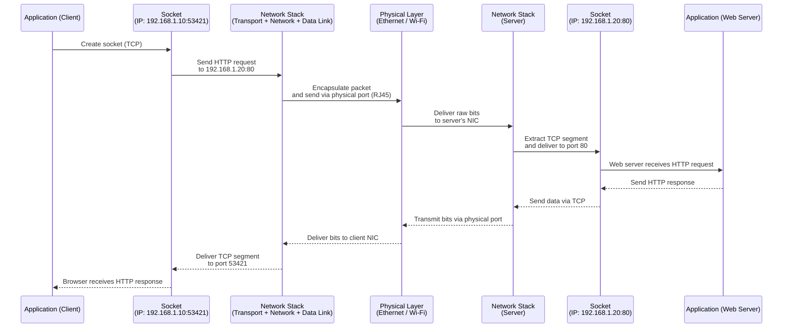

# Networking in Linux

If not on internet, you need a **local or physical connection** between the machines 

| Method                            | Description                                       | Requirement                             |
| --------------------------------- | ------------------------------------------------- | --------------------------------------- |
| **Ethernet (LAN cable)**          | Connect machines via direct cable or local switch | Both machines must have Ethernet ports  |
| **USB drive / External HDD**      | Use removable storage                             | Simple but manual                       |
| **Serial cable (RS232)**          | Legacy, but possible for small data               | Serial ports on both machines           |
| **Wi-Fi Direct / Ad-hoc network** | Peer-to-peer Wi-Fi                                | Wi-Fi adapters that support ad-hoc mode |
 

**Using Ethernet (fastest & most reliable method)**

#### **Step 1: Connect machines**

Plug in an Ethernet cable directly between both machines.

#### **Step 2: Assign static IPs**

On **Machine A:**

```bash
sudo ip addr add 192.168.1.1/24 dev eth0
sudo ip link set eth0 up
```

On **Machine B:**

```bash
sudo ip addr add 192.168.1.2/24 dev eth0
sudo ip link set eth0 up
```

#### **Step 3: Verify connection**

```bash
ping 192.168.1.2  # from Machine A
```

If successful → both machines can communicate.

 

###  3. **Transfer methods**

#### **Option 1: `scp` (secure copy)**

If both machines have SSH enabled:

```bash
scp /path/to/file username@192.168.1.2:/destination/path
```

Its Encrypted , Fast (over Ethernet) and does not Requires SSH
 

#### **Option 2: `rsync`**

For large or incremental transfers:

```bash
rsync -avz /source/path username@192.168.1.2:/destination/path
```

- Can resume if interrupted
- Only transfers differences
- Faster than scp for repeated transfers
 
#### **Option 3: `netcat` (no SSH needed)**

If SSH is not allowed, use raw sockets:

On **Machine B** (receiver):

```bash
nc -l -p 9000 > received_file
```

On **Machine A** (sender):

```bash
cat file_to_send | nc 192.168.1.2 9000
```

It Works without SSH but No encryption (use only in secure environment)


###  4. **Using Removable Storage**

If machines are physically isolated:

1. Plug a **USB drive** or **external SSD** into machine A.
2. Copy files:

   ```bash
   cp /data/* /media/usb/
   ```
3. Unmount and plug into machine B, then copy:

   ```bash
   cp /media/usb/* /destination/
   ```

Its Simple but  Manual and  Slow for large or frequent transfers
 

###  5. **Optional — Setup a Local FTP/HTTP server**

On **Machine A**:

```bash
python3 -m http.server 8080
```

On **Machine B**, open in browser or use `wget`:

```bash
wget http://192.168.1.1:8080/file.zip
```

Its simple , Works well in LAN , but not encrypted

 

| Method                 | Needs Network? | Encryption | Speed        | Use Case              |
| ---------------------- | -------------- | ---------- | ------------ | --------------------- |
| **USB drive**          | ❌ No           | ✅ Manual   | 🐢 Slow      | Air-gapped transfer   |
| **scp**                | ✅ Yes          | ✅ SSH      | ⚡ Fast       | Secure file copy      |
| **rsync**              | ✅ Yes          | ✅ SSH      | ⚡⚡ Very fast | Syncing directories   |
| **netcat**             | ✅ Yes          | ❌ None     | ⚡ Fast       | Raw data transfer     |
| **python http.server** | ✅ Yes          | ❌ None     | ⚡ Medium     | Simple ad-hoc sharing |

 
 

 

| Concept           | Type     | Description                                                                                                               |
| ----------------- | -------- | ------------------------------------------------------------------------------------------------------------------------- |
| **Physical Port** | Hardware | The *actual physical connector* on a device — e.g., Ethernet port (RJ45), USB, serial, or fiber port.                     |
| **Logical Port**  | Software | A *virtual communication endpoint* used by network protocols (e.g., TCP/UDP). Identified by a port number (0–65535).      |
| **Socket**        | Software | The *combination of an IP address + protocol (TCP/UDP) + logical port number*. Used by applications to send/receive data. |

 

Physical Port (Hardware Level)

> A **physical port** is tangible — you can touch it.
It’s how a network cable or device physically connects to your computer or switch. Examples:

* **Ethernet port (RJ-45)** → connects network cables.
* **Fiber port (SFP/GBIC)** → for high-speed optical connections.
* **Serial port (RS-232)** → older devices and routers.

 

They enable *physical data transmission* via:

* Electrical signals (Ethernet copper)
* Light (Fiber)
* Radio (Wi-Fi, Bluetooth)

These ports work at **OSI Layer 1 – Physical Layer**.


Logical Port (Software Level)

> Once a physical connection is established, we need a way for multiple programs to use the same network interface simultaneously — that’s where **logical ports** come in.A **logical port** is an integer from **0–65535** assigned to a specific process or service.Example:

| Service | Default Port | Protocol |
| ------- | ------------ | -------- |
| HTTP    | 80           | TCP      |
| HTTPS   | 443          | TCP      |
| SSH     | 22           | TCP      |
| DNS     | 53           | UDP      |
| MySQL   | 3306         | TCP      |

Function:

Logical ports act like **"doors"** inside the computer.
Each door corresponds to a service or application that listens for network data.

If the OS receives data for port 22 → it knows to deliver it to the SSH process.

Logical ports work at **OSI Layer 4 – Transport Layer**.


Sockets — The Communication Endpoint

> A **socket** is a software structure that represents one endpoint of a network communication.Formally defined as:

```
Socket = IP Address + Protocol (TCP/UDP) + Port Number
```

Example:

```
192.168.1.10:8080 (TCP)
```

This combination uniquely identifies where data should go.
Browser connecting to a web server

1. **Physical connection:**
   Ethernet port connects your PC to router or switch.

2. **Logical connection setup:**
   Browser (client) wants to talk to a web server on port 80 (HTTP).

3. **Socket creation:**

   * Client socket: `(Client_IP, Random_Port)` → e.g., `192.168.1.5:53421`
   * Server socket: `(Server_IP, 80)`

4. **TCP handshake:**
   TCP establishes a reliable connection between the two sockets.

5. **Data exchange:**

   * Client sends HTTP request to `Server_IP:80`
   * Server replies through the established socket

6. **Connection close:**
   TCP performs a 4-way close and releases socket resources.

 
 

```text
+--------------------------------------------------------+
| Application Layer  (HTTP, SSH, DNS, etc.)              |
|   Uses socket for communication                        |
+--------------------------------------------------------+
| Transport Layer (TCP/UDP)                              |
|   Logical ports identify which application to deliver   |
|   data to (e.g., port 80 → web server)                 |
+--------------------------------------------------------+
| Network Layer (IP)                                     |
|   Identifies host using IP address                     |
+--------------------------------------------------------+
| Data Link & Physical Layers                            |
|   Send/receive raw bits via physical ports              |
|   (Ethernet, Fiber, Wi-Fi, etc.)                       |
+--------------------------------------------------------+
```

 

| Layer                  | Element       | Example             | Description                             |
| ---------------------- | ------------- | ------------------- | --------------------------------------- |
| **Physical (Layer 1)** | Physical Port | RJ-45 Ethernet Port | Hardware connector transmitting signals |
| **Data Link (L2)**     | MAC Address   | `00:1A:2B:3C:4D:5E` | Identifies NIC within local network     |
| **Network (L3)**       | IP Address    | `192.168.1.10`      | Identifies device globally              |
| **Transport (L4)**     | Logical Port  | `80`, `22`, `443`   | Identifies application/service          |
| **Application (L7)**   | Socket        | `192.168.1.10:80`   | Actual communication endpoint           |

Refer [Packet Life cycle](Packet.md) 



 
1. **App1** (like your web browser) opens a **socket** using a random **client port** (e.g., 53421).
2. It connects to the server’s **socket** at IP `192.168.1.20` and port `80`.
3. The **network stack** (TCP/IP) encapsulates the data into packets.
4. The **physical port** (e.g., Ethernet) transmits the electrical or optical signals.
5. On the receiving side, the server’s **network stack** decodes the packet, recognizes port `80`, and delivers it to the web server application.
6. The same process happens in reverse for the response.

## Local Area Network (LAN)  

 **isolated Local Area Network (LAN)** with ~10 Linux machines, capable of **intercommunication (ping, SCP, SSH, etc.)** but **completely disconnected from the internet**.

 **hardware** and **software/network configuration**.
 

###   Hardware Setup (Physical Layer)

You’ll need:

*   **10 Linux computers**
*   **1 Network Switch** (unmanaged is fine for simplicity, e.g., 16-port Gigabit switch)
*   **Ethernet cables (Cat5e or Cat6)**
* (Optional) **Router (without Internet uplink)** if you want DHCP instead of static IPs

**Physical connections:**

```
[PC1] \
[PC2]  \
[PC3]   ----> [Switch] <---- (optional router for DHCP)
[PC4]  /
[PC5] /
...
```

Each machine’s **Ethernet port (physical port)** connects to the switch using a cable.
 
###  Network Topology and IP Addressing (Logical Layer)

Since it’s an **isolated LAN**, you’ll use a **private IP address range**.

Common private ranges:

* `192.168.0.0/24`
* `10.0.0.0/24`
* `172.16.0.0/24`

Let’s pick:

```
Network: 192.168.10.0/24
Netmask: 255.255.255.0
```

### Assign Static IPs:

Each system gets one:

| Machine | IP Address    | Hostname |
| ------- | ------------- | -------- |
| PC1     | 192.168.10.1  | node1    |
| PC2     | 192.168.10.2  | node2    |
| PC3     | 192.168.10.3  | node3    |
| ...     | ...           | ...      |
| PC10    | 192.168.10.10 | node10   |

No need for a gateway or DNS unless you want name resolution locally.

 

### Configure Each Linux Machine

###  Option A — Static IP (recommended for isolated LAN)

Edit your network config.

#### For systems using **Netplan** (Ubuntu ≥18.04):

```yaml
# /etc/netplan/01-lan.yaml
network:
  version: 2
  ethernets:
    eth0:
      dhcp4: no
      addresses: [192.168.10.1/24]
```

*(Change `192.168.10.1` per machine)*

Apply the config:

```bash
sudo netplan apply
```

#### For systems using **ifconfig/network-scripts** (CentOS/RHEL):

Edit `/etc/sysconfig/network-scripts/ifcfg-eth0`:

```bash
DEVICE=eth0
BOOTPROTO=static
ONBOOT=yes
IPADDR=192.168.10.1
NETMASK=255.255.255.0
```

Then restart networking:

```bash
sudo systemctl restart network
```

 

### Option B — DHCP (optional)

If you want IPs to be auto-assigned:

* Plug in an offline router (no internet)
* Enable DHCP
* All machines will get IPs automatically (e.g., 192.168.10.x)

You can check assigned IPs via:

```bash
ip a
```

### Verify Connectivity

On any node:

```bash
ping 192.168.10.2
```

If the network is correct, you’ll see:

```
64 bytes from 192.168.10.2: icmp_seq=1 ttl=64 time=0.2 ms
```

 

### Enable SSH for File Transfer (SCP)

On each machine:

```bash
sudo apt install openssh-server -y   # Ubuntu/Debian
sudo systemctl enable ssh
sudo systemctl start ssh
```

Verify:

```bash
ssh node2@192.168.10.2
```

Now you can securely transfer data:

```bash
scp file.txt node2@192.168.10.2:/home/node2/
```

 

### Optional – Local Name Resolution

Instead of typing IPs, edit `/etc/hosts` on all machines:

```
192.168.10.1 node1
192.168.10.2 node2
192.168.10.3 node3
...
```

Now you can:

```bash
ping node3
scp file.txt node3:/tmp/
```

 

### Optional – Shared Folder Using NFS (for bulk data)

Install on one machine (server):

```bash
sudo apt install nfs-kernel-server -y
sudo mkdir /mnt/share
sudo chmod 777 /mnt/share
echo "/mnt/share *(rw,sync,no_subtree_check)" | sudo tee -a /etc/exports
sudo exportfs -a
sudo systemctl restart nfs-kernel-server
```

Mount on other machines:

```bash
sudo apt install nfs-common -y
sudo mount 192.168.10.1:/mnt/share /mnt
```

Now everyone can read/write in `/mnt/share`.

 

### Security Note

Since it’s **isolated**, you can:

* Disable firewall (`sudo ufw disable`)
* Disable NetworkManager auto-updates
* Remove gateway/DNS routes (`sudo ip route del default`)

That ensures **no external communication**.

 

 

| Step | Component         | Purpose                    |
| ---- | ----------------- | -------------------------- |
| 1    | Switch + cables   | Physical connectivity      |
| 2    | Private IP subnet | Logical addressing         |
| 3    | Static IP config  | Predictable communication  |
| 4    | Ping test         | Verify L2/L3 communication |
| 5    | SSH + SCP         | Secure file transfer       |
| 6    | `/etc/hosts`      | Name resolution            |
| 7    | (Optional) NFS    | Shared folder              |
| 8    | No default route  | True isolation             |

 

More : isolated LAN topology (10 nodes + switch + communication paths)?


