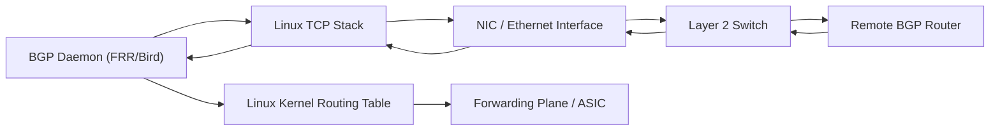

 

## Layer 3 Routing Protocols  

 


* For **inside a network (IGP)** → OSPF, IS-IS.
* For **between networks (EGP)** → BGP.
* EIGRP is **rare** outside Cisco.
* Static + policy routing often complements dynamic protocols.

Details 

* The Linux **kernel routing table** stores routes and makes forwarding decisions.
* User-space **routing daemons** (e.g., via packages like **Quagga**, **FRRouting (FRR)**, **BIRD**, **XORP**) implement routing protocols (like OSPF, BGP, RIP, etc.).
* These daemons update the kernel routing table via **Netlink** API.

 

### 1. **Static Routing**

* Not a protocol, but a manual setup of routes (`ip route add ...`).
* Useful for small/simple networks.
* **Command Example:**

  ```bash
  ip route add 192.168.2.0/24 via 192.168.1.1
  ```

 
### 2. **RIP (Routing Information Protocol)**

* Distance-vector protocol (uses hop count).
* Suitable for **small networks**.
* Linux support via **quagga / frr / bird**.
* Periodically exchanges the full routing table → not efficient for large networks.

 

### 3. **OSPF (Open Shortest Path First)**

* **Link-state protocol** (uses Dijkstra’s SPF algorithm).
* Faster and more scalable than RIP.
* Used inside organizations (**IGP – Interior Gateway Protocol**).
* Linux supports via **FRRouting (frr)**, **Quagga**, **BIRD**.
* Builds a **link-state database (LSDB)** and computes shortest paths.

 

### 4. **BGP (Border Gateway Protocol)**

* **Path-vector protocol**, the backbone of the internet.
* Used between organizations (**EGP – Exterior Gateway Protocol**).
* BGP in Linux is supported via **FRRouting, Quagga, BIRD**.
* Determines routes using **AS-paths** (autonomous systems).
* Policies (filters, prefix limits, communities) are critical in real deployments.

 

Border Gateway Protocol (BGP) is a **path-vector routing protocol** used to exchange routing information between autonomous systems (AS) on the Internet.
It runs over **TCP port 179**, so the **Linux TCP stack** handles session creation, retransmission, and reliability.
BGP maintains routing tables, selects best paths using attributes (AS-Path, Local-Pref, MED), and informs neighbor routers of changes.

### Physical Hardware BGP Interacts With

BGP is a control-plane protocol, so it runs on **routing devices**.
In a Linux system acting as a router, BGP interacts with:

### 1. **Network Interface Cards (NICs)**
   Handles sending/receiving TCP packets carrying BGP messages.

### 2. **Switches**
   Only at Layer 2 for frame forwarding; switches do **not process BGP**.

### 3. **Routers**
   BGP peers are routers or Linux systems running a routing daemon (FRRouting, Bird, Quagga).

### 4. **Routing Engine / Control Processor**
   In hardware routers (Cisco, Juniper, Arista), BGP runs on the RE/CP, which programs the forwarding plane.

### 5. **Forwarding ASICs (hardware routers)**
   BGP does not directly interact with ASICs; it updates routing tables → control processor → FIB → ASIC programs forwarding entries.


In Linux When you use a BGP daemon like **FRR** or **Bird**:

* BGP daemon runs in **user space**
* Uses **Linux TCP stack** to establish neighbor session
* Installs routes into the **Linux kernel routing table (FIB)** using Netlink sockets
* Kernel forwards packets based on those routes

### Important BGP Configuration Steps (Linux FRR Example)

#### 1. Install FRRouting

```bash
sudo apt install frr frr-pythontools
```

#### 2. Enable BGP daemon

Edit `/etc/frr/daemons`:

```
bgpd=yes
```

Restart:

```bash
sudo systemctl restart frr
```

#### 3. Minimal BGP Setup

```
router bgp 65001
 bgp router-id 1.1.1.1
 neighbor 10.0.0.2 remote-as 65002
 network 192.168.10.0/24
```

### Important BGP Operational Commands (Linux + FRR)

#### Check BGP Status

```bash
vtysh -c "show ip bgp summary"
```

#### Check BGP Neighbor Details

```bash
vtysh -c "show ip bgp neighbors"
```

Check BGP Routing Table

```bash
vtysh -c "show ip bgp"
```

Check Routes Installed in Linux Kernel

```bash
ip route show
```
Output
```bash
default via 10.0.0.1 dev ens3 
default via 10.0.0.1 dev ens3 proto dhcp src 10.0.0.53 metric 100 
10.0.0.0/24 dev ens3 proto kernel scope link src 10.0.0.53 
10.0.0.0/24 dev ens3 proto kernel scope link src 10.0.0.53 metric 100 
169.254.0.0/16 dev ens3 scope link 
169.254.0.0/16 dev ens3 proto dhcp scope link src 10.0.0.53 metric 100
```
Explanation of output.

`default via 10.0.0.1 dev ens3`

System sends all non-local traffic to **gateway 10.0.0.1** via **ens3**.

### What is `ens3`

`ens3` is the **name of a network interface** on a Linux system.
It follows the **Predictable Network Interface Names** scheme introduced by systemd/udev.

 

`ens3` =

* **en** → Ethernet interface
* **s3** → Located on **slot/index 3** of the system’s firmware-defined hardware path

So `ens3` represents the **Ethernet NIC assigned as interface #3** by the firmware. Older names like `eth0`, `eth1` were unpredictable after reboot or hardware changes.
`ens3` ensures stable, consistent naming based on actual hardware location.
 

`default via 10.0.0.1 dev ens3 proto dhcp src 10.0.0.53 metric 100`

A second default route added by **DHCP** with **higher metric** (lower priority).
Kernel prefers the first default route.

`10.0.0.0/24 dev ens3 proto kernel scope link src 10.0.0.53`

Local subnet directly reachable on **ens3**.
No gateway required.

`10.0.0.0/24 dev ens3 proto kernel scope link src 10.0.0.53 metric 100`

Duplicate local network route from DHCP with lower priority.

`169.254.0.0/16 dev ens3 scope link`

Link-local range (used when no DHCP is available).
Automatically added by kernel.

`169.254.0.0/16 dev ens3 proto dhcp scope link src 10.0.0.53 metric 100`

Second link-local entry created by DHCP, lower priority.

 
Overall , we have **two identical sets of routes**:

* Kernel-created routes (no metric) → higher priority
* DHCP-created routes (metric 100) → backup entries

The kernel will always use the **non-metric routes** first.


---

Verify TCP Session (transport layer for BGP)

```bash
ss -tn sport = :179 or dport = :179
```

 Important Logs

```bash
tail -f /var/log/frr/bgpd.log
```




 
A Linux server in a data center uses BGP to advertise a virtual IP /24 prefix to a Top-of-Rack (ToR) router:

* BGP daemon learns prefixes from multiple peers
* Selects best path
* Installs next-hops into Linux routing table
* Hardware router forwards packets to the server based on advertised route

More :

* Full BGP FRR configuration template
* Differences between iBGP and eBGP
* BGP attributes with examples
* BGP troubleshooting checklist (TCP handshake, TTL, AS mismatch, timers)


## 5. **EIGRP (Enhanced Interior Gateway Routing Protocol)**

* Originally **Cisco proprietary**, partially documented later as an IETF draft (not widely used outside Cisco).
* Distance-vector + some link-state features (uses DUAL algorithm).
* Limited support in Linux (not standard in FRR or BIRD).
* Typically you would run OSPF or IS-IS instead of EIGRP on Linux.

 

### 6. **IS-IS (Intermediate System to Intermediate System)**

* Another **link-state IGP** (like OSPF).
* Used heavily by ISPs for backbone routing.
* Linux support: **FRRouting**, **Quagga**.

 

### 7. **Other Protocols / Tools**

* **PIM / IGMP** – for multicast routing.
* **MPLS + LDP/RSVP** – supported in Linux with patches and FRRouting.
* **Policy routing** – via `ip rule` and multiple routing tables.

 

##  Linux Routing Daemons

To run these protocols, install one of:

* **FRRouting (FRR)** → Actively maintained, supports BGP, OSPF, IS-IS, RIP, PIM.
* **BIRD** → Very popular for BGP (used in ISPs, IXPs).
* **Quagga** → Older, predecessor of FRR.
* **XORP** → Academic/research use.

 

 

| Protocol     | Type                  | Use Case                      | Linux Support         |
| ------------ | --------------------- | ----------------------------- | --------------------- |
| **Static**   | Manual                | Small/simple networks         | Native (`ip route`)   |
| **RIP**      | Distance-vector       | Small LANs                    | FRR, Quagga           |
| **OSPF**     | Link-state (Dijkstra) | Enterprise IGP                | FRR, Quagga, BIRD     |
| **IS-IS**    | Link-state            | ISP core                      | FRR                   |
| **BGP**      | Path-vector           | Internet routing, ISP peering | FRR, BIRD             |
| **EIGRP**    | Hybrid (Cisco)        | Cisco networks                | Limited, not standard |
| **PIM/IGMP** | Multicast             | Video, streaming              | FRR, pimd             |

 
 
